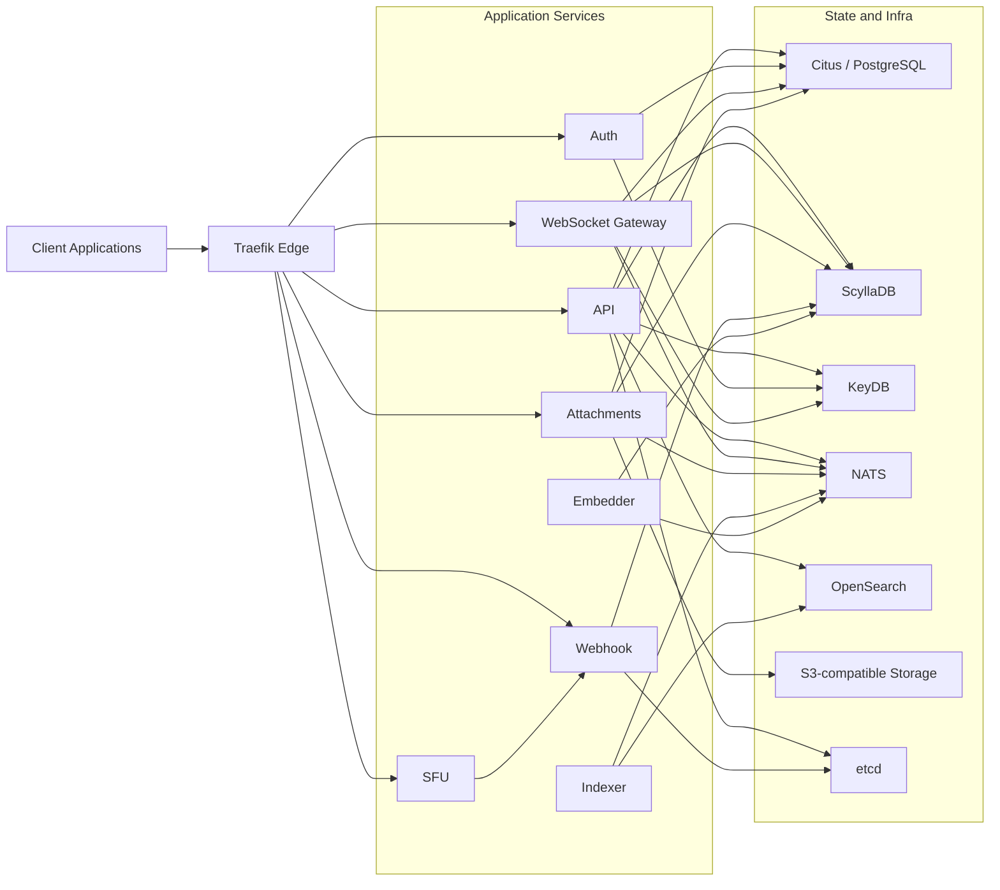

# GoChat

<p align="center">
  <strong>Distributed real-time chat and voice backend written in Go.</strong><br />
  REST API, WebSocket delivery, file uploads, search indexing, generated embeds, and SFU-based voice.
</p>

<p align="center">
  <a href="docs/project/README.md"></a>
  <a href="docs/api/swagger.json"></a>
  <a href="https://github.com/FlameInTheDark/gochat-react"></a>
  <a href="https://github.com/FlameInTheDark/gochat-deployment"></a>
</p>

<p align="center">
  <a href="CHANGELOG.md">Changelog</a>
  |
  <a href="clients/api/goclient/">Go client</a>
  |
  <a href="clients/api/jsclient/">TypeScript client</a>
  |
  <a href="LICENSE">License</a>
</p>

## Overview

GoChat is a service-oriented messaging platform built around focused Go services. This repository contains the backend services, local development stack, generated API clients, and project documentation for messaging, presence, uploads, search, webhooks, and voice.

## Quick Links

- [Project documentation](docs/project/README.md)
- [Services overview](docs/project/Services.md)
- [WebSocket docs](docs/project/ws/README.md)
- [Voice docs](docs/project/voice/README.md)
- [Presence system](docs/project/Presence.md)
- [Tools CLI](docs/project/Tools.md)
- [OpenAPI schema](docs/api/swagger.json)
- [Go API client](clients/api/goclient/)
- [TypeScript API client](clients/api/jsclient/)

## What Ships Here

| Area | What it covers |
| --- | --- |
| Core services | API, auth, WebSocket gateway, attachments, webhook, indexer, embedder, and SFU |
| Data layer | Citus/PostgreSQL for relational state and ScyllaDB for message-heavy workloads |
| Messaging | NATS-backed event flow for real-time delivery and background workers |
| Media | S3-compatible object storage for uploads, avatars, icons, and attachment assets |
| Search | OpenSearch indexing pipeline driven by the `indexer` service |
| Discovery | etcd-backed voice service discovery through the `webhook` service |
| Clients | Generated Go and TypeScript API clients under `clients/api/` |
| Operations | Docker Compose stack, monitoring, dashboards, and helper CLI tooling |

## Architecture



## Services

| Service | Path | Responsibility |
| --- | --- | --- |
| API | `cmd/api` | Main REST surface for users, guilds, channels, messages, invites, search, uploads, and voice control |
| Auth | `cmd/auth` | Registration, login, refresh tokens, email flows, and password reset |
| WebSocket Gateway | `cmd/ws` | Real-time subscriptions, event delivery, presence updates, and session handling |
| Attachments | `cmd/attachments` | Upload pipeline for attachments, avatars, icons, and related metadata |
| Webhook | `cmd/webhook` | Internal webhook surface for trusted service callbacks such as SFU heartbeats and attachment finalization |
| SFU | `cmd/sfu` | WebRTC media relay and signaling for voice channels |
| Indexer | `cmd/indexer` | Consumes message events and writes search documents to OpenSearch |
| Embedder | `cmd/embedder` | Builds generated message embeds from remote metadata and republishes updates |
| Tools | `cmd/tools` | Operational helpers such as webhook token generation |

## Feature Surface

- Account lifecycle with token-based authentication
- Guilds, channels, roles, invites, bans, and custom emoji
- Direct messages, message history, mentions, attachments, and embed generation
- Presence updates and real-time event fanout over WebSocket
- Search indexing and query flow through OpenSearch
- Voice channel join flow with region-aware SFU discovery
- Generated Go and TypeScript API clients from the OpenAPI schema

## Stack

- Go `1.25.1`
- Fiber, Fiber WebSocket, and Pion WebRTC
- Citus/PostgreSQL for relational data
- ScyllaDB for message timelines and attachment-heavy data
- NATS for async messaging between services
- KeyDB for cache and presence/session state
- OpenSearch for full-text search
- S3-compatible storage for media assets
- etcd for service discovery
- Traefik, Prometheus, Grafana, Loki, and OpenSearch Dashboards for local operations

## Repository Layout

```text
cmd/             runnable services and operational tools
internal/        shared packages for transport, storage, search, mail, presence, and server wiring
db/              PostgreSQL and ScyllaDB migrations
docs/            project docs and generated OpenAPI output
clients/api/     generated Go and TypeScript API clients
compose.yaml     reference local development stack
Makefile         bootstrap, migration, client generation, and rebuild commands
```

## Getting Started

### Prerequisites

- Go `1.25.1` or newer
- Docker and Docker Compose
- GNU Make
- `migrate` CLI for database migrations (`make tools` installs it)

### Fast Path

```bash
make setup
```

`make setup` installs local tooling, starts the reference stack, initializes ScyllaDB, and applies both PostgreSQL and ScyllaDB migrations.

### Manual Bootstrap

Start the local infrastructure:

```bash
docker compose up -d
docker compose exec scylla bash ./init-scylladb.sh
docker compose -p gochat up --scale citus-worker=3 -d
```

Install the migration tool and apply migrations:

```bash
go install -tags "postgres cassandra" github.com/golang-migrate/migrate/v4/cmd/migrate@latest
migrate -database "postgres://postgres@127.0.0.1/gochat" -path ./db/postgres up
migrate -database "cassandra://127.0.0.1/gochat?x-multi-statement=true" -path ./db/cassandra up
```

Review the example configuration files before running services locally:

- `api_config.example.yaml`
- `auth_config.example.yaml`
- `attachments_config.example.yaml`
- `ws_config.example.yaml`
- `sfu_config.example.yaml`
- `webhook_config.example.yaml`
- `indexer_config.example.yaml`
- `embedder_config.example.yaml`

## Running Services

Run individual services directly with Go:

```bash
go run ./cmd/api
go run ./cmd/auth
go run ./cmd/ws
go run ./cmd/attachments
go run ./cmd/webhook
go run ./cmd/sfu
go run ./cmd/indexer
go run ./cmd/embedder
```

Useful Make targets:

- `make up` to start the Compose stack and initialize ScyllaDB
- `make down` to stop the stack
- `make migrate` to apply both database migration sets
- `make swag` to rebuild `docs/api/swagger.json`
- `make client` to regenerate Go and TypeScript clients
- `make rebuild_all` to rebuild the application containers

## Documentation and Clients

| Resource | Link |
| --- | --- |
| Project docs | [docs/project/README.md](docs/project/README.md) |
| Service documentation | [docs/project/Services.md](docs/project/Services.md) |
| WebSocket protocol | [docs/project/ws/README.md](docs/project/ws/README.md) |
| Voice and SFU docs | [docs/project/voice/README.md](docs/project/voice/README.md) |
| Presence model | [docs/project/Presence.md](docs/project/Presence.md) |
| OpenAPI schema | [docs/api/swagger.json](docs/api/swagger.json) |
| Go API client | [clients/api/goclient/](clients/api/goclient/) |
| TypeScript API client | [clients/api/jsclient/](clients/api/jsclient/) |
| Frontend repository | [gochat-react](https://github.com/FlameInTheDark/gochat-react) |
| Deployment repository | [gochat-deployment](https://github.com/FlameInTheDark/gochat-deployment) |

## Local Operations

The Compose stack includes additional tooling for local inspection and troubleshooting:

- Traefik dashboard on `http://localhost:8080`
- Prometheus on `http://localhost:9090`
- Grafana on `http://localhost:3030`
- OpenSearch Dashboards on `http://localhost:5601`

## License

MIT. See [LICENSE](LICENSE).
