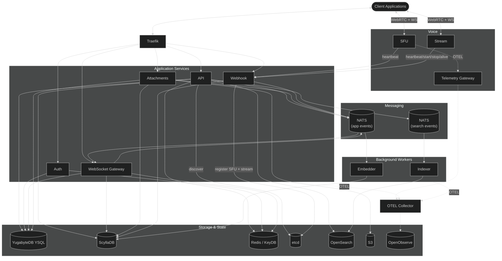

[← Project docs](README.md)

# Architecture

GoChat is composed of focused services connected through a shared data and messaging layer. The diagram below shows the primary data-flow relationships between all components.

## Service responsibilities

| Service | Path | Role |
| --- | --- | --- |
| API | `cmd/api` | Public REST surface — guilds, channels, messages, search, voice and stream control |
| Auth | `cmd/auth` | Registration, login, token refresh, email flows, password reset |
| WebSocket Gateway | `cmd/ws` | Real-time subscriptions, event delivery, presence, session handling |
| Attachments | `cmd/attachments` | Upload pipeline for files, avatars, icons; S3 storage and metadata |
| Webhook | `cmd/webhook` | Internal callbacks — SFU/stream heartbeats, stream lifecycle, and attachment finalization |
| SFU | `cmd/sfu` | WebRTC media relay and WebSocket signaling for voice channels |
| Stream | `cmd/stream` | WebRTC media relay and WebSocket signaling for voice-channel screen/app sharing |
| Indexer | `cmd/indexer` | Consumes NATS message events, writes to OpenSearch |
| Embedder | `cmd/embedder` | Builds link-preview embeds from remote metadata |
| Telemetry Gateway | `cmd/telemetrygateway` | OTEL proxy — collects signals from all services and forwards to the observability backend |
| Tools | `cmd/tools` | Operational helpers (observability bootstrap, webhook token generation) |

## Data stores

| Store | Technology | Primary use |
| --- | --- | --- |
| Relational | YugabyteDB YSQL | Users, guilds, channels, roles, invites, bans |
| Time-series / wide-column | ScyllaDB | Message timelines, attachment metadata, presence data |
| Cache / session | Redis / KeyDB | Auth tokens, voice route bindings, presence state |
| Messaging | NATS | Async event delivery between services |
| Search index | OpenSearch | Full-text message search |
| Object storage | S3-compatible | Uploaded files, avatars, icons |
| Service discovery | etcd | Voice SFU and stream instance registries |

## Voice flow

1. Client calls `POST /api/v1/channel/{id}/voice/join` — API picks the best SFU via etcd.
2. API issues a short-lived SFU JWT (2-minute expiry, HS256) and returns the SFU endpoint.
3. Client connects directly to SFU over WebSocket and establishes a WebRTC peer connection.
4. SFU sends periodic heartbeats to `Webhook`, which refreshes the instance in etcd.
5. On region change, the API publishes `VoiceRegionChanging` over NATS, waits 3 seconds (jitter), updates the cache binding, then sends a `VoiceRebind` event and closes the old SFU channel via admin endpoint.

See [`voice/SystemArchitecture.md`](voice/SystemArchitecture.md) and [`voice/ConnectionProtocol.md`](voice/ConnectionProtocol.md) for the full protocol.

## Streaming flow

Screen/app streaming is a separate media plane attached to voice channels:

1. Client is already connected to a voice channel.
2. Client calls `POST /api/v1/guild/{guild_id}/voice/{channel_id}/streams`.
3. API validates voice membership plus `PermVoiceConnect` and `PermVoiceVideo`.
4. API resolves the effective voice region and selects only stream instances in that same region.
5. API returns `stream_url` and a one-minute publisher JWT signed with the shared `auth_secret` and bound to the selected stream service.
6. Client connects directly to `cmd/stream` over `/signal?v=2` and establishes a separate WebRTC connection.
7. Stream service confirms publisher media by calling `POST /api/v1/webhook/stream/start`.
8. Webhook writes `stream:*` cache state, writes `presence:stream:{userId}`, publishes `GuildMemberStartStream`, and refreshes OP 3 presence.
9. Viewers call `POST /streams/{stream_id}/join` and receive viewer-only JWTs for separate receive-only WebRTC sessions.

See [`voice/Streaming.md`](voice/Streaming.md) for the complete pipeline, keys, events, and migration behavior.
