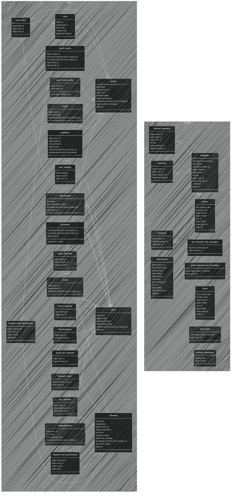

[<- Documentation](README.md)

[dbdocs.io](https://dbdocs.io/FlameInTheDark/GoChat)

```mermaid
---
config:
    look: handDrawn
    theme: dark
---
classDiagram
    direction TB
    namespace Citus {
        class audit {
            bigint guild_id
            jsonb changes
            timestamp with time zone created_at
        }

        class authentications {
            bigint user_id
            text email
            text password_hash
            timestamp with time zone created_at
        }

        class blocked_users {
            bigint blocked_user_id
            bigint user_id
        }

        class channel_roles_permissions {
            bigint channel_id
            bigint role_id
            bigint accept
            bigint deny
        }

        class channel_user_permissions {
            bigint channel_id
            bigint user_id
            bigint accept
            bigint deny
        }

        class channels {
            text name
            integer type
            bigint parent_id
            bigint permissions
            text topic
            boolean private
            bigint last_message
            timestamp with time zone created_at
            text voice_region
            bigint id
        }

        class discriminators {
            bigint user_id
            text discriminator
        }

        class dm_channels {
            bigint user_id
            bigint participant_id
            bigint channel_id
        }

        class friend_requests {
            bigint friend_id
            bigint user_id
        }

        class friends {
            bigint user_id
            bigint friend_id
            timestamp with time zone created_at
        }

        class group_dm_channels {
            bigint user_id
            bigint channel_id
        }

        class guild_channels {
            bigint guild_id
            bigint channel_id
            integer position
        }

        class guild_invite_codes {
            bigint invite_id
            bigint guild_id
            varchar(8) invite_code
        }

        class guild_invites {
            bigint author_id
            timestamp with time zone created_at
            timestamp with time zone expires_at
            bigint guild_id
            bigint invite_id
        }

        class guilds {
            text name
            bigint owner_id
            bigint icon
            boolean public
            bigint permissions
            timestamp with time zone created_at
            bigint system_messages
            bigint id
        }

        class members {
            bigint user_id
            bigint guild_id
            text username
            bigint avatar
            timestamp with time zone join_at
            timestamp with time zone timeout
        }

        class recoveries {
            timestamp with time zone expires_at
            timestamp with time zone created_at
            bigint user_id
            varchar(64) token
        }

        class registrations {
            text email
            text confirmation_token
            timestamp with time zone created_at
            bigint user_id
        }

        class roles {
            bigint id
            bigint guild_id
            text name
            integer color
            bigint permissions
        }

        class user_roles {
            bigint guild_id
            bigint user_id
            bigint role_id
        }

        class user_settings {
            jsonb settings
            bigint version
            bigint user_id
        }

        class users {
            text name
            bigint avatar
            boolean blocked
            bigint upload_limit
            timestamp with time zone created_at
            bigint id
        }
    }

    audit "guild_id" --> "id" guilds
    authentications "user_id" --> "id" users
    blocked_users "user_id" --> "id" users
    channel_roles_permissions "channel_id" --> "id" channels
    channel_roles_permissions "role_id" --> "id" roles
    channel_user_permissions "channel_id" --> "id" channels
    channel_user_permissions "user_id" --> "id" users
    discriminators "user_id" --> "id" users
    dm_channels "channel_id" --> "id" channels
    dm_channels "user_id" --> "id" users
    friend_requests "user_id" --> "id" users
    friends "user_id/friend_id" --> "id" users
    group_dm_channels "channel_id" --> "id" channels
    group_dm_channels "user_id" --> "id" users
    guild_channels "channel_id" --> "id" channels
    guild_channels "guild_id" --> "id" guilds
    guild_invite_codes "guild_id" --> "id" guilds
    guild_invites "guild_id" --> "id" guilds
    members "guild_id" --> "id" guilds
    members "user_id" --> "id" users
    recoveries "user_id" --> "id" users
    registrations "user_id" --> "id" users
    roles "guild_id" --> "id" guilds
    user_roles "guild_id" --> "id" guilds
    user_roles "role_id" --> "id" roles
    user_roles "user_id" --> "id" users
    user_settings "user_id" --> "id" users

    namespace ScyllaDB {
        class attachments {
            bigint author_id
            text content_type
            boolean done
            bigint filesize
            bigint height
            text name
            text preview_url
            text url
            bigint width
            bigint channel_id
            bigint id
        }
        class avatars {
            text content_type
            boolean done
            bigint filesize
            bigint height
            text url
            bigint width
            bigint user_id
            bigint id
        }
        class channel_mentions {
            bigint author_id
            bigint guild_id
            bigint role_id
            int type
            bigint channel_id
            bigint message_id
        }
        class dm_channels_last_messages {
            bigint last_message_id
            bigint channel_id
        }
        class guild_channels_last_messages {
            map~bigint, bigint~ channels
            bigint guild_id
        }
        class icons {
            text content_type
            boolean done
            bigint filesize
            bigint height
            text url
            bigint width
            bigint guild_id
            bigint id
        }
        class mentions {
            bigint author_id
            bigint user_id
            bigint channel_id
            bigint message_id
        }
        class messages {
            list~bigint~ attachments
            text content
            timestamp edited_at
            bigint reference
            bigint thread
            int type
            bigint user_id
            bigint channel_id
            int bucket
            bigint id
        }
        class reactions {
            bigint emote_id
            bigint message_id
            bigint user_id
        }
        class read_states {
            map~bigint, bigint~ channels
            bigint user_id
        }
        class schema_migrations {
            boolean dirty
            bigint version
        }
    }
    channel_mentions "message_id" --> "id" messages
    mentions "message_id" --> "id" messages
    reactions "message_id" --> "id" messages
    attachments "id" --> "attachments" messages
```
