[Project main](../../README.md)
# Project documentation

Here goes the project documentation.

- [Channels](channels/README.md)
- [Guilds](guilds/README.md)

- [WebSocket Events](ws/README.md)

- [Voice](voice/README.md)

- [Services Overview](Services.md)
- [Tools CLI](Tools.md)

- [Swagger API Documentation](https://petstore.swagger.io/?url=https://raw.githubusercontent.com/FlameInTheDark/gochat/refs/heads/dev/docs/api/swagger.json)
- [Database Diagram](Database.md)

## Architecture Diagram

```mermaid
---
config:
    look: handDrawn
    theme: dark
---
flowchart
    n4("Client Applications")
    n13("Load Balancer (Ingress/Traefik)")

    subgraph s1["API Layer"]
        n7("Messaging Queue")
        n3("WebSocket Messaging")
        n2("Auth")
        n1("API")
        n14("Attachments")
        n17("Webhook")
    end
    subgraph s2["Data Layer"]
        n8("PostgreSQL/Citus")
        n6("Cassandra/ScyllaDB")
        n5("Redis/KeyDB")
        n16("etcd")
    end
    subgraph s3["Search Engine Layer"]
        n12("OpenSearch")
        n11("Message Indexer")
        n10("Indexer Queue")
    end
    subgraph s4["Voice Regions"]
        n15("SFU with WebSocket signaling")
    end
    subgraph s5["Media Datacenter"]
        n9("S3 Object Storage")
    end

    n17 ---> n6
    n17 ---> n7
    n1 ---> n7
    n7 ---> n3
    n3 ---> n8
    n1 ---> n6
    n3 ---> n6
    n1 ---> n8
    n17 ---> n5
    n1 --> n5
    n1 ---> n10
    n10 ---> n11
    n1 ---> n12
    n11 ---> n12
    n2 ---> n8
    n4 <---> n13
    n13 ---> n1
    n13 ---> n2
    n13 <--> n3
    n13 ---> n14
    n14 -- "Store media" --> n9
    n14 ---> n6
    n4 <-- "WebRTC and WebSocket" --> n15
    n15 -- "Heartbeat/Discovery" --> n17
    n13 ---> n17
    n17 -- "Discovery write" --> n16
    n1 -- "Discover voice servers" --> n16
    n4 -- "Get public media" --> n9

    style s1 fill:#004a11
    style s2 fill:#472b0e
    style s3 fill:#250e47
    style s4 fill:#685dce
    style s5 fill:#740580
```

