[Project main](../../README.md)
# Project documentation

Here goes the project documentation.

- [Channels](channels/README.md)
- [Guilds](guilds/README.md)

- [WebSocket Events](ws/README.md)

## Architecture Diagram

```mermaid
---
config:
    look: handDrawn
    theme: dark
---
flowchart
	subgraph s1["API Layer"]
		n7["Messagin Queue"]
		n3["WebSocket Messaging"]
		n2["Auth"]
		n1["API"]
	end
	style s1 fill:#004a11
	n4["Client"]
	subgraph s2["Data Layer"]
		n9["S3"]
		n8["PostgreSQL"]
		n6["Cassandra"]
		n5["Redis"]
	end
	n1
	n3
	n1 --- n7
	n7 --- n3
	
	n4
	s1
	n4
	n1
	n4
	n2
	n4["Client Applications"]
	n3
	n3 --- n8
	n3 --- n6
	n1 --- n9["S3 Obecj Storage"]
	n1 --- n8
	n1 --- n6
	n1 --- n5
	subgraph s3["Search Engine Layer"]
		n12["OpenSearch"]
		n11["Message Indexer"]
		n10["Indexer Queue"]
	end
	
	n1 --- n10
	n10 --- n11
	n11 --- n12
	n1 --- n12
	n2 --- n8
	n13["Load Balancer"]
	n4 --- n13
	n13 --- n1
	n13 --- n2
	n13["Load Balancer (Ingress/Traefik)"] --- n3
	style s2 fill:#472b0e
	style s3 fill:#250e47
```
