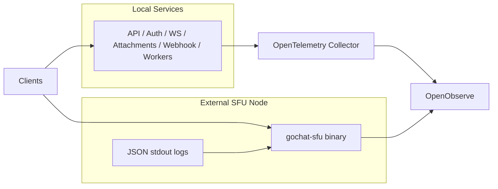

[<- Observability](README.md)

# Architecture

The project uses two signal paths on purpose.

- Local application services use the collector path because Docker Compose already provides a shared network and a single bootstrap surface.
- External SFU nodes use a self-shipping path because they may run as plain binaries on any host or operating system.

## Signal flow

## Local services

- HTTP services use shared request middleware for `traceparent`, `X-Request-ID`, request spans, HTTP metrics, and structured request logs.
- Async workers propagate trace context and request identity through NATS headers.
- The collector forwards traces, metrics, and container logs into OpenObserve.

## External SFU

- Traces go directly from the SFU process to the OTLP HTTP traces endpoint.
- Metrics go directly from the SFU process to the OTLP HTTP metrics endpoint.
- Logs stay on stdout and are also mirrored to OpenObserve through a built-in async HTTP exporter.
- The log exporter is best-effort by design: it uses a bounded queue, batching, retry/backoff, and dropped-log accounting so media flow is never blocked by observability.

## Identity model

These dimensions are the canonical way to identify an SFU node:

- `service.name=gochat-sfu`
- `voice.region`
- `service.instance.id`
- `deployment.environment`

They are attached to SFU spans and metrics as resource attributes and are also emitted in SFU logs.
