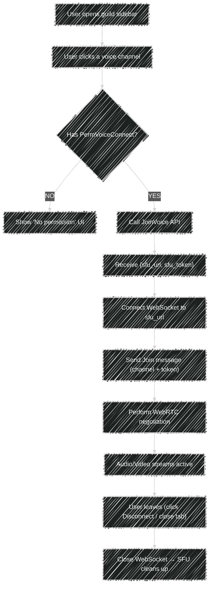
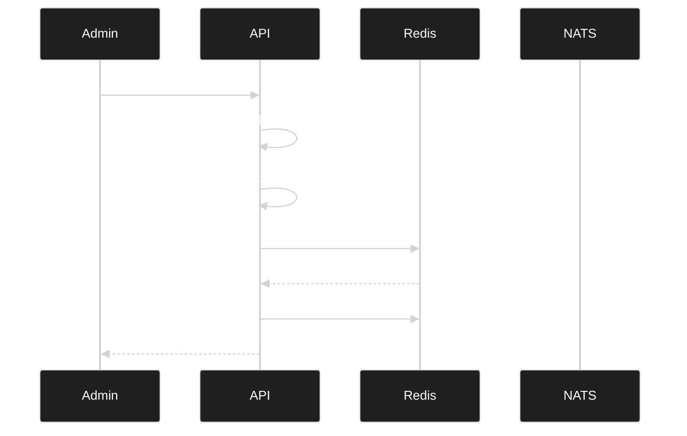
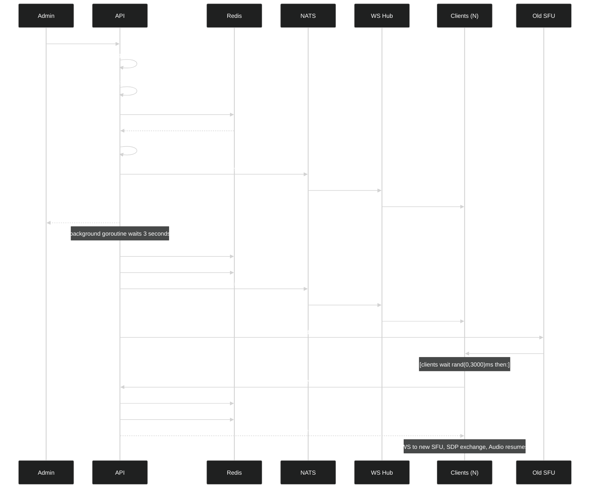
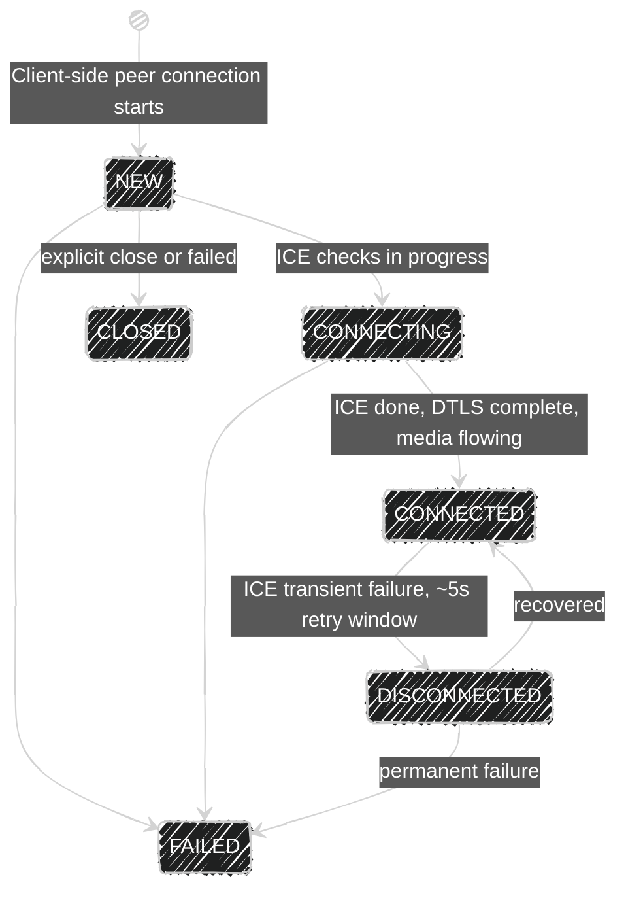
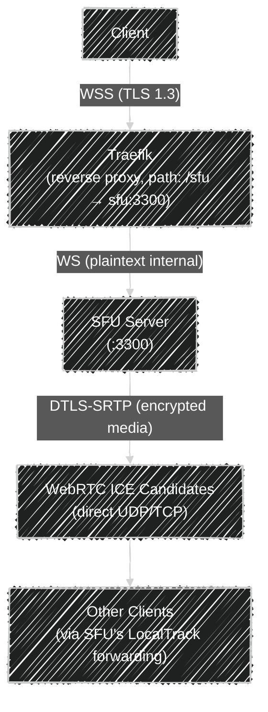

[<- Documentation](../README.md) - [Voice](README.md)

# Voice Userflow and Connection Protocol

## Overview

This document describes the complete user journey through the voice system — from joining a voice channel to leaving — including all protocol messages, WebRTC signaling steps, and event flows.

---

## 1. High-Level Userflow



---

## 2. Step-by-Step Connection Protocol

### Step 1 — Client Requests Voice Access (REST)

The client sends a REST request to the API server:

```
POST /api/v1/guild/{guild_id}/voice/{channel_id}/join
Authorization: Bearer {user_jwt}
```

**API processing:**
1. Decode user from JWT.
2. Verify user is a member of the guild.
3. Verify channel belongs to the guild.
4. Verify user has `PermVoiceConnect`.
5. Compute voice permission bitmask for the user:
   - `PermVoiceSpeak` if role grants speak.
   - `PermVoiceVideo` if role grants video.
   - Administrative permissions as applicable.
6. Check Redis for existing route: `voice:route:{channelId}`.
   - **HIT:** Use cached SFU URL and ID.
   - **MISS:** Query etcd via `disco.List(voice_region)` → pick SFU using weighted random selection → write via `SET NX` with 60s TTL. If NX lost (concurrent write), re-read the winning entry.
7. If no SFU available → `503 Service Unavailable`.
8. Check `voice:rebind:{channelId}`: if present, issue a **5-minute** JWT instead of the standard 2-minute one (active migration in progress).
9. Issue SFU JWT:
   ```json
   {
     "typ": "sfu",
     "iss": "gochat",
     "aud": ["sfu"],
     "user_id": 42,
     "channel_id": 789,
     "guild_id": 111,
     "perms": 7,
     "moved": false,
     "iat": 1700000000,
     "exp": 1700000120
   }
   ```
10. Return response:
   ```json
   {
     "sfu_url": "wss://sfu.gochat.io/signal",
     "sfu_token": "eyJhbGci..."
   }
   ```

---

### Step 2 — Client Connects WebSocket to SFU

Client opens a WebSocket connection:
```
WSS: wss://sfu.gochat.io/signal
```

The SFU uses `gorilla/websocket` (wrapped in `threadSafeWriter`) to handle the connection. No HTTP headers or subprotocols are required at upgrade time; authentication happens at the application level in the next step.

---

### Step 3 — Client Sends Join Message

Immediately after WebSocket upgrade, the client sends:

```json
{
  "op": 7,
  "t": 500,
  "d": {
    "channel": 789,
    "token": "eyJhbGci..."
  }
}
```

**Fields:**
| Field | Type | Description |
|-------|------|-------------|
| `op` | int | `7` = `OPCodeRTC` |
| `t` | int | `500` = `EventTypeRTCJoin` |
| `d.channel` | int64 | Target voice channel ID |
| `d.token` | string | SFU JWT from Step 1 |

**SFU processing:**
1. Parse and validate JWT (issuer, audience, type, expiry).
2. Extract `userID`, `channelID`, `guildID`, `perms`, `moved`.
3. Check block list: is `userID` blocked from `channelID`?
4. Create WebRTC peer connection.
5. Add audio transceiver (sendrecv).
6. Add video transceiver (sendrecv).
7. Register event handlers (ICE candidate, track, state change).
8. Add peer to `channelState.peers`.
9. Trigger renegotiation (so existing peers' tracks are sent to new peer).
10. Send Join ACK:
    ```json
    {
      "op": 7,
      "t": 501,
      "d": { "channel": 789 }
    }
    ```

---

### Step 4 — SFU Sends Initial Offer

The debounced signaling goroutine fires (50ms after peer addition) and calls `doSignalPeerConnections()`:

1. For each peer, compute the set of tracks to receive (all other users' tracks).
2. Add missing `RTPSender` entries.
3. Remove senders for tracks that no longer exist.
4. Create SDP offer.
5. If `MaxAudioBitrateKbps` configured, modify SDP via `limitAudioBitrateInSDP()`.
6. Set as local description.
7. Send to peer:

```json
{
  "op": 7,
  "t": 503,
  "d": {
    "type": "offer",
    "sdp": "v=0\r\no=- 123456 ...\r\n..."
  }
}
```

**Fields:**
| Field | Type | Description |
|-------|------|-------------|
| `op` | int | `7` = `OPCodeRTC` |
| `t` | int | `503` = `EventTypeRTCSDP` |
| `d.type` | string | `"offer"` |
| `d.sdp` | string | SDP offer body |

---

### Step 5 — Client Sends Answer

Client processes the offer (creating tracks and ICE parameters), generates an SDP answer, and sends:

```json
{
  "op": 7,
  "t": 503,
  "d": {
    "type": "answer",
    "sdp": "v=0\r\no=- 654321 ...\r\n..."
  }
}
```

**SFU processing:**
- Call `peer.peerConnection.SetRemoteDescription(answer)`.

---

### Step 6 — ICE Candidate Exchange

Both sides discover ICE candidates asynchronously and trickle them to the peer:

**SFU → Client:**
```json
{
  "op": 7,
  "t": 504,
  "d": {
    "candidate": "candidate:0 1 UDP 2122252543 192.168.1.5 54321 typ host",
    "sdp_mid": "0",
    "sdp_mline_index": 0
  }
}
```

**Client → SFU:**
```json
{
  "op": 7,
  "t": 504,
  "d": {
    "candidate": "candidate:0 1 UDP 2122252543 10.0.0.2 12345 typ host",
    "sdp_mid": "0",
    "sdp_mline_index": 0
  }
}
```

**Fields:**
| Field | Type | Description |
|-------|------|-------------|
| `op` | int | `7` = `OPCodeRTC` |
| `t` | int | `504` = `EventTypeRTCCandidate` |
| `d.candidate` | string | ICE candidate string |
| `d.sdp_mid` | string | Media section ID |
| `d.sdp_mline_index` | int | Media line index |

After sufficient candidates exchange, ICE connectivity checks complete and DTLS handshake follows, establishing the encrypted media path.

---

### Step 7 — Media Streams Active

After ICE + DTLS:
- Client sends audio RTP via the established DTLS-SRTP path.
- SFU receives on `OnTrack` callback:
  1. Check `PermVoiceSpeak` / `PermVoiceVideo`.
  2. Check `serverMuted` flag.
  3. Create `LocalTrack` with stream ID `u:{userId}`.
  4. Register in `channelState.trackLocals`.
  5. Trigger renegotiation for all other peers.
  6. Begin RTP forwarding loop.
- Other peers receive updated offers with the new track.
- Audio is heard by all other participants.

---

### Step 8 — Speaking Indicator

When a client detects voice activity (VAD), it sends:

```json
{
  "op": 7,
  "t": 506,
  "d": {
    "speaking": true
  }
}
```

**SFU processing:**
- Call `channelState.BroadcastSpeaking(userID, speaking)`.
- Sends to all *other* peers in the channel:
  ```json
  {
    "op": 7,
    "t": 506,
    "d": {
      "user": 42,
      "speaking": true
    }
  }
  ```

When the user stops speaking:
```json
{
  "op": 7,
  "t": 506,
  "d": { "speaking": false }
}
```

---

### Step 9 — Client Leaves Voice Channel

**Normal disconnect:**
1. Client closes the WebSocket connection.
2. SFU `OnConnectionStateChange` fires with `PeerConnectionStateClosed` or `PeerConnectionStateFailed`.
3. `channelState.RemovePeer(userID)` called:
   - Removes peer from `peers` slice.
   - Removes peer's tracks from `trackLocals`.
   - Triggers renegotiation for remaining peers.
4. If channel now empty:
   - TTL ticker stopped.
   - Signal goroutine stopped.
   - `channelState` removed from `SFU.channels`.
5. SFU fires webhook: `GuildMemberLeaveVoice → webhook → NATS → WS hub → guild subscribers`.

---

## 3. Complete Message Reference

### 3.1 Opcodes

| Value | Name | Direction | Description |
|-------|------|-----------|-------------|
| `2` | `OpCodeDispatch` | Server → Client | General dispatch event |
| `7` | `OPCodeRTC` | Bidirectional | Voice/RTC events |

### 3.2 Event Types

| Value | Name | Direction | Description |
|-------|------|-----------|-------------|
| `206` | `EventTypeGuildMemberJoinVoice` | WS → All guild clients | User joined voice channel |
| `207` | `EventTypeGuildMemberLeaveVoice` | WS → All guild clients | User left voice channel |
| `208` | `EventTypeGuildVoiceRegionChanging` | WS → All guild clients | Region migration starting; `delay_ms` = ms until `VoiceRebind` fires |
| `500` | `EventTypeRTCJoin` | Client → SFU | Join voice channel (with token) |
| `501` | `EventTypeRTCJoinAck` | SFU → Client | Join confirmed |
| `503` | `EventTypeRTCSDP` | Bidirectional | SDP offer or answer |
| `504` | `EventTypeRTCCandidate` | Bidirectional | ICE candidate |
| `505` | `EventTypeRTCServerMuted` | SFU → Client | Server-muted notification |
| `506` | `EventTypeRTCSpeaking` | Bidirectional | Speaking state |
| `507` | `EventTypeRTCServerDeafened` | SFU → Client | Server-deafened notification |
| `510` | `EventTypeRTCServerKickUser` | SFU → Client | Kicked from channel |
| `512` | `EventTypeRTCMoved` | WS → Client | Moved to new channel (with new SFU URL) |
| `513` | `EventTypeRTCServerRebind` | WS → Client | Region changed; reconnect required (includes `jitter_ms`) |

### 3.3 Message Envelope

All SFU WebSocket messages use this envelope:

```json
{
  "op": <opcode: int>,
  "t":  <event_type: int>,
  "d":  <payload: object>
}
```

---

## 4. Administrative Event Flows

### 4.1 Server Mute

**Initiator:** Admin calls mute API (or SFU mute operation).

**SFU internal (`ServerMuteUser`):**
1. Find peer by `userID`.
2. Set `peer.serverMuted = true`.
3. Remove user's audio track senders from all peers.
4. Trigger renegotiation.
5. Send to muted user:
   ```json
   { "op": 7, "t": 505, "d": { "muted": true } }
   ```

**Unmute:** Reverse — add back audio senders, renegotiate, send `{"muted": false}`.

### 4.2 Server Deafen

**SFU internal (`ServerDeafenUser`):**
1. Find peer by `userID`.
2. Set `peer.serverDeafened = true`.
3. Remove all outgoing track senders from that peer's connection (they hear nothing).
4. Trigger renegotiation.
5. Send to deafened user:
   ```json
   { "op": 7, "t": 507, "d": { "deafened": true } }
   ```

### 4.3 Kick User

**SFU internal (`KickUser`):**
1. Find peer by `userID`.
2. Send kick notification:
   ```json
   { "op": 7, "t": 508, "d": { "channel": 789 } }
   ```
3. Close WebRTC peer connection.
4. Normal leave cleanup follows.

### 4.4 Move Member

**Initiator:** Admin calls `POST /guild/{guild_id}/voice/move`.

**API flow:**
1. Verify `PermVoiceMoveMembers`.
2. Resolve target channel SFU via discovery/cache.
3. Resolve source channel SFU via discovery/cache.
4. Issue new SFU token for target channel (with `moved: true`).
5. Issue admin token for source channel.
6. Publish via NATS to `user.{userId}`:
   ```json
   {
     "op": 7,
     "t": 510,
     "d": {
       "channel": 999,
       "sfu_url": "wss://sfu.gochat.io/signal",
       "sfu_token": "eyJhbGci..."
     }
   }
   ```

**Client receives VoiceMove:**
1. Disconnect from current SFU.
2. Connect to new SFU URL.
3. Send Join with new token and new channel ID.
4. Resume audio in new channel.

**API response includes:** `from_sfu_url` and `from_sfu_token` so the API caller (or an intermediary) can instruct the source SFU to send `RTCMoved` (event 509) to the user's old connection — this triggers client-side cleanup before the new join.

---

## 5. Region Change Event Flow

### 5.1 Nobody in Channel



Next join picks up new region from DB → correct SFU selected.

### 5.2 Channel Has Active Users

The region change now uses a **3-second pre-notification + background goroutine** to avoid blocking the admin's HTTP request and to give clients advance warning:



**Key improvements vs. old behaviour:**
- Admin's `200 OK` returns immediately (no 3s HTTP block).
- Clients get 3s advance warning via `VoiceRegionChanging` (event 208).
- Clients spread their `JoinVoice` calls with `rand(0, 3000)` ms jitter (field `jitter_ms` in `VoiceRebind`).
- Extended 5-minute JWT issued during migration window.
- Old SFU explicitly told to close the channel via admin endpoint.
- Disruption window: **~0.1–3s** per individual client (staggered), versus the previous simultaneous 2–4s drop for everyone.

---

## 6. WebRTC State Machine



The SFU monitors state changes via `OnConnectionStateChange`. On `Failed` or `Closed`, the peer is removed and cleanup triggered.

---

## 7. Error States and Client Handling

| Error | Cause | Client Response |
|-------|-------|----------------|
| `503` from JoinVoice | No SFU in region | Show "Voice unavailable" |
| `422` from SetVoiceRegion | No SFU in requested region | Show error; DB unchanged |
| `403` from JoinVoice | No PermVoiceConnect | Show "No permission" |
| SFU rejects token (expired/invalid) | JWT expired or wrong channel | Re-call JoinVoice |
| SFU closes connection | Kicked / blocked | Show "Removed from channel" |
| `VoiceRegionChanging` event (208) | Region migration starting | Show countdown UI; prepare to reconnect |
| `VoiceRebind` event (513) | Region changed | Wait `rand(0, jitter_ms)` ms, then re-call JoinVoice and reconnect |
| VoiceMove event | Admin moved user | Connect to new channel SFU |
| ICE FAILED state | Network issue | Show reconnecting indicator; retry |

---

## 8. Timing Constants

| Parameter | Value | Location |
|-----------|-------|---------|
| SFU JWT expiry (normal) | 2 minutes | `cmd/api/endpoints/guild/voice.go` |
| SFU JWT expiry (during migration) | 5 minutes | `cmd/api/endpoints/guild/voice.go` |
| Admin JWT expiry | 2 minutes | `cmd/api/endpoints/guild/voice.go` |
| Route cache TTL (`voice:route:*`) | 60 seconds | `cmd/api/endpoints/guild/voice.go` |
| Migration marker TTL (`voice:rebind:*`) | 300 seconds | `cmd/api/endpoints/guild/voice.go` |
| Region change pre-notification delay | 3000 ms | `cmd/api/endpoints/guild/voice.go` |
| VoiceRebind jitter window | 0–3000 ms (client-side) | `internal/mq/mqmsg/voice_route.go` |
| SFU heartbeat interval | 5 seconds | `cmd/sfu/app.go` |
| etcd TTL for SFU instance | 15 seconds | `cmd/webhook/` |
| Channel TTL notification | 60 seconds | `cmd/sfu/sfu.go` |
| Signaling debounce | 50 milliseconds | `cmd/sfu/sfu.go` |
| Bitrate measurement window | 1 second | `cmd/sfu/app.go` |
| Bitrate violation tolerance | 2 consecutive seconds | `cmd/sfu/app.go` |

---

## 9. Codec Negotiation Details

The SFU presents only permitted codecs in SDP. The offer always includes:

**Audio:**
```
m=audio 9 UDP/TLS/RTP/SAVPF 111
a=rtpmap:111 opus/48000/2
a=fmtp:111 minptime=10;useinbandfec=1
```

If bitrate limiting is enabled, additionally:
```
b=TIAS:{bits_per_second}
b=AS:{kilobits_per_second}
a=fmtp:111 minptime=10;useinbandfec=1;maxaveragebitrate={bits}
```

**Video:**
```
m=video 9 UDP/TLS/RTP/SAVPF 96 98
a=rtpmap:96 VP8/90000
a=rtpmap:98 VP9/90000
```

Clients that attempt to send H.264 or AV1 will find no matching codec in the offer and those tracks will be inactive.

---

## 10. Network Path Summary



Control plane (REST + WebSocket events) is entirely separate from the media plane (DTLS-SRTP over ICE), following standard WebRTC architecture.
