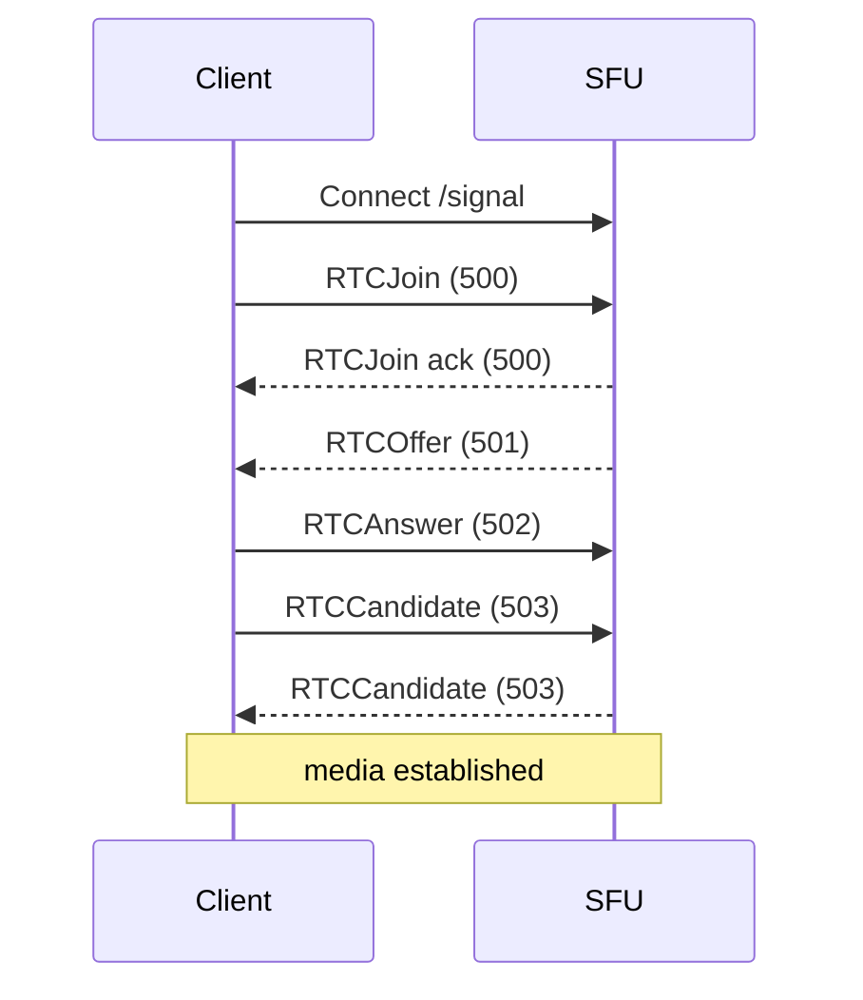
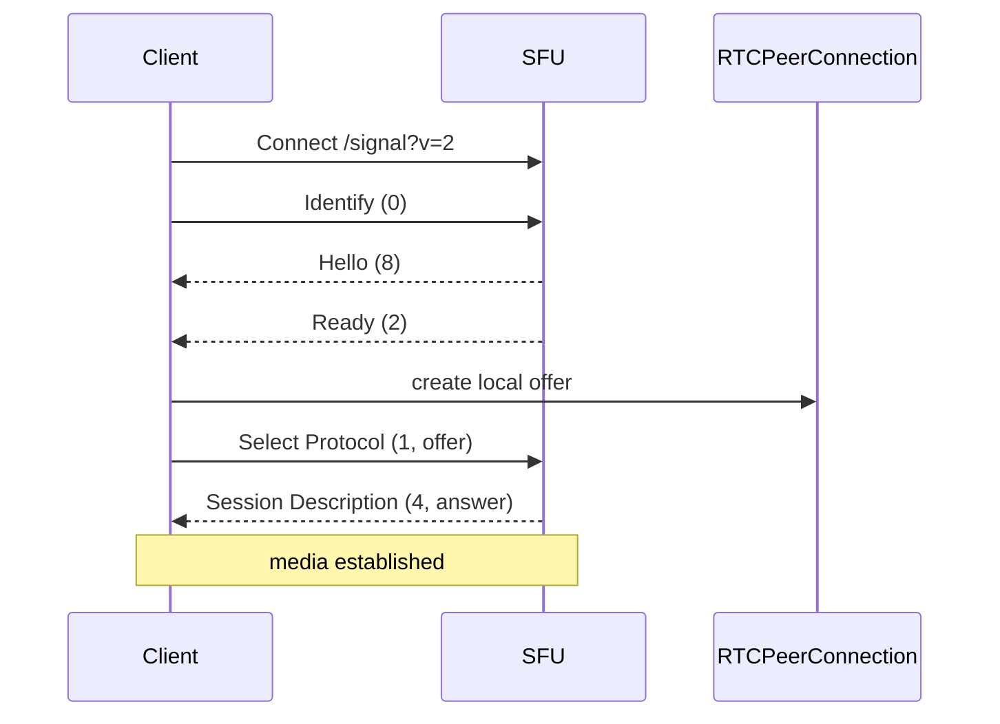
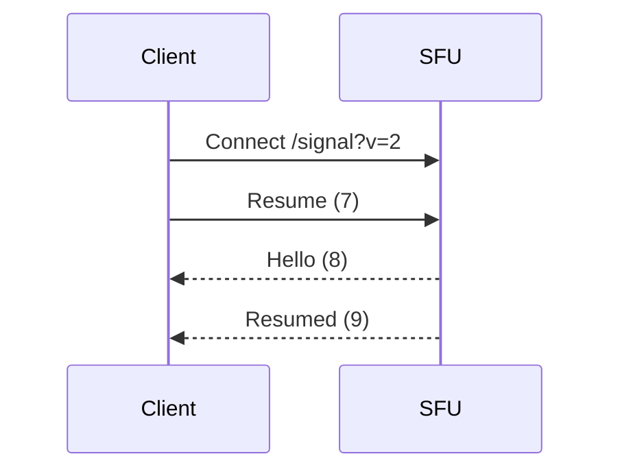

[<- Documentation](../README.md) - [Voice](README.md)

# Voice Connection Protocol

This document describes the end-to-end flow from `JoinVoice` to an established SFU media session.

## Overview

The REST join contract stays unchanged. The API still returns:

```json
{
  "sfu_url": "wss://sfu.gochat.io/signal",
  "sfu_token": "<jwt>"
}
```

The client then chooses a signaling version:

- `v=1`: legacy bootstrap, selected by `/signal` or `/signal?v=1`
- `v=2`: voice gateway signaling, selected by `/signal?v=2`

If the client later reconnects because of move, rebind, or transient failure, it should keep using the same signaling version it already negotiated.

## Transport Security Layer

The signaling flow described here bootstraps a normal WebRTC transport:

- ICE finds a path between client and SFU
- SDP carries DTLS fingerprint information
- DTLS negotiates keys
- SRTP encrypts media between the client and the SFU

Frontend implication:

- use the browser `RTCPeerConnection` flow as-is
- do not strip `a=fingerprint` or related DTLS SDP attributes
- expect DTLS to be handled inside the browser rather than in app-level code

See [DTLS Transport Security](DTLS.md) for the full browser and deployment guidance.

## JoinVoice REST Step

`POST /api/v1/guild/{guild_id}/voice/{channel_id}/join`

The API:

1. Validates membership and `PermVoiceConnect`.
2. Resolves the channel's SFU route.
3. Issues a short-lived SFU JWT with `user_id`, `channel_id`, `guild_id`, `perms`, and optional `moved`.
4. Returns `sfu_url` and `sfu_token`.

## Version Selection

| URL | Result |
|-----|--------|
| `/signal` | Uses `v=1` |
| `/signal?v=1` | Uses `v=1` |
| `/signal?v=2` | Uses `v=2` |
| `/signal?v=<anything else>` | HTTP `400`, no WebSocket upgrade |

## `v=1` Connection Flow


```mermaid
sequenceDiagram
    participant Client
    participant SFU

    Client->>SFU: Connect /signal
    Client->>SFU: RTCJoin (500)
    SFU-->>Client: RTCJoin ack (500)
    SFU-->>Client: RTCOffer (501)
    Client->>SFU: RTCAnswer (502)
    Client->>SFU: RTCCandidate (503)
    SFU-->>Client: RTCCandidate (503)
    Note over Client,SFU: media established
```

### `v=1` Notes

- The SFU creates the initial offer.
- Later renegotiation also stays on `501/502/503`.
- The older simple JSON compatibility messages are still accepted on `v=1`.

## `v=2` Connection Flow


```mermaid
sequenceDiagram
    participant Client
    participant SFU
    participant PC as RTCPeerConnection

    Client->>SFU: Connect /signal?v=2
    Client->>SFU: Identify (0)
    SFU-->>Client: Hello (8)
    SFU-->>Client: Ready (2)
    Client->>PC: create local offer
    Client->>SFU: Select Protocol (1, offer)
    SFU-->>Client: Session Description (4, answer)
    Note over Client,SFU: media established
```

### `v=2` Sequence

1. Client opens `/signal?v=2`.
2. Client sends `Identify (0)` with `channel_id`, `token`, and DAVE capability fields.
3. SFU validates the join token, block state, and DAVE policy.
4. SFU replies with `Hello (8)` and `Ready (2)`.
5. Client creates the local offer and sends `Select Protocol (1)`.
6. SFU applies the offer, synchronizes already-published channel tracks into the new peer, creates the answer, and replies with `Session Description (4)`.
7. After establishment, the SFU sends membership events `11` and `13`.
8. If DAVE is active, epoch and transition events use `21-31` plus binary `25-30`.

### Why `v=2` Exists

`v=2` separates bootstrap, renegotiation, and encrypted media coordination:

- the client owns the initial offer
- heartbeat is explicit
- membership is explicit through `11/13`
- DAVE state transitions have dedicated gateway opcodes
- public `v=2` no longer depends on the custom `op=7,t=*` RTC bootstrap

## Resume On `v=2`

`v=2` supports short reconnects:


```mermaid
sequenceDiagram
    participant Client
    participant SFU

    Client->>SFU: Connect /signal?v=2
    Client->>SFU: Resume (7)
    SFU-->>Client: Hello (8)
    SFU-->>Client: Resumed (9)
```

- The resume window is short-lived.
- The client must present the same `session_id`, `channel_id`, and valid join token.
- `Resumed (9)` includes the current `dave_protocol_version` and `dave_epoch`.

## Post-Connect Renegotiation

`v=1` and `v=2` now diverge here too:

- `v=1`: later renegotiation remains `RTCOffer (501) -> RTCAnswer (502) -> RTCCandidate (503)`
- `v=2`: later renegotiation reuses `Session Description (4)` from the SFU and `Select Protocol (1)` from the client

In practice, the SFU still uses the same channel revision and sender-sync engine internally; only the public wire differs.

## DAVE / E2EE Lifecycle

### Transport-Only To DAVE

1. All connected participants become DAVE-capable.
2. SFU sends `Prepare Epoch (24)` and binary `External Sender Package (25)`.
3. Clients send binary `Key Package (26)`.
4. SFU broadcasts binary `Proposals (27)`.
5. A committing member sends binary `Commit Welcome (28)`.
6. SFU broadcasts binary `Announce Commit Transition (29)` and targeted `Welcome (30)`.
7. Clients send `Transition Ready (23)`.
8. SFU sends `Execute Transition (22)`.

### DAVE To Transport-Only

1. A non-DAVE participant joins.
2. SFU sends `Prepare Transition (21)` with `protocol_version = 0`.
3. DAVE clients switch to passthrough receive mode and send `23`.
4. SFU sends `22`.

## Error Handling

### Shared Cases

| Case | Behavior |
|------|----------|
| Invalid or expired JWT | Re-run `JoinVoice` and reconnect |
| Blocked user | SFU rejects join / identify |
| Permission failure | UI should show a voice permission error |
| ICE failure | Client should surface reconnect state and retry |

### `v=2` Close Codes

| Code | Meaning |
|------|---------|
| `4001` | Unknown opcode |
| `4002` | Invalid payload |
| `4003` | Unauthorized or blocked |
| `4009` | Heartbeat timeout |
| `4016` | Resume session expired |
| `4017` | DAVE is required but unsupported |
| `4020` | Wrong phase |
| `4021` | Unsupported protocol |

## Media Routing Summary

- Remote streams are forwarded with `stream.id = "u:<user_id>"`.
- Remote track ids are normalized as `"<user_id>-<original_track_id>"`.
- Audio and video permission checks happen when the SFU receives inbound tracks.
- Server mute removes a user's published audio from the fan-out graph.
- Server deafen removes received media for the target peer.

## Timing Notes

| Setting | Value |
|---------|-------|
| Default signal heartbeat interval | `15000 ms` |
| DAVE transition timeout | `2000 ms` |
| DAVE old-ratchet retention window | `10000 ms` |
| Signaling debounce | `50 ms` |

## Scope Notes

- `v=1` remains unchanged and default.
- `v=2` carries the voice-gateway order and DAVE opcode surface for GoChat clients.
- Persistent identity verification UX is intentionally out of scope for this rollout.
