[<- Documentation](../README.md) - [Voice](README.md)

# SFU React Frontend Integration

This document describes how to integrate the gochat SFU (Selective Forwarding Unit) voice service with a React frontend.

## Overview

The SFU handles real-time voice and video communication using WebRTC. It acts as a media relay server that:
- Receives audio/video streams from clients
- Forwards streams to other participants in the same voice channel
- Broadcasts speaking indicators
- Enforces server-side mute/deafen

## Architecture

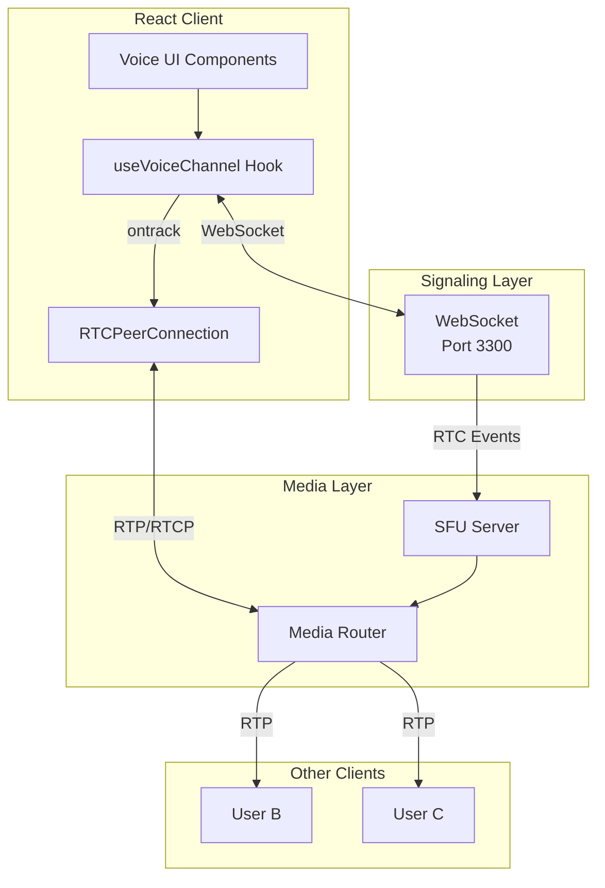

## Connection Flow

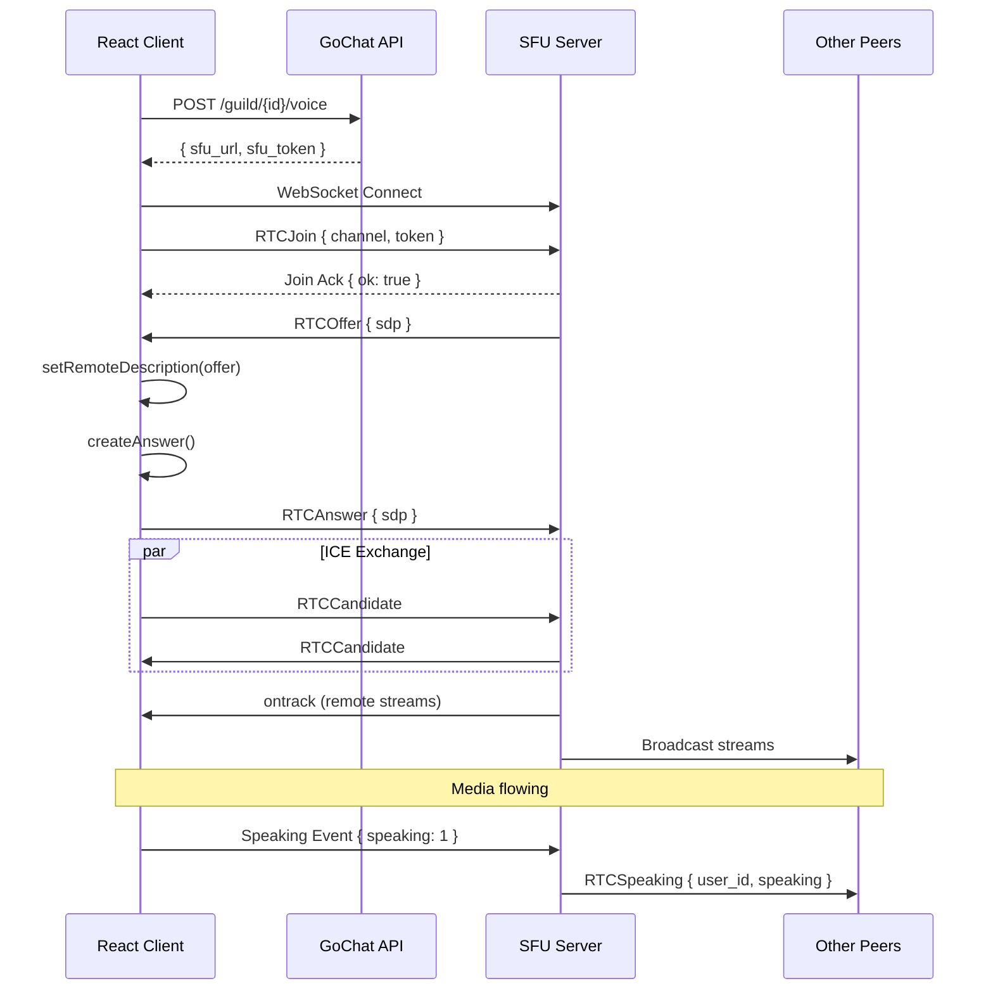

### Connection Steps

1. **Join Voice Channel** → Call API `POST /guild/{id}/voice` to get SFU token and URL
2. **Connect WebSocket** → Connect to SFU WebSocket (`wss://sfu.gochat.io/signal`)
3. **Send RTCJoin** → Authenticate with the short-lived token
4. **Handle Server Offer** → SFU sends SDP offer immediately after join
5. **Send Answer** → Create and send SDP answer
6. **Exchange ICE** → Exchange ICE candidates
7. **Media Flow** → Audio/video tracks are now flowing

## Getting User ID from Track

When a remote peer publishes audio/video, the SFU forwards it with metadata encoded in the stream ID. This allows you to identify which user each track belongs to.

### Stream ID Format

- **Stream ID**: `"u:<user_id>"` (e.g., `"u:2230469276416868352"`)
- **Track ID**: `"<user_id>-<original_track_id>"` (e.g., `"2230469276416868352-audio"`)

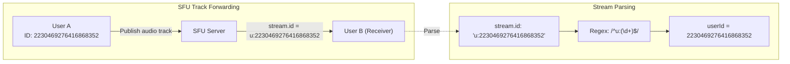

### React Hook Example

```typescript
import { useEffect, useRef, useCallback } from 'react';

interface RemotePeer {
  userId: number;
  stream: MediaStream;
  audioElement?: HTMLAudioElement;
  isSpeaking: boolean;
}

export function useVoiceChannel(
  channelId: number,
  sfuUrl: string,
  token: string,
  localStream: MediaStream | null
) {
  const pcRef = useRef<RTCPeerConnection | null>(null);
  const wsRef = useRef<WebSocket | null>(null);
  const [remotePeers, setRemotePeers] = useState<Map<number, RemotePeer>>(new Map());

  // Parse userId from stream
  const getUserIdFromStream = useCallback((stream: MediaStream): number | null => {
    // stream.id format: "u:2230469276416868352"
    const match = stream.id.match(/^u:(\d+)$/);
    if (match) {
      return parseInt(match[1], 10);
    }
    return null;
  }, []);

  // Handle incoming track
  const handleTrack = useCallback((event: RTCTrackEvent) => {
    const stream = event.streams[0];
    const userId = getUserIdFromStream(stream);

    if (!userId) {
      console.warn('Could not parse userId from stream:', stream.id);
      return;
    }

    console.log(`Received track from user ${userId}, kind: ${event.track.kind}`);

    setRemotePeers(prev => {
      const next = new Map(prev);
      const existing = next.get(userId);

      if (existing) {
        // Update existing peer's stream
        existing.stream = stream;
      } else {
        // Create new peer entry
        next.set(userId, {
          userId,
          stream,
          isSpeaking: false,
        });
      }

      return next;
    });
  }, [getUserIdFromStream]);

  // Create and configure peer connection
  const createPeerConnection = useCallback(() => {
    const pc = new RTCPeerConnection({
      iceServers: [
        { urls: 'stun:stun.l.google.com:19302' },
        // Add your TURN servers for NAT traversal
      ],
    });

    pc.ontrack = handleTrack;

    pc.onicecandidate = (event) => {
      if (event.candidate && wsRef.current) {
        wsRef.current.send(JSON.stringify({
          op: 7,
          t: 503, // RTCCandidate
          d: {
            candidate: event.candidate.candidate,
            sdpMid: event.candidate.sdpMid,
            sdpMLineIndex: event.candidate.sdpMLineIndex,
          }
        }));
      }
    };

    // Add local tracks
    if (localStream) {
      localStream.getTracks().forEach(track => {
        pc.addTrack(track, localStream);
      });
    }

    return pc;
  }, [handleTrack, localStream]);

  // Connect to SFU
  useEffect(() => {
    if (!sfuUrl || !token) return;

    const ws = new WebSocket(sfuUrl);
    wsRef.current = ws;

    ws.onopen = () => {
      // Send RTCJoin
      ws.send(JSON.stringify({
        op: 7,
        t: 500, // RTCJoin
        d: {
          channel: channelId,
          token: token,
        }
      }));
    };

    ws.onmessage = async (event) => {
      const msg = JSON.parse(event.data);

      switch (msg.t) {
        case 500: // Join Ack
          console.log('Joined voice channel successfully');
          break;

        case 501: // RTCOffer (from server)
          if (!pcRef.current) {
            pcRef.current = createPeerConnection();
          }
          await pcRef.current.setRemoteDescription({
            type: 'offer',
            sdp: msg.d.sdp,
          });
          const answer = await pcRef.current.createAnswer();
          await pcRef.current.setLocalDescription(answer);
          ws.send(JSON.stringify({
            op: 7,
            t: 502, // RTCAnswer
            d: { sdp: answer.sdp }
          }));
          break;

        case 503: // RTCCandidate
          if (pcRef.current && msg.d.candidate) {
            await pcRef.current.addIceCandidate({
              candidate: msg.d.candidate,
              sdpMid: msg.d.sdpMid,
              sdpMLineIndex: msg.d.sdpMLineIndex,
            });
          }
          break;

        case 514: // RTCSpeaking
          // Handle speaking indicator - see next section
          handleSpeakingEvent(msg.d);
          break;
      }
    };

    return () => {
      ws.close();
      pcRef.current?.close();
    };
  }, [channelId, sfuUrl, token, createPeerConnection]);

  return { remotePeers };
}
```

## Speaking Events

The SFU broadcasts speaking indicators to all clients when a user starts or stops speaking.

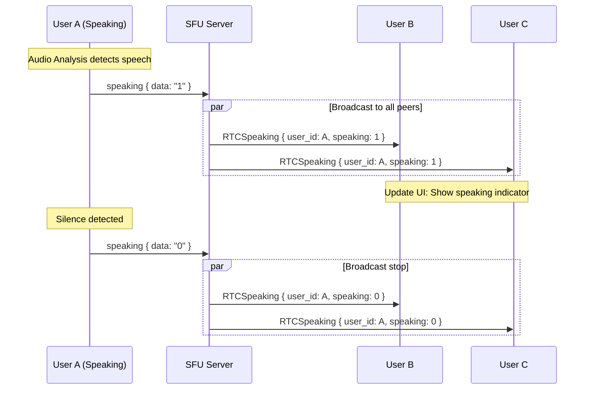

### Event Format

```json
{
  "op": 7,
  "t": 514,
  "d": {
    "user_id": 2230469276416868352,
    "speaking": 1
  }
}
```

| Field | Type | Description |
|-------|------|-------------|
| `user_id` | int64 | The user who is speaking |
| `speaking` | int | `1` = speaking, `0` = not speaking |

### Sending Speaking Indicator

To notify others when you're speaking, send:

```typescript
// Simple format (recommended)
ws.send(JSON.stringify({
  event: 'speaking',
  data: '1'  // or '0' to indicate stopped speaking
}));

// Alternative: Full envelope format
ws.send(JSON.stringify({
  op: 7,
  t: 514,
  d: { speaking: 1 }
}));
```

> [!NOTE]
> The SFU does not automatically detect speaking. Your client must analyze audio levels and send speaking events.

### Speaking Detection Flow

```mermaid
graph LR
    subgraph "Audio Analysis Pipeline"
        direction TB
        Stream["Local MediaStream"]
        Source["MediaStreamSource"]
        Analyser["AnalyserNode"]
        Data["Frequency Data"]
        Calc["Calculate dB Level"]
        Threshold["Threshold Check"]
        State["Update isSpeaking"]
    end

    subgraph "SFU Notification"
        WS[WebSocket]
        Broadcast[Broadcast to Peers]
    end

    Stream --> Source
    Source --> Analyser
    Analyser -->|getByteFrequencyData| Data
    Data --> Calc
    Calc -->|db > threshold| Threshold
    Threshold -->|State Change| State
    State -->|Send Event| WS
    WS -->|speaking: 1/0| Broadcast

    style Analyser fill:#f9f,stroke:#333
    style WS fill:#bbf,stroke:#333
```

### React Speaking Detection Hook

```typescript
import { useEffect, useRef, useState, useCallback } from 'react';

export function useSpeakingDetector(
  localStream: MediaStream | null,
  ws: WebSocket | null,
  threshold: number = -50 // dB
) {
  const [isSpeaking, setIsSpeaking] = useState(false);
  const analyserRef = useRef<AnalyserNode | null>(null);
  const intervalRef = useRef<NodeJS.Timeout | null>(null);
  const lastSpeakingRef = useRef<boolean>(false);

  const detectSpeaking = useCallback(() => {
    if (!analyserRef.current || !ws) return;

    const dataArray = new Uint8Array(analyserRef.current.frequencyBinCount);
    analyserRef.current.getByteFrequencyData(dataArray);

    // Calculate average volume
    const average = dataArray.reduce((a, b) => a + b) / dataArray.length;
    const db = 20 * Math.log10(average / 255);

    const currentlySpeaking = db > threshold;

    if (currentlySpeaking !== lastSpeakingRef.current) {
      lastSpeakingRef.current = currentlySpeaking;
      setIsSpeaking(currentlySpeaking);

      // Send speaking event to SFU
      ws.send(JSON.stringify({
        event: 'speaking',
        data: currentlySpeaking ? '1' : '0'
      }));
    }
  }, [ws, threshold]);

  useEffect(() => {
    if (!localStream) return;

    const audioTrack = localStream.getAudioTracks()[0];
    if (!audioTrack) return;

    const audioContext = new AudioContext();
    const source = audioContext.createMediaStreamSource(localStream);
    const analyser = audioContext.createAnalyser();

    analyser.fftSize = 256;
    analyser.smoothingTimeConstant = 0.8;
    source.connect(analyser);

    analyserRef.current = analyser;

    // Check speaking state every 100ms
    intervalRef.current = setInterval(detectSpeaking, 100);

    return () => {
      if (intervalRef.current) {
        clearInterval(intervalRef.current);
      }
      audioContext.close();
    };
  }, [localStream, detectSpeaking]);

  return isSpeaking;
}
```

### Receiving Speaking Events

```typescript
const handleSpeakingEvent = useCallback((data: { user_id: number; speaking: number }) => {
  const { user_id, speaking } = data;
  const isSpeaking = speaking === 1;

  setRemotePeers(prev => {
    const next = new Map(prev);
    const peer = next.get(user_id);
    if (peer) {
      peer.isSpeaking = isSpeaking;
    }
    return next;
  });
}, []);
```

## React Component Architecture

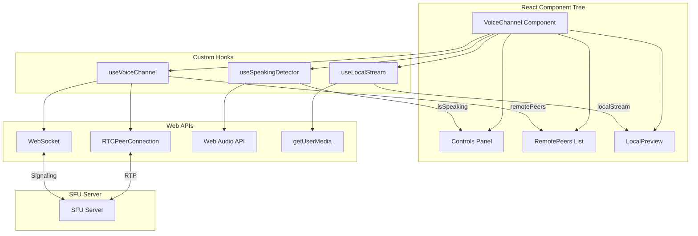

## Complete React Component Example

```tsx
import React, { useState, useEffect, useCallback, useRef } from 'react';

interface VoiceChannelProps {
  channelId: number;
  guildId: number;
  apiToken: string;
}

export const VoiceChannel: React.FC<VoiceChannelProps> = ({ channelId, guildId, apiToken }) => {
  const [connectionState, setConnectionState] = useState<'idle' | 'connecting' | 'connected'>('idle');
  const [localStream, setLocalStream] = useState<MediaStream | null>(null);
  const [remotePeers, setRemotePeers] = useState<Map<number, RemotePeer>>(new Map());
  const [muted, setMuted] = useState(false);
  const [deafened, setDeafened] = useState(false);

  const pcRef = useRef<RTCPeerConnection | null>(null);
  const wsRef = useRef<WebSocket | null>(null);
  const localAudioRef = useRef<HTMLAudioElement>(null);

  // Parse userId from stream
  const getUserIdFromStream = useCallback((stream: MediaStream): number | null => {
    const match = stream.id.match(/^u:(\d+)$/);
    return match ? parseInt(match[1], 10) : null;
  }, []);

  // Handle speaking events
  const handleSpeakingEvent = useCallback((data: { user_id: number; speaking: number }) => {
    setRemotePeers(prev => {
      const next = new Map(prev);
      const peer = next.get(data.user_id);
      if (peer) {
        peer.isSpeaking = data.speaking === 1;
      }
      return next;
    });
  }, []);

  // Join voice channel
  const joinChannel = useCallback(async () => {
    setConnectionState('connecting');

    try {
      // 1. Get media permissions
      const stream = await navigator.mediaDevices.getUserMedia({
        audio: true,
        video: false, // Set to true for video
      });
      setLocalStream(stream);

      // 2. Call API to get SFU token
      const response = await fetch(`/api/guild/${guildId}/voice`, {
        method: 'POST',
        headers: {
          'Content-Type': 'application/json',
          'Authorization': `Bearer ${apiToken}`,
        },
        body: JSON.stringify({ channel_id: channelId }),
      });
      const { sfu_url, sfu_token } = await response.json();

      // 3. Connect to SFU WebSocket
      const ws = new WebSocket(sfu_url);
      wsRef.current = ws;

      ws.onopen = () => {
        ws.send(JSON.stringify({
          op: 7,
          t: 500,
          d: { channel: channelId, token: sfu_token }
        }));
      };

      ws.onmessage = async (event) => {
        const msg = JSON.parse(event.data);

        switch (msg.t) {
          case 500: // Join Ack
            console.log('Joined voice channel');
            setConnectionState('connected');
            break;

          case 501: // RTCOffer
            if (!pcRef.current) {
              pcRef.current = createPeerConnection(stream, ws);
            }
            await pcRef.current.setRemoteDescription({
              type: 'offer',
              sdp: msg.d.sdp,
            });
            const answer = await pcRef.current.createAnswer();
            await pcRef.current.setLocalDescription(answer);
            ws.send(JSON.stringify({
              op: 7,
              t: 502,
              d: { sdp: answer.sdp }
            }));
            break;

          case 503: // RTCCandidate
            if (pcRef.current && msg.d.candidate) {
              await pcRef.current.addIceCandidate(msg.d);
            }
            break;

          case 505: // Server mute notification
            setMuted(msg.d.muted);
            break;

          case 506: // Server deafen notification
            setDeafened(msg.d.deafened);
            break;

          case 514: // Speaking event
            handleSpeakingEvent(msg.d);
            break;
        }
      };

    } catch (error) {
      console.error('Failed to join voice channel:', error);
      setConnectionState('idle');
    }
  }, [channelId, guildId, apiToken, handleSpeakingEvent]);

  // Create peer connection
  const createPeerConnection = (stream: MediaStream, ws: WebSocket) => {
    const pc = new RTCPeerConnection({
      iceServers: [{ urls: 'stun:stun.l.google.com:19302' }],
    });

    // Add local tracks
    stream.getTracks().forEach(track => {
      pc.addTrack(track, stream);
    });

    // Handle remote tracks
    pc.ontrack = (event) => {
      const stream = event.streams[0];
      const userId = getUserIdFromStream(stream);

      if (userId) {
        setRemotePeers(prev => {
          const next = new Map(prev);
          next.set(userId, {
            userId,
            stream,
            isSpeaking: false,
          });
          return next;
        });
      }
    };

    // Send ICE candidates
    pc.onicecandidate = (event) => {
      if (event.candidate) {
        ws.send(JSON.stringify({
          op: 7,
          t: 503,
          d: {
            candidate: event.candidate.candidate,
            sdpMid: event.candidate.sdpMid,
            sdpMLineIndex: event.candidate.sdpMLineIndex,
          }
        }));
      }
    };

    return pc;
  };

  // Toggle mute
  const toggleMute = useCallback(() => {
    if (localStream) {
      const audioTrack = localStream.getAudioTracks()[0];
      if (audioTrack) {
        audioTrack.enabled = !audioTrack.enabled;
        setMuted(!audioTrack.enabled);

        // Notify SFU
        wsRef.current?.send(JSON.stringify({
          op: 7,
          t: 505,
          d: { muted: !audioTrack.enabled }
        }));
      }
    }
  }, [localStream]);

  // Leave channel
  const leaveChannel = useCallback(() => {
    wsRef.current?.send(JSON.stringify({ op: 7, t: 504, d: {} }));
    wsRef.current?.close();
    pcRef.current?.close();
    localStream?.getTracks().forEach(track => track.stop());
    setLocalStream(null);
    setRemotePeers(new Map());
    setConnectionState('idle');
  }, [localStream]);

  return (
    <div className="voice-channel">
      <div className="controls">
        {connectionState === 'idle' ? (
          <button onClick={joinChannel}>Join Voice</button>
        ) : (
          <>
            <button onClick={toggleMute}>
              {muted ? 'Unmute' : 'Mute'}
            </button>
            <button onClick={leaveChannel}>Disconnect</button>
          </>
        )}
      </div>

      {/* Local audio (for monitoring, usually muted) */}
      {localStream && (
        <audio
          ref={localAudioRef}
          srcObject={localStream}
          muted
          autoPlay
        />
      )}

      {/* Remote peers */}
      <div className="remote-peers">
        {Array.from(remotePeers.values()).map(peer => (
          <div
            key={peer.userId}
            className={`peer ${peer.isSpeaking ? 'speaking' : ''}`}
          >
            <span>User {peer.userId}</span>
            {peer.isSpeaking && <span className="speaking-indicator">🎤</span>}
            <audio
              srcObject={peer.stream}
              autoPlay
              playsInline
            />
          </div>
        ))}
      </div>
    </div>
  );
};
```

## Connection State Machine

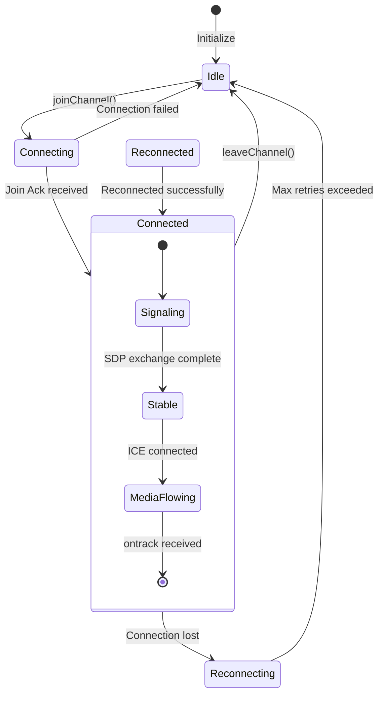

## Data Flow: Track to User Mapping

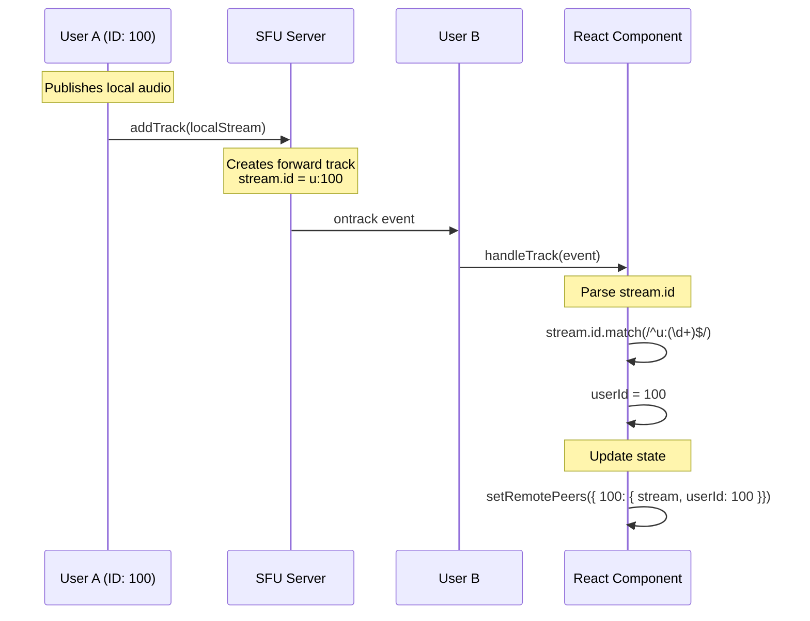

## Voice State / Presence Integration

To let other users know when you're muted or deafened, you need to update your presence via the **Gateway WebSocket** (`/subscribe`), not the SFU WebSocket. The SFU handles audio routing, while presence handles visibility of your voice state to others.

### Updating Mute/Deafen Status

Send an **OP 3 Presence Update** to the Gateway WebSocket:

```typescript
// Gateway WebSocket (port 3100) - NOT the SFU WebSocket
gatewayWs.send(JSON.stringify({
  op: 3,
  d: {
    status: 'online',              // Your current status
    voice_channel_id: channelId,   // Current voice channel
    mute: true,                    // true = muted, false = unmuted
    deafen: false                  // true = deafened, false = undeafened
  }
}));
```

**Important:** Only send `mute` and `deafen` fields when you're in a voice channel (`voice_channel_id` is set).

### What Other Users Receive

When you update your voice state, other users receive:

1. **Presence Update (OP 3)** — Sent to users who subscribed to your presence:
```json
{
  "op": 3,
  "d": {
    "user_id": 2226021950625415200,
    "status": "online",
    "since": 1700000000,
    "voice_channel_id": 2230469276416868352,
    "mute": true,
    "deafen": false
  }
}
```

2. **Voice State Update (t=209)** — Broadcast to all guild members:
```json
{
  "op": 0,
  "t": 209,
  "d": {
    "guild_id": 2226022078304223200,
    "user_id": 2226021950625415200,
    "channel_id": 2230469276416868352,
    "mute": true,
    "deafen": false
  }
}
```

### React Hook Example

```typescript
import { useCallback } from 'react';

export function useVoiceState(
  gatewayWs: WebSocket | null,
  channelId: number | null
) {
  const setMute = useCallback((muted: boolean) => {
    if (!gatewayWs || !channelId) return;
    
    gatewayWs.send(JSON.stringify({
      op: 3,
      d: {
        status: 'online',
        voice_channel_id: channelId,
        mute: muted
      }
    }));
  }, [gatewayWs, channelId]);

  const setDeafen = useCallback((deafened: boolean) => {
    if (!gatewayWs || !channelId) return;
    
    gatewayWs.send(JSON.stringify({
      op: 3,
      d: {
        status: 'online',
        voice_channel_id: channelId,
        deafen: deafened
      }
    }));
  }, [gatewayWs, channelId]);

  return { setMute, setDeafen };
}
```

### Architecture Flow

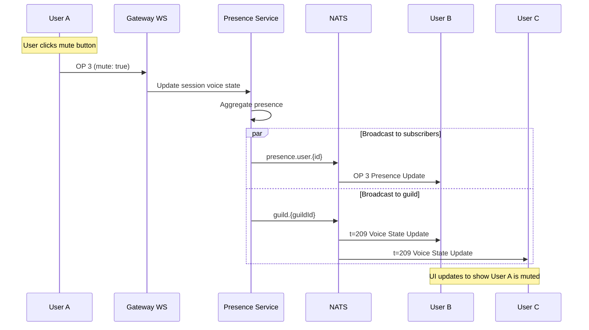

### Differences: SFU Mute vs Presence Mute

| Aspect | SFU Mute (t=505) | Presence Mute (OP 3) |
|--------|------------------|---------------------|
| **WebSocket** | SFU (`/signal`) | Gateway (`/subscribe`) |
| **Effect** | Stops sending audio RTP | Shows mute icon to others |
| **Required?** | Yes, for actual mute | Yes, for UI indication |
| **Permissions** | None (self) | None (self) |

**Best Practice:** Update both when user mutes themselves:
1. Send to SFU to stop audio transmission (immediate)
2. Send OP 3 to update presence (for UI)

## Event Reference

### Client → SFU Events

| t | Name | Payload | Description |
|---|------|---------|-------------|
| 500 | RTCJoin | `{ channel, token }` | Join a voice channel |
| 502 | RTCAnswer | `{ sdp }` | SDP answer |
| 503 | RTCCandidate | `{ candidate, sdpMid, sdpMLineIndex }` | ICE candidate |
| 504 | RTCLeave | `{}` | Leave channel |
| 505 | RTCMuteSelf | `{ muted }` | Toggle self-mute |
| 506 | RTCMuteUser | `{ user, muted }` | Locally mute a user |

### SFU → Client Events

| t | Name | Payload | Description |
|---|------|---------|-------------|
| 500 | RTCJoin Ack | `{ ok }` | Join confirmed |
| 501 | RTCOffer | `{ sdp }` | SDP offer from server |
| 503 | RTCCandidate | `{ candidate, ... }` | ICE candidate |
| 505 | RTCServerMuteUser | `{ user_id, muted }` | Server muted user |
| 506 | RTCServerDeafenUser | `{ user_id, deafened }` | Server deafened user |
| 507 | RTCServerKickUser | `{ user_id }` | User was kicked |
| 512 | RTCMoved | `{ channel }` | User moved to new channel |
| 514 | RTCSpeaking | `{ user_id, speaking }` | Speaking indicator |

### Event Flow Diagram

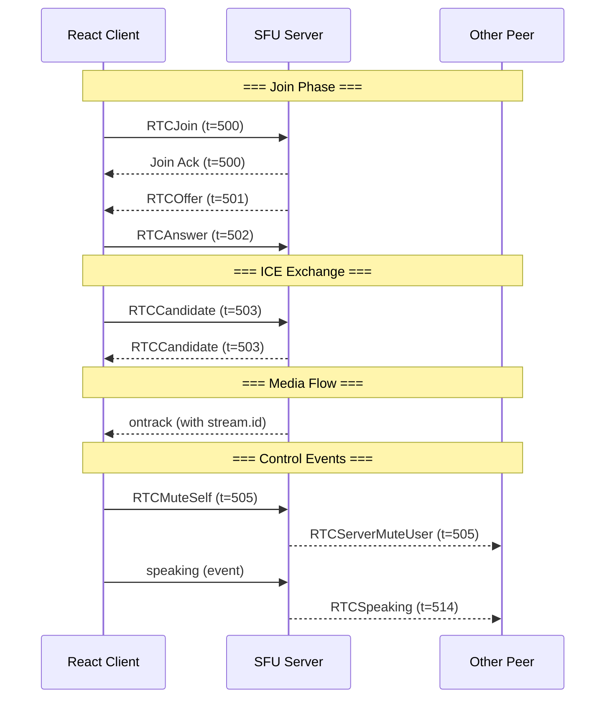

## Error Handling

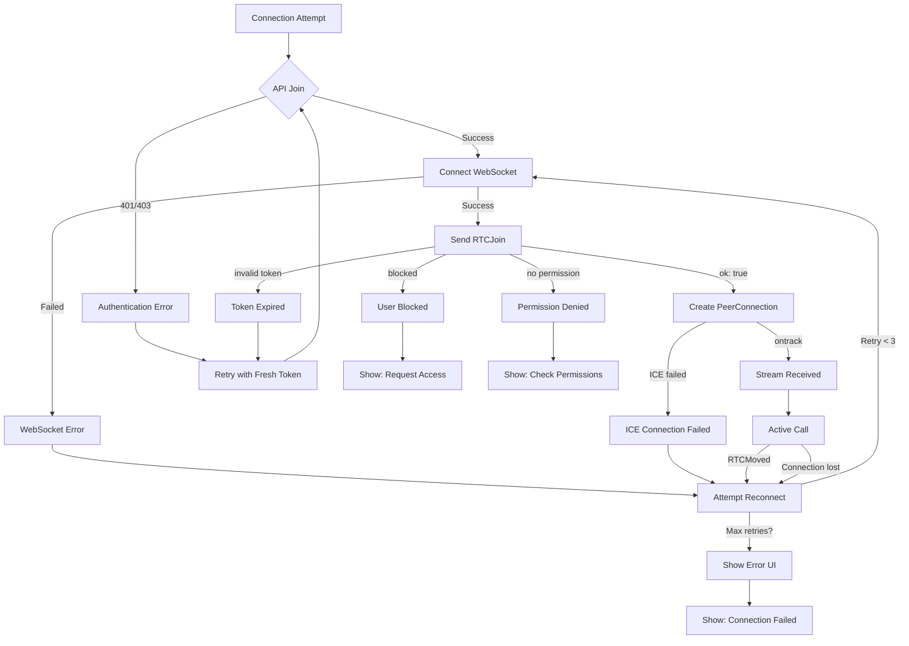

Common errors and their solutions:

| Error | Cause | Solution |
|-------|-------|----------|
| `invalid token` | Token expired or malformed | Re-call API to get fresh token |
| `blocked` | User is blocked from channel | Request unblock from moderator |
| `no PermVoiceConnect` | Missing permission | Check guild permissions |
| `rejecting audio track` | Server muted or no speak permission | Unmute or request permissions |

## Best Practices

1. **Always use the stream ID** to map tracks to users, not track IDs
2. **Implement speaking detection** using Web Audio API for better UX
3. **Handle reconnection** - SFU may send `t=512` (moved) requiring reconnect
4. **Clean up resources** - Close WebSocket and PeerConnection on unmount
5. **Use TURN servers** for users behind restrictive NATs
6. **Debounce speaking events** - Don't send more than 10 events per second
