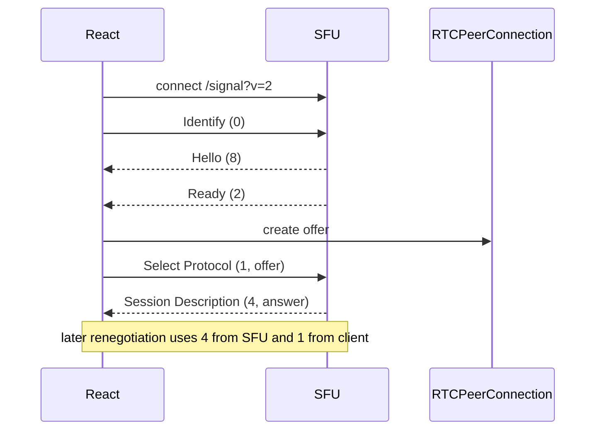

[<- Documentation](../README.md) - [Voice](README.md)

# SFU React Integration

This document shows the recommended frontend integration for the SFU signaling service.

## Recommendation

Use signaling `v=2` for new clients.

- `v=2` gives you an explicit voice gateway contract
- the client owns the initial SDP offer
- membership and DAVE transitions have dedicated opcodes
- resume is built into the same socket

Keep `v=1` support only if you still need compatibility with older clients.

## Build The Signal URL

The API still returns `sfu_url` and `sfu_token`. Opt into `v=2` by appending the query parameter on the client:

```ts
export function buildSignalUrl(baseUrl: string, version: 1 | 2 = 2) {
  const url = new URL(baseUrl);
  if (version === 2) {
    url.searchParams.set("v", "2");
  }
  return url.toString();
}
```

- `buildSignalUrl(sfuUrl, 2)` -> `.../signal?v=2`
- `buildSignalUrl(sfuUrl, 1)` -> `.../signal`

If the client reconnects because of move or rebind, build the next URL with the same version it was already using.

## Recommended `v=2` Flow


```mermaid
sequenceDiagram
    participant React
    participant SFU
    participant PC as RTCPeerConnection

    React->>SFU: connect /signal?v=2
    React->>SFU: Identify (0)
    SFU-->>React: Hello (8)
    SFU-->>React: Ready (2)
    React->>PC: create offer
    React->>SFU: Select Protocol (1, offer)
    SFU-->>React: Session Description (4, answer)
    Note over React,SFU: later renegotiation uses 4 from SFU and 1 from client
```

## Hook Skeleton

```ts
import { useEffect, useRef, useState } from "react";

type GatewayPacket = {
  op: number;
  d?: any;
};

export function useVoiceConnection({
  channelId,
  sfuUrl,
  sfuToken,
  localStream,
}: {
  channelId: number;
  sfuUrl: string;
  sfuToken: string;
  localStream: MediaStream | null;
}) {
  const wsRef = useRef<WebSocket | null>(null);
  const pcRef = useRef<RTCPeerConnection | null>(null);
  const heartbeatRef = useRef<number | null>(null);
  const sessionIdRef = useRef<string | null>(null);
  const rtcConnectionIdRef = useRef(crypto.randomUUID());
  const [remotePeers, setRemotePeers] = useState(new Map<number, MediaStream>());

  useEffect(() => {
    if (!sfuUrl || !sfuToken) {
      return;
    }

    const ws = new WebSocket(buildSignalUrl(sfuUrl, 2));
    ws.binaryType = "arraybuffer";
    wsRef.current = ws;

    function send(op: number, d?: any) {
      ws.send(JSON.stringify({ op, d }));
    }

    async function ensurePeerConnection(iceServers: RTCIceServer[]) {
      if (pcRef.current) {
        return pcRef.current;
      }

      const pc = new RTCPeerConnection({ iceServers });
      pcRef.current = pc;

      pc.ontrack = (event) => {
        const stream = event.streams[0];
        const userId = getUserIdFromStream(stream);
        if (!userId) {
          return;
        }
        setRemotePeers((prev) => {
          const next = new Map(prev);
          next.set(userId, stream);
          return next;
        });
      };

      if (localStream) {
        for (const track of localStream.getTracks()) {
          pc.addTrack(track, localStream);
        }
      }

      return pc;
    }

    ws.onopen = () => {
      send(0, {
        channel_id: channelId,
        token: sfuToken,
        max_dave_protocol_version: 1,
        supports_encoded_transforms: true,
        video: Boolean(localStream?.getVideoTracks().length),
      });
    };

    ws.onmessage = async (event) => {
      if (typeof event.data !== "string") {
        await handleBinaryDaveMessage(event.data as ArrayBuffer);
        return;
      }

      const msg = JSON.parse(event.data) as GatewayPacket;

      switch (msg.op) {
        case 8: {
          sessionIdRef.current = msg.d.session_id;
          const interval = msg.d.heartbeat_interval as number;
          heartbeatRef.current = window.setInterval(() => {
            send(3, { t: Date.now() });
          }, interval);
          break;
        }

        case 2: {
          const pc = await ensurePeerConnection(msg.d.ice_servers);
          const offer = await pc.createOffer();
          await pc.setLocalDescription(offer);

          send(1, {
            protocol: "webrtc",
            type: "offer",
            sdp: pc.localDescription?.sdp,
            rtc_connection_id: rtcConnectionIdRef.current,
          });
          break;
        }

        case 4: {
          const pc = pcRef.current;
          if (!pc) {
            break;
          }
          await pc.setRemoteDescription({
            type: msg.d.type,
            sdp: msg.d.sdp,
          });

          if (msg.d.type === "offer") {
            const answer = await pc.createAnswer();
            await pc.setLocalDescription(answer);
            send(1, {
              protocol: "webrtc",
              type: "answer",
              sdp: pc.localDescription?.sdp,
              rtc_connection_id: msg.d.rtc_connection_id,
            });
          }
          break;
        }

        case 5: {
          // Speaking event: { user_id, speaking }
          break;
        }

        case 9: {
          // Resume success: { session_id, dave_protocol_version, dave_epoch }
          break;
        }

        case 11: {
          // Clients connect: { user_ids: ["42"] }
          break;
        }

        case 13: {
          // Client disconnect: { user_id: "42" }
          break;
        }

        case 21:
        case 22:
        case 23:
        case 24:
        case 31: {
          await handleDaveJsonMessage(msg);
          break;
        }
      }
    };

    return () => {
      if (heartbeatRef.current !== null) {
        window.clearInterval(heartbeatRef.current);
      }
      ws.close();
      pcRef.current?.close();
      pcRef.current = null;
    };
  }, [channelId, sfuUrl, sfuToken, localStream]);

  return { remotePeers };
}
```

## DAVE Client Notes

For DAVE-capable `v=2` clients:

1. Attach encoded transforms from the start.
2. Start in passthrough mode.
3. When `Session Description (4)` carries `dave_protocol_version = 1`, be ready to send `Key Package (26)` if the gateway later requests group creation.
4. Handle JSON opcodes `21-24` and `31`.
5. Handle binary opcodes `25-30`.
6. Send `Transition Ready (23)` only after the receive-side decryptors are prepared.

The current server expects opaque MLS payload bytes for binary `26` and `28`. The gateway controls transition timing and membership, but GoChat clients should not assume Discord service interoperability.

## Speaking Events

`v=2` speaking uses `op=5`:

```ts
ws.send(JSON.stringify({
  op: 5,
  d: { speaking: 1 }
}));
```

The SFU broadcasts:

```json
{
  "op": 5,
  "d": {
    "user_id": "42",
    "speaking": 1
  }
}
```

## Track To User Mapping

The SFU forwards streams with a stream id that embeds the sender's user id:

- `stream.id = "u:<user_id>"`
- `track.id = "<user_id>-<original_track_id>"`

Use the stream id, not the track id, to attach media to UI state:

```ts
export function getUserIdFromStream(stream: MediaStream): number | null {
  const match = stream.id.match(/^u:(\d+)$/);
  return match ? Number(match[1]) : null;
}
```

## `v=1` Fallback

If you need the legacy flow:

1. Connect to `/signal` or `/signal?v=1`
2. Send `RTCJoin`
3. Wait for `RTCOffer (501)`
4. Send `RTCAnswer (502)`
5. Continue with `RTCCandidate (503)`

## Error Handling

Recommended client handling:

- close codes `4001-4021` on `v=2`: close the socket and retry only when the code is retryable for your UI flow
- invalid or expired token: call `JoinVoice` again for a fresh token
- ICE failure: surface reconnect state and retry the whole voice connection
- move or rebind: reconnect using the same signaling version as before

## Best Practices

1. Prefer `v=2` for all new frontend work.
2. Start the heartbeat loop only after `Hello (8)`.
3. Build the peer connection from `Ready.ice_servers`, not hard-coded STUN values.
4. Add local tracks before creating the initial `v=2` offer.
5. Keep handling `Session Description (4)` with both `offer` and `answer` types.
6. Treat binary `25-30` as part of the DAVE state machine, not generic media.
7. Reconnect with the same signaling version you were already using.
