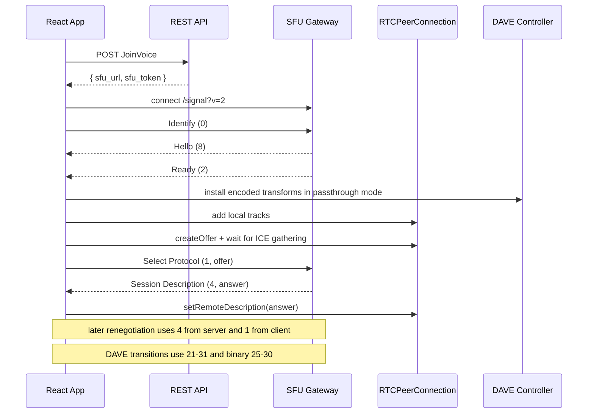
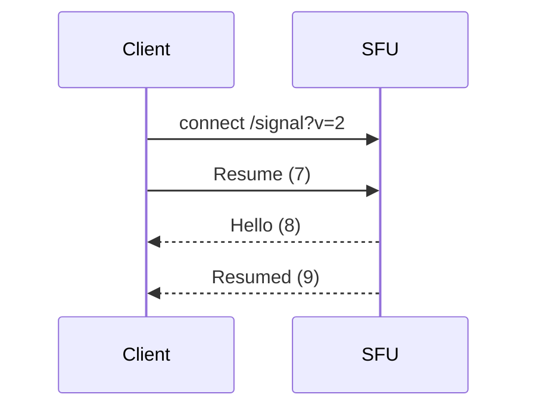

[<- Documentation](../README.md) - [Voice](README.md)

# SFU v2 + DAVE React Frontend Guide

This guide is for React clients that connect to GoChat voice through `/signal?v=2`.

It focuses on the frontend implementation shape:

- how to join voice and open the socket
- how to run the `v=2` gateway state machine
- how to handle WebRTC bootstrap and later renegotiation
- how to wire DAVE encoded transforms without coupling the whole app to MLS details

For the full wire contract, also read [Connection Protocol](ConnectionProtocol.md), [DTLS Transport Security](DTLS.md), [SFU WebSocket Protocol](SFUProtocol.md), and [Voice End-to-End Encryption](VoiceEncryption.md).

## Use `v=2` For New React Clients

Use signaling `v=2` unless you are maintaining an older client that still depends on the legacy server-offer bootstrap.

Why `v=2` is the right frontend target:

- the client owns the initial SDP offer
- the websocket has a stable voice-gateway contract
- reconnect and resume use the same socket model
- membership changes have dedicated events
- DAVE upgrade and downgrade are explicit instead of being mixed into generic RTC signaling

`v=1` should be treated as compatibility mode, not the default design target for new UI work.

## Recommended Frontend Structure

Keep the protocol engine out of React components. A good split is:

```text
src/voice/
  joinVoice.ts              // REST call that returns sfu_url and sfu_token
  buildSignalUrl.ts         // adds ?v=2
  gatewayTypes.ts           // JSON packet types and op constants
  gatewayClient.ts          // websocket lifecycle, heartbeat, resume, speaking
  rtcPeer.ts                // RTCPeerConnection, local tracks, renegotiation
  participants.ts           // user/session/media mapping for UI state
  dave/
    daveController.ts       // transition state machine and browser feature detection
    daveWorker.ts           // MLS and binary opcode handling off the main thread
    encodedTransform.ts     // sender/receiver transform adapters
  useVoiceConnection.ts     // React hook that glues everything together
```

Recommended ownership:

- `gatewayClient.ts` knows websocket opcodes and phases, but not React state
- `rtcPeer.ts` knows SDP and media tracks, but not DAVE group logic
- `daveController.ts` knows DAVE transitions and worker calls, but not socket retry policy
- `useVoiceConnection.ts` coordinates them and exposes a simple UI-facing model

That separation keeps the app maintainable when we add screen share, device switching, or stricter MLS validation later.

## End-To-End Flow


```mermaid
sequenceDiagram
    participant React as React App
    participant API as REST API
    participant WS as SFU Gateway
    participant PC as RTCPeerConnection
    participant DAVE as DAVE Controller

    React->>API: POST JoinVoice
    API-->>React: { sfu_url, sfu_token }
    React->>WS: connect /signal?v=2
    React->>WS: Identify (0)
    WS-->>React: Hello (8)
    WS-->>React: Ready (2)
    React->>DAVE: install encoded transforms in passthrough mode
    React->>PC: add local tracks
    React->>PC: createOffer + wait for ICE gathering
    React->>WS: Select Protocol (1, offer)
    WS-->>React: Session Description (4, answer)
    React->>PC: setRemoteDescription(answer)
    Note over React,WS: later renegotiation uses 4 from server and 1 from client
    Note over React,WS: DAVE transitions use 21-31 and binary 25-30
```

## Step 1: Join Voice

The REST contract does not change for `v=2`. The client still receives:

```json
{
  "sfu_url": "wss://.../signal",
  "sfu_token": "<jwt>"
}
```

Build the socket URL like this:

```ts
export function buildSignalUrl(baseUrl: string, version: 1 | 2 = 2) {
  const url = new URL(baseUrl);
  if (version === 2) {
    url.searchParams.set("v", "2");
  }
  return url.toString();
}
```

Rules:

- `/signal` and `/signal?v=1` use the legacy flow
- `/signal?v=2` uses the voice-gateway flow described here
- if the client reconnects after move, rebind, or transient network loss, keep using the same signaling version

## Step 2: Detect DAVE Capability Before Connecting

The `Identify (0)` packet should reflect real browser capability.

Recommended rule:

- if encoded transforms are supported, send `supports_encoded_transforms: true` and `max_dave_protocol_version: 1`
- otherwise send `supports_encoded_transforms: false` and `max_dave_protocol_version: 0`

Example feature detection:

```ts
export function supportsEncodedTransforms() {
  const anyWindow = window as typeof window & {
    RTCRtpScriptTransform?: unknown;
  };

  const senderProto = RTCRtpSender.prototype as RTCRtpSender & {
    createEncodedStreams?: () => unknown;
  };
  const receiverProto = RTCRtpReceiver.prototype as RTCRtpReceiver & {
    createEncodedStreams?: () => unknown;
  };

  return Boolean(
    anyWindow.RTCRtpScriptTransform ||
      (senderProto.createEncodedStreams && receiverProto.createEncodedStreams),
  );
}
```

The server also sends DAVE policy in `Ready (2)`:

- `dave_enabled`
- `dave_required`
- `allow_av1_under_dave`

Frontend guidance:

- if `dave_required` is `true` and the browser does not support encoded transforms, stop early and surface a clear UI error
- if `allow_av1_under_dave` is `false`, do not prefer AV1 in your local codec selection while DAVE is active

## Step 3: Define The `v=2` Gateway Types

Keep packet types in a dedicated module so React code can stay mostly UI-focused.

```ts
export const GatewayOp = {
  Identify: 0,
  SelectProtocol: 1,
  Ready: 2,
  Heartbeat: 3,
  SessionDescription: 4,
  Speaking: 5,
  HeartbeatAck: 6,
  Resume: 7,
  Hello: 8,
  Resumed: 9,
  ClientsConnect: 11,
  ClientDisconnect: 13,
  DavePrepareTransition: 21,
  DaveExecuteTransition: 22,
  DaveTransitionReady: 23,
  DavePrepareEpoch: 24,
  DaveInvalidCommitWelcome: 31,
} as const;

export type GatewayPacket<T = unknown> = {
  op: number;
  d?: T;
  seq?: number;
};

export type HelloPayload = {
  v: number;
  heartbeat_interval: number;
  session_id: string;
};

export type ReadyPayload = {
  ice_servers: RTCIceServer[];
  supported_codecs: Array<{
    name: string;
    type: "audio" | "video";
    payload_type?: number;
    rtx_payload_type?: number;
    priority?: number;
  }>;
  can_publish_audio: boolean;
  can_publish_video: boolean;
  max_audio_bitrate_kbps: number;
  experiments: string[];
  dave_enabled: boolean;
  dave_required: boolean;
  allow_av1_under_dave: boolean;
};

export type SessionDescriptionPayload = {
  type: "offer" | "answer";
  sdp: string;
  rtc_connection_id: string;
  media_session_id: string;
  audio_codec?: string;
  video_codec?: string;
  dave_protocol_version: 0 | 1;
  dave_epoch?: number;
};
```

## Step 4: Model The Connection State Machine Explicitly

Do not drive the voice session from a loose collection of boolean flags. A small state machine makes reconnect and DAVE transitions much easier to reason about.

Recommended phases:

```ts
export type VoicePhase =
  | "idle"
  | "joining"
  | "socket_connecting"
  | "identifying"
  | "ready"
  | "negotiating"
  | "connected"
  | "resuming"
  | "reconnecting"
  | "failed"
  | "closed";
```

Useful persistent refs:

```ts
type VoiceSessionRefs = {
  sessionId: string | null;
  rtcConnectionId: string;
  channelId: number;
  token: string;
  signalVersion: 2;
};
```

What to persist for resume:

- `sessionId` from `Hello (8)`
- `channelId`
- current join `token`
- a stable `rtcConnectionId` for the active connection

## Step 5: Open The Socket And Send `Identify (0)`

Important nuance: on `v=2`, the client speaks first. Do not wait for a server hello before sending `Identify`.

```ts
function connectGateway({
  sfuUrl,
  channelId,
  token,
  daveSupported,
}: {
  sfuUrl: string;
  channelId: number;
  token: string;
  daveSupported: boolean;
}) {
  const ws = new WebSocket(buildSignalUrl(sfuUrl, 2));
  ws.binaryType = "arraybuffer";

  ws.addEventListener("open", () => {
    const identify = {
      op: GatewayOp.Identify,
      d: {
        channel_id: channelId,
        token,
        max_dave_protocol_version: daveSupported ? 1 : 0,
        supports_encoded_transforms: daveSupported,
        dave_supported: daveSupported,
      },
    };
    ws.send(JSON.stringify(identify));
  });

  return ws;
}
```

Notes:

- `dave_supported` is optional, but it is reasonable to keep it aligned with `supports_encoded_transforms`
- send `video` and `streams` if your UI already knows it is publishing camera video
- identity-key metadata is optional for now

## Step 6: Start Heartbeats Only After `Hello (8)`

The server returns:

```json
{
  "op": 8,
  "d": {
    "v": 2,
    "heartbeat_interval": 15000,
    "session_id": "..."
  }
}
```

The frontend should:

- store `session_id`
- start a repeating heartbeat loop using `heartbeat_interval`
- stop the heartbeat loop on socket close or reconnect

Recommended implementation:

```ts
function startHeartbeat(ws: WebSocket, intervalMs: number) {
  const id = window.setInterval(() => {
    ws.send(JSON.stringify({
      op: GatewayOp.Heartbeat,
      d: { t: Date.now() },
    }));
  }, intervalMs);

  return () => window.clearInterval(id);
}
```

The server answers with `Heartbeat ACK (6)`. You usually only need that for metrics and debugging.

## Step 7: Build The Peer Connection From `Ready (2)`

`Ready (2)` is the point where the client has enough information to build the peer connection.

Use:

- `ice_servers` for `RTCPeerConnection`
- `can_publish_audio` and `can_publish_video` to gate local capture UI
- `supported_codecs` and `allow_av1_under_dave` to drive codec preferences

One important `v=2` rule:

- do not send separate candidate packets
- wait for ICE gathering to complete, then send the full SDP in `Select Protocol (1)`

### DTLS Expectations In The Frontend

DTLS is not a separate API that the React client has to drive manually.

What the frontend should do:

- build `RTCPeerConnection` from `Ready.ice_servers`
- exchange SDP normally through `Select Protocol (1)` and `Session Description (4)`
- pass the browser-generated SDP through without removing DTLS fields
- let the browser complete the DTLS handshake internally after `setRemoteDescription(...)`

What the frontend should not do:

- do not load the SFU PEM files into browser code
- do not try to pin the generated SFU certificate from JavaScript
- do not strip `a=fingerprint` or `a=setup` lines from SDP

For the transport-layer model and operational setup, see [DTLS Transport Security](DTLS.md).

Recommended helpers:

```ts
export function waitForIceGatheringComplete(pc: RTCPeerConnection) {
  if (pc.iceGatheringState === "complete") {
    return Promise.resolve();
  }

  return new Promise<void>((resolve) => {
    const onStateChange = () => {
      if (pc.iceGatheringState === "complete") {
        pc.removeEventListener("icegatheringstatechange", onStateChange);
        resolve();
      }
    };

    pc.addEventListener("icegatheringstatechange", onStateChange);
  });
}
```

```ts
async function createInitialOffer(
  pc: RTCPeerConnection,
  rtcConnectionId: string,
  send: (packet: GatewayPacket) => void,
) {
  const offer = await pc.createOffer();
  await pc.setLocalDescription(offer);
  await waitForIceGatheringComplete(pc);

  send({
    op: GatewayOp.SelectProtocol,
    d: {
      protocol: "webrtc",
      type: "offer",
      sdp: pc.localDescription?.sdp,
      rtc_connection_id: rtcConnectionId,
    },
  });
}
```

### Webcam Capture Target: 720p30

If the product goal is "webcam should look at least like 720p at 30fps", the React publisher has to ask for that explicitly. The SFU now negotiates the codec/feedback path needed for it, but it still forwards what the browser captures and encodes.

Recommended browser capture constraints:

```ts
const stream = await navigator.mediaDevices.getUserMedia({
  audio: true,
  video: {
    width: { ideal: 1280, min: 960 },
    height: { ideal: 720, min: 540 },
    frameRate: { ideal: 30, max: 30 },
    facingMode: "user",
  },
});
```

After adding the video track to the peer connection, keep the sender encodings aligned with that target instead of silently inheriting a very low publish budget:

```ts
async function tuneCameraSender(sender: RTCRtpSender) {
  const params = sender.getParameters();
  const encodings = params.encodings?.length ? [...params.encodings] : [{}];

  encodings[0] = {
    ...encodings[0],
    maxBitrate: 2_500_000,
    maxFramerate: 30,
    scaleResolutionDownBy: 1,
  };

  await sender.setParameters({
    ...params,
    degradationPreference: "balanced",
    encodings,
  });
}
```

Practical guidance:

- avoid setting webcam `maxBitrate` to a few hundred kbps unless you intentionally want soft video
- do not set `scaleResolutionDownBy` above `1` for the main camera sender if 720p is the target
- verify the browser is really publishing what you expect via `getStats()`
- use runtime fallbacks when bandwidth stays poor instead of freezing on one profile

### Recommended Adaptive Fallback Ladder

For now, assume single-stream adaptive publishing on web clients. The SFU forwards the published stream as-is, so the publisher should move between a small set of explicit quality profiles when outbound stats show sustained network pressure.

Recommended ladder:

- `720p`: `1280x720`, `30fps`, `maxBitrate: 2_500_000`, `scaleResolutionDownBy: 1`
- `360p`: `640x360`, `20-30fps`, `maxBitrate: 900_000`, `scaleResolutionDownBy: 2`
- `240p`: `426x240`, `15-20fps`, `maxBitrate: 350_000`, `scaleResolutionDownBy: 3`

Example helper:

```ts
type CameraProfile = "720p" | "360p" | "240p";

const cameraProfiles: Record<CameraProfile, {
  maxBitrate: number;
  maxFramerate: number;
  scaleResolutionDownBy: number;
}> = {
  "720p": { maxBitrate: 2_500_000, maxFramerate: 30, scaleResolutionDownBy: 1 },
  "360p": { maxBitrate: 900_000, maxFramerate: 24, scaleResolutionDownBy: 2 },
  "240p": { maxBitrate: 350_000, maxFramerate: 20, scaleResolutionDownBy: 3 },
};

async function applyCameraProfile(
  sender: RTCRtpSender,
  profile: CameraProfile,
) {
  const params = sender.getParameters();
  const encodings = params.encodings?.length ? [...params.encodings] : [{}];
  const next = cameraProfiles[profile];

  encodings[0] = {
    ...encodings[0],
    maxBitrate: next.maxBitrate,
    maxFramerate: next.maxFramerate,
    scaleResolutionDownBy: next.scaleResolutionDownBy,
  };

  await sender.setParameters({
    ...params,
    degradationPreference: "balanced",
    encodings,
  });
}
```

Reasonable downgrade triggers:

- `qualityLimitationReason === "bandwidth"` for several consecutive samples
- outbound `framesPerSecond` staying far below target
- repeated retransmissions and rising packet loss

Reasonable upgrade triggers:

- bandwidth limitation clears for a sustained window
- actual sent resolution and fps recover
- retransmissions and packet loss settle back down

If the frontend later adds proper simulcast, keep the same ladder semantics and map them to layered encodings instead of a single adaptive encoding.

The most useful outbound stats to log are:

- `frameWidth`
- `frameHeight`
- `framesPerSecond`
- `qualityLimitationReason`
- `qualityLimitationDurations`
- `retransmittedPacketsSent`
- `nackCount`

If those stats show the browser is only sending `640x360` or `15fps`, that is a frontend capture/encoding issue, not an SFU forwarding limit.

## Step 8: Handle `Session Description (4)` For Both Bootstrap And Renegotiation

On `v=2`, `Session Description (4)` is used in two situations:

- the initial answer from the server
- later server-driven offers when channel topology changes

That means the frontend must handle both `answer` and `offer`.

Recommended handler:

```ts
async function handleSessionDescription(
  pc: RTCPeerConnection,
  payload: SessionDescriptionPayload,
  send: (packet: GatewayPacket) => void,
) {
  await pc.setRemoteDescription({
    type: payload.type,
    sdp: payload.sdp,
  });

  if (payload.type !== "offer") {
    return;
  }

  const answer = await pc.createAnswer();
  await pc.setLocalDescription(answer);
  await waitForIceGatheringComplete(pc);

  send({
    op: GatewayOp.SelectProtocol,
    d: {
      protocol: "webrtc",
      type: "answer",
      sdp: pc.localDescription?.sdp,
      rtc_connection_id: payload.rtc_connection_id,
    },
  });
}
```

Do not use legacy `501/502/503` behavior on `v=2`.

## Recommended React Hook Shape

Your hook should expose UI-level state, not raw websocket details.

Suggested model:

```ts
export type RemoteParticipant = {
  userId: string;
  stream: MediaStream | null;
  speaking: boolean;
  connected: boolean;
};

export type UseVoiceConnectionResult = {
  phase: VoicePhase;
  participants: Map<string, RemoteParticipant>;
  connect: () => Promise<void>;
  disconnect: () => void;
  setLocalStream: (stream: MediaStream | null) => Promise<void>;
  setSpeaking: (speaking: boolean) => void;
  lastError: string | null;
};
```

Keep websocket objects, peer connections, heartbeat timers, and DAVE state inside refs or dedicated controller instances. React state should only mirror what the UI needs to render.

## Membership, Streams, And Speaking

`v=2` gives you three different kinds of user presence signals:

- `Clients Connect (11)` tells you who is currently in the channel
- `Client Disconnect (13)` tells you who left
- `Speaking (5)` tells you who is actively talking

Remote media attachment still comes from `RTCPeerConnection.ontrack`.

The SFU encodes the sender identity into the stream id:

- `stream.id = "u:<user_id>"`
- `track.id = "<user_id>-<original_track_id>"`

Use the stream id, not the track id, for UI mapping:

```ts
export function getUserIdFromStream(stream: MediaStream): string | null {
  const match = stream.id.match(/^u:(\d+)$/);
  return match ? match[1] : null;
}
```

Recommended UI behavior:

- create placeholder participant rows from `11`
- attach real `MediaStream` objects when `ontrack` fires
- keep `speaking` separate from `connected`, because users can be connected and silent

Outgoing speaking updates are simple:

```ts
function setSpeaking(ws: WebSocket, speaking: boolean) {
  ws.send(JSON.stringify({
    op: GatewayOp.Speaking,
    d: { speaking: speaking ? 1 : 0 },
  }));
}
```

## DAVE Integration Strategy For React

The best React integration is to treat DAVE as a controller behind a narrow interface, not as ad-hoc websocket conditionals inside the hook.

Recommended DAVE controller responsibilities:

- feature detection
- sender and receiver encoded-transform attachment
- passthrough vs encrypted mode switching
- current `protocol_version`, `epoch`, and `transition_id`
- forwarding MLS-related binary payloads to a worker
- emitting `Key Package (26)`, `Commit Welcome (28)`, `Transition Ready (23)`, and `Invalid Commit Welcome (31)` when needed

Recommended worker responsibilities:

- parse binary opcodes `25-30`
- maintain MLS group state
- produce raw bytes for `26` and `28`
- prepare receiver state before `23`
- activate sender state only after `22`

### DAVE Client Rules That Matter Most

1. Attach encoded transforms from the start.
2. Start in passthrough mode, even if you expect DAVE later.
3. Do not switch sender-side encryption on just because `Session Description (4)` says `dave_protocol_version = 1`.
4. Only switch protocol mode when the transition flow reaches `Execute Transition (22)`.
5. Keep receive-side preparation ahead of send-side activation.

That last rule is the most important transition invariant.

## DAVE Event Handling

### JSON DAVE Events

| Opcode | Direction | Meaning | Frontend action |
|--------|-----------|---------|-----------------|
| `21` | server -> client | Prepare Transition | Prepare downgrade to transport-only, make receivers ready for passthrough, then send `23` |
| `22` | server -> client | Execute Transition | Commit the pending mode switch on sender and receiver pipelines |
| `23` | client -> server | Transition Ready | Send this after local receiver state is prepared |
| `24` | server -> client | Prepare Epoch | Start an upgrade or group-recreation flow for protocol version `1` |
| `31` | client -> server | Invalid Commit Welcome | Send this if MLS import fails and the client needs the server to recreate the group |

### Binary DAVE Events

| Opcode | Direction | Meaning |
|--------|-----------|---------|
| `25` | server -> client | External sender package |
| `26` | client -> server | Key package |
| `27` | server -> client | Proposal batch |
| `28` | client -> server | Commit and optional welcome |
| `29` | server -> client | Announce commit transition |
| `30` | server -> client | Welcome for pending members |

### Practical Frontend Flow

When the gateway upgrades or recreates a DAVE group, React clients should behave like this:

1. Receive `Prepare Epoch (24)`.
2. Receive binary `25`.
3. Ask the DAVE worker to generate a key package.
4. Send binary `26`.
5. Wait for binary `27`.
6. If this client is the elected committer, generate commit and welcome and send binary `28`.
7. Existing members process binary `29`.
8. Pending members import binary `30`.
9. Once receive-side decryptors are ready, send `Transition Ready (23)`.
10. After `Execute Transition (22)`, switch sender transforms out of passthrough mode.

### Committer Election

The current gateway accepts `Commit Welcome (28)` from any DAVE-capable participant. It does not currently nominate the committer for you.

React clients should therefore elect one deterministically. Recommended rule:

- the DAVE-capable participant with the lowest numeric `user_id` sends binary `28`

That rule is simple, stable across reconnects, and can be derived from `Clients Connect (11)` plus the local user id.

## DAVE State To Keep In The Frontend

Keep this state outside React render loops unless the UI actually needs it:

```ts
type DaveMode = "passthrough" | "pending_upgrade" | "encrypted" | "pending_downgrade";

type DaveState = {
  supported: boolean;
  protocolVersion: 0 | 1;
  epoch: number;
  mode: DaveMode;
  transitionId: number | null;
  externalSenderReady: boolean;
};
```

React usually only needs a small projection of that state, for example:

- whether DAVE is available
- whether DAVE is currently active
- whether a transition is in progress
- whether the browser is blocked because DAVE is required but unsupported

## Verification UX For Real User Trust

If you want users to confirm that the call is really end-to-end encrypted, expose a short verification code in the voice UI and let participants compare it out of band.

Good UX pattern:

- show the code only when `dave_protocol_version = 1`
- hide it or mark it unavailable while a DAVE transition is still in progress
- regenerate it whenever the DAVE epoch changes or the verified member set changes
- let users tap to reveal it, copy it, and read it aloud to each other

Recommended user-facing copy:

- "Compare this code with the other people in the call."
- "If everyone sees the same code, you are in the same encrypted voice session."

### What The Verification Code Should Mean

The code should be derived from the DAVE group state, not from random UI state and not from transport-only WebRTC values.

Best input material:

- the active DAVE `protocol_version`
- the active DAVE `epoch`
- the MLS group identifier or epoch authenticator if your worker exposes it
- the sorted list of member identity fingerprints in the current encrypted group

If every participant sees the same code, that means they all derived the same cryptographic session view.

Important caveat:

- with stable long-lived identity keys, matching codes are a strong authenticity check
- with purely ephemeral session identities, matching codes still prove that everyone is on the same encrypted session and same epoch, but they do not by themselves prove long-term identity across calls

That is still worth showing in the UI. It gives users a practical way to detect mismatched group state or a broken encrypted-session setup.

### Recommended Derivation

Keep the derivation deterministic and easy to reimplement on web and native clients.

One practical approach:

1. Build a canonical JSON object from the current DAVE state.
2. Hash it with `SHA-256`.
3. Convert the first few bytes into a short human-readable code.

Example:

```ts
type VerificationMaterial = {
  protocolVersion: 1;
  epoch: number;
  groupIDHex?: string;
  epochAuthenticatorHex?: string;
  memberFingerprints: string[];
};

export async function deriveVoiceVerificationCode(
  material: VerificationMaterial,
) {
  const canonical = JSON.stringify({
    protocol_version: material.protocolVersion,
    epoch: material.epoch,
    group_id: material.groupIDHex ?? "",
    epoch_authenticator: material.epochAuthenticatorHex ?? "",
    members: [...material.memberFingerprints].sort(),
  });

  const bytes = new TextEncoder().encode(canonical);
  const digest = new Uint8Array(await crypto.subtle.digest("SHA-256", bytes));

  const chunks = [];
  for (let i = 0; i < 4; i += 1) {
    const value = ((digest[i * 2] << 8) | digest[i * 2 + 1]) % 10000;
    chunks.push(value.toString().padStart(4, "0"));
  }

  return chunks.join("-");
}
```

Example output:

```text
1834-5521-0926-4410
```

This format is short enough to read aloud, but long enough to make accidental collisions unlikely in normal use.

### Where To Get The Input Data

The cleanest place to compute the code is the DAVE worker or DAVE controller, because that layer already sees the cryptographic group state.

Recommended data flow:

- the DAVE worker exports the current epoch, group identifier, and member identity fingerprints
- the DAVE controller derives the short code
- the React hook exposes only the finished string and a boolean like `verificationAvailable`

Suggested frontend shape:

```ts
type VoiceSecurityState = {
  encrypted: boolean;
  verificationAvailable: boolean;
  verificationCode: string | null;
  verificationMeaning:
    | "transport_only"
    | "session_verified"
    | "identity_verified";
};
```

Use `verificationMeaning = "session_verified"` when the code is based on ephemeral session identity only, and upgrade that to `"identity_verified"` once the product supports stable identity keys and out-of-band trust.

### When To Recompute The Code

Recompute the code when any of these change:

- `Execute Transition (22)` activates a new protocol mode
- `Prepare Epoch (24)` eventually leads to a new DAVE epoch
- a member joins or leaves the encrypted group
- the worker detects that identity fingerprints changed after an MLS import

Do not keep showing an old code after the group changes.

### How To Present It In The UI

A simple pattern works well:

- show a lock badge only when DAVE is active
- open a "Verify encryption" dialog from that badge
- show the short code and the current participant list in that dialog
- explain whether the code is session-only or identity-backed

Suggested copy for the first rollout:

- "This call is end-to-end encrypted."
- "Compare this code with the other people in the call."
- "If it matches for everyone, you are in the same encrypted session."
- "This first rollout uses session keys, so the code confirms the live encrypted call state, not long-term identity history."

## Resume And Reconnect

Use `Resume (7)` only for short websocket interruptions where you still want to keep the existing peer connection alive.

Resume flow:


```mermaid
sequenceDiagram
    participant Client
    participant SFU

    Client->>SFU: connect /signal?v=2
    Client->>SFU: Resume (7)
    SFU-->>Client: Hello (8)
    SFU-->>Client: Resumed (9)
```

What to do on resume:

- reopen the websocket
- send `session_id`, `channel_id`, and the current join token
- restart heartbeats after the new `Hello (8)`
- keep the same peer connection if it is still healthy
- keep the DAVE controller alive if local sender and receiver transforms are still attached

When to abandon resume and do a full reconnect:

- close code `4016` session expired
- close code `4003` unauthorized
- the peer connection is already failed or closed
- the local capture graph changed enough that you need a fresh offer anyway

## Error And Close-Code Handling

Recommended mapping for `v=2`:

| Code | Meaning | Frontend response |
|------|---------|-------------------|
| `4001` | Unknown opcode | bug in client, stop and log |
| `4002` | Invalid payload | bug in client, stop and log |
| `4003` | Unauthorized or blocked | refresh join state or surface permission error |
| `4009` | Heartbeat timeout | reconnect |
| `4016` | Resume session expired | do a full reconnect |
| `4017` | DAVE required | show unsupported-browser or unsupported-device error |
| `4020` | Wrong phase | bug in client state machine |
| `4021` | Unsupported protocol | bug in client signaling implementation |

## Things React Clients Should Not Do

Avoid these common mistakes:

1. Do not wait for `Hello (8)` before sending `Identify (0)`.
2. Do not send legacy custom `op=7, t=...` packets on `v=2`.
3. Do not send `RTCCandidate (503)`-style trickle candidates on `v=2`.
4. Do not hard-code STUN servers instead of using `Ready.ice_servers`.
5. Do not attach encoded transforms only when the first DAVE upgrade starts.
6. Do not switch sender encryption before `Execute Transition (22)`.
7. Do not key remote participants by `track.id`; use `stream.id`.

## Minimal Hook Skeleton

This is intentionally incomplete, but it shows the shape that works well in React:

```ts
import { useEffect, useRef, useState } from "react";

export function useVoiceConnection({
  channelId,
  sfuUrl,
  sfuToken,
  localStream,
}: {
  channelId: number;
  sfuUrl: string;
  sfuToken: string;
  localStream: MediaStream | null;
}) {
  const wsRef = useRef<WebSocket | null>(null);
  const pcRef = useRef<RTCPeerConnection | null>(null);
  const cleanupHeartbeatRef = useRef<(() => void) | null>(null);
  const sessionIdRef = useRef<string | null>(null);
  const rtcConnectionIdRef = useRef(crypto.randomUUID());
  const [phase, setPhase] = useState<VoicePhase>("idle");
  const [participants, setParticipants] = useState<Map<string, RemoteParticipant>>(new Map());

  useEffect(() => {
    if (!sfuUrl || !sfuToken) {
      return;
    }

    const daveSupported = supportsEncodedTransforms();
    const ws = connectGateway({ sfuUrl, channelId, token: sfuToken, daveSupported });
    wsRef.current = ws;
    setPhase("identifying");

    const send = (packet: GatewayPacket) => {
      ws.send(JSON.stringify(packet));
    };

    ws.onmessage = async (event) => {
      if (typeof event.data !== "string") {
        await daveController.handleBinary(event.data as ArrayBuffer);
        return;
      }

      const packet = JSON.parse(event.data) as GatewayPacket;

      switch (packet.op) {
        case GatewayOp.Hello: {
          const hello = packet.d as HelloPayload;
          sessionIdRef.current = hello.session_id;
          cleanupHeartbeatRef.current?.();
          cleanupHeartbeatRef.current = startHeartbeat(ws, hello.heartbeat_interval);
          break;
        }

        case GatewayOp.Ready: {
          const ready = packet.d as ReadyPayload;
          const pc = await ensurePeer({
            localStream,
            iceServers: ready.ice_servers,
            onTrack(stream) {
              const userId = getUserIdFromStream(stream);
              if (!userId) {
                return;
              }
              setParticipants((prev) => {
                const next = new Map(prev);
                next.set(userId, {
                  userId,
                  stream,
                  speaking: next.get(userId)?.speaking ?? false,
                  connected: true,
                });
                return next;
              });
            },
          });

          await daveController.attachToPeer(pc, ready);
          await createInitialOffer(pc, rtcConnectionIdRef.current, send);
          setPhase("negotiating");
          break;
        }

        case GatewayOp.SessionDescription: {
          await handleSessionDescription(
            pcRef.current!,
            packet.d as SessionDescriptionPayload,
            send,
          );
          setPhase("connected");
          break;
        }

        case GatewayOp.ClientsConnect: {
          const { user_ids } = packet.d as { user_ids: string[] };
          setParticipants((prev) => {
            const next = new Map(prev);
            for (const userId of user_ids) {
              if (!next.has(userId)) {
                next.set(userId, {
                  userId,
                  stream: null,
                  speaking: false,
                  connected: true,
                });
              }
            }
            return next;
          });
          break;
        }

        case GatewayOp.ClientDisconnect: {
          const { user_id } = packet.d as { user_id: string };
          setParticipants((prev) => {
            const next = new Map(prev);
            next.delete(user_id);
            return next;
          });
          break;
        }

        case GatewayOp.Speaking: {
          const { user_id, speaking } = packet.d as { user_id: string; speaking: number };
          setParticipants((prev) => {
            const next = new Map(prev);
            const current = next.get(user_id);
            if (!current) {
              return next;
            }
            next.set(user_id, { ...current, speaking: speaking !== 0 });
            return next;
          });
          break;
        }

        case GatewayOp.DavePrepareEpoch:
        case GatewayOp.DavePrepareTransition:
        case GatewayOp.DaveExecuteTransition: {
          await daveController.handleJson(packet);
          break;
        }
      }
    };

    return () => {
      cleanupHeartbeatRef.current?.();
      ws.close();
      pcRef.current?.close();
      pcRef.current = null;
      setPhase("closed");
    };
  }, [channelId, localStream, sfuToken, sfuUrl]);

  return { phase, participants };
}
```

## Frontend Test Checklist

Before shipping a React client, verify these scenarios:

1. First `v=2` join with one DAVE-capable client establishes media in transport-only mode.
2. Second DAVE-capable client joining the same channel triggers `24/25/26/27/28/29/30/23/22`.
3. A non-DAVE client joining a DAVE channel triggers downgrade through `21/23/22`.
4. A later server `Session Description (4, offer)` renegotiation is answered correctly.
5. Socket resume works without rebuilding the whole voice session.
6. A failed resume falls back to a full reconnect.
7. `stream.id = "u:<user_id>"` always maps media to the right participant row.
8. Speaking indicators update from `op=5`.

## `v=1` Fallback

Only keep `v=1` support if you still have legacy clients. The frontend behavior is different enough that it should usually live behind a separate adapter:

- `v=1` connects to `/signal` or `/signal?v=1`
- the server creates the initial SDP offer
- later renegotiation uses `501/502/503`
- older simple JSON compatibility messages are still part of that flow

If the app is greenfield, build only `v=2`.
