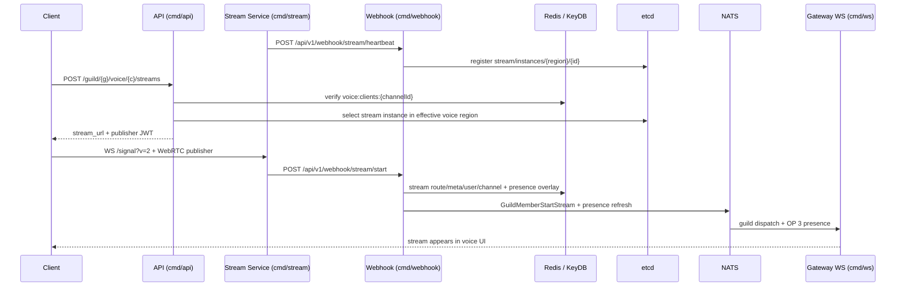

[<- Documentation](../README.md) - [Voice](README.md)

# Voice-Channel Streaming

GoChat screen sharing is implemented as a separate media service (`cmd/stream`) that is attached to voice channels. A user must already be connected to voice before they can start or watch a stream, but the stream itself uses a separate WebSocket and WebRTC peer connection from the voice SFU.

The model intentionally mirrors Discord-style "Go Live":

- voice membership is still represented by `voice_channel_id`
- a user's live screen/app share is represented by `active_stream`
- one voice channel can have multiple active streams
- each active stream is pinned to one stream-service route
- publishers receive a stream JWT with publish rights
- viewers receive a stream JWT with receive-only rights

## Components



## Service Boundaries

| Service | Responsibility |
| --- | --- |
| `cmd/api` | REST control plane, voice membership validation, stream region selection, stream JWT issuance, owner stop, region-migration rebind planning. |
| `cmd/stream` | WebSocket signaling, WebRTC forwarding for screen/app video and optional audio, publisher/viewer role enforcement, DAVE coordination, stream lifecycle webhooks. |
| `cmd/webhook` | Internal stream callbacks, stream instance discovery registration, active stream cache/index writes, presence overlay writes, guild event publication. |
| `cmd/ws` | Delivers `guild.{guildId}` stream events and merged OP 3 presence updates to subscribed clients. |
| Redis / KeyDB | Active voice membership, active stream route/meta/index state, stream rebind markers, stream presence overlay. |
| etcd | Stream service discovery under a separate prefix from voice SFU discovery. |

The stream service can be run outside Docker, like the voice SFU. This is recommended for local WebRTC testing because Docker networking can break ICE candidate reachability.

## Region And Discovery

Streams reuse voice region IDs and voice region configuration. There is no separate stream region allowlist.

The API resolves the effective stream region in this order:

1. Active voice route binding region from `voice:route:{channelId}`.
2. Channel preferred voice region from the existing voice region configuration.
3. The configured default voice region.

After the effective region is known, stream discovery is strict. `cmd/api` selects only stream-service instances registered in that exact region through `stream_etcd_prefix`; it does not fall back to another region. If no stream service is available in that region, stream start/join returns `503`.

Discovery data is separate from the voice SFU registry:

| Purpose | Key / Prefix |
| --- | --- |
| Stream instance discovery | `stream/instances/{region}/{id}` under `stream_etcd_prefix` |
| Active route binding | `stream:route:{streamId}` |
| Stream metadata | `stream:meta:{streamId}` |
| Owner index | `stream:user:{userId}` |
| Channel index | `stream:channel:{channelId}` hash, field = `streamId` |
| Migration marker | `stream:rebind:{streamId}` |
| Presence overlay | `presence:stream:{userId}` |

Stream route/meta/index TTLs are currently 180 seconds and are refreshed by `/webhook/stream/alive`. Stream rebind markers live for 300 seconds.

## REST API

All REST endpoints require the normal user access token. The caller must have `PermVoiceConnect` and must currently be present in `voice:clients:{channelId}`.

| Method | Path | Purpose |
| --- | --- | --- |
| `GET` | `/guild/{guild_id}/voice/{channel_id}/streams` | List active streams in a voice channel. |
| `POST` | `/guild/{guild_id}/voice/{channel_id}/streams` | Create or resume the caller's stream. Requires `PermVoiceVideo`. |
| `POST` | `/guild/{guild_id}/voice/{channel_id}/streams/{stream_id}/join` | Join an active stream as a receive-only viewer. |
| `DELETE` | `/guild/{guild_id}/voice/{channel_id}/streams/{stream_id}` | Stop the caller's own stream. Idempotent when already stopped. |

Start request:

```json
{
  "source_type": "screen",
  "audio_mode": "desktop"
}
```

Allowed values:

| Field | Values |
| --- | --- |
| `source_type` | `screen`, `application` |
| `audio_mode` | `desktop`, `application`, `none` |

Start response:

```json
{
  "stream_id": 2309446798663483392,
  "stream_url": "wss://stream-eu.example.com/signal",
  "stream_token": "<publisher-jwt>",
  "stream": {
    "id": 2309446798663483392,
    "owner_user_id": 2308863155104645120,
    "channel_id": 2308859058410487808,
    "source_type": "screen",
    "audio_mode": "desktop",
    "started_at": 1776943455
  }
}
```

`POST /streams` is idempotent per owner and voice channel. If the user already has an active stream in the same channel, the API returns the existing `stream_id` with a fresh publisher token and current route. If the user is already streaming in a different channel, it returns `409`.

### Direct-message call streams

Direct-message calls reuse the same stream service with private per-DM endpoints:

| Method | Path | Purpose |
| --- | --- | --- |
| `GET` | `/user/me/channels/{channel_id}/call/streams` | List active streams in a DM call. |
| `POST` | `/user/me/channels/{channel_id}/call/streams` | Create or resume the caller's DM call stream. |
| `POST` | `/user/me/channels/{channel_id}/call/streams/{stream_id}/join` | Join a DM call stream as viewer. |
| `DELETE` | `/user/me/channels/{channel_id}/call/streams/{stream_id}` | Stop the caller's own DM call stream. |

DM call streams are visible only to the two DM participants and emit private user WebSocket events instead of guild stream events. See [Direct-Message Calls](DMCalls.md) for the full lifecycle and event list.

## Stream JWTs

Stream media tokens are separate from voice SFU tokens.

| Claim | Value |
| --- | --- |
| `typ` | `stream` |
| `aud` | `stream` |
| `iss` | `gochat` |
| `user_id` | Caller user ID |
| `stream_id` | Active stream ID |
| `channel_id` | Voice channel ID, or direct DM channel ID for DM call streams |
| `guild_id` | Guild ID; `0` or omitted for DM call streams |
| `owner_user_id` | Stream owner user ID |
| `route_id` | Stream service ID selected for this stream |
| `role` | `publisher` or `viewer` |
| `source_type` | `screen` or `application` |
| `audio_mode` | `desktop`, `application`, or `none` |

Tokens are signed by API with the shared `auth_secret`, the same signing model used by voice SFU tokens. `cmd/stream` validates the token with its `auth_secret`; during migration only, `STREAM_AUTH_SECRET` is accepted as a fallback when `AUTH_SECRET`/`auth_secret` is unset.

Stream tokens expire after 1 minute. Clients should request a new token for reconnects, stream rebinds, or after leaving and rejoining a stream.

## Stream Signaling And Media

The stream service exposes:

```text
GET /signal?v=2
```

The signaling shape matches the voice SFU v2 protocol: identify, hello, ready, SDP select protocol/session description, heartbeat, resume, client connect/disconnect, and DAVE transition opcodes. See [SFU WebSocket Protocol](SFUProtocol.md) for the shared opcode surface.

Important stream-specific rules:

- A publisher token grants synthetic `PermVoiceSpeak | PermVoiceVideo` inside `cmd/stream`.
- A viewer token grants no publish permissions.
- DM call publisher tokens are media-scoped to the private call and do not grant guild moderation permissions.
- If a viewer attempts to publish audio or video tracks, the stream service rejects those inbound tracks.
- `cmd/stream` forwards RTP; it does not transcode or record the stream.
- Stream video/audio can use DAVE. DAVE capability and transition behavior follows the same client model as voice.
- Use browser encoded transforms for DAVE-capable Chromium clients. Firefox may not support every video transform path equally.

The stream service can carry:

- screen/app video
- optional desktop/application audio when the browser supplies an audio track
- no audio when `audio_mode = none` or the selected browser capture source has no audio track

## Quality And Bitrate

Stream quality is selected by the client as capture constraints: resolution, frame rate, and optional audio. The backend is designed as a high ceiling rather than an aggressive limiter.

Relevant `stream_config` values:

| Setting | Default / Example | Meaning |
| --- | --- | --- |
| `max_audio_bitrate_kbps` | `256` | SDP cap for OPUS audio when configured. |
| `enforce_audio_bitrate` | `false` | If true, disconnects publishers that exceed the audio cap beyond margin. |
| `audio_bitrate_margin_percent` | `15` | Enforcement tolerance for measured RTP overhead. |
| `max_video_bitrate_kbps` | `100000` | High SDP ceiling for video, suitable for 4K60-class streams. |
| `dave_allow_av1` | `true` | Registers and advertises AV1 for stream video, including DAVE-protected streams. |

Video bitrate is not hard-enforced. The stream service advertises the configured ceiling in SDP and allows WebRTC congestion control to adapt down when packet loss or bandwidth pressure appears. Viewers receive the forwarded RTP under the same negotiated SDP constraints.

## Webhook Callbacks

All stream webhooks use `X-Webhook-Token` with an HS256 service token whose claims include `typ = "stream"` and `id = <service_id>` for heartbeat. The token secret is `webhook_config.jwt_secret`.

| Endpoint | Caller | Purpose |
| --- | --- | --- |
| `POST /api/v1/webhook/stream/heartbeat` | `cmd/stream` | Registers or refreshes a stream service instance in discovery. |
| `POST /api/v1/webhook/stream/start` | `cmd/stream` | Marks a stream active after publisher media is established. |
| `POST /api/v1/webhook/stream/stop` | `cmd/stream` | Removes stream state after explicit stop, publisher disconnect, or failure. |
| `POST /api/v1/webhook/stream/alive` | `cmd/stream` | Refreshes active stream TTLs while media is alive. |

Heartbeat payload:

```json
{
  "id": "stream-eu-1",
  "region": "eu",
  "url": "wss://stream-eu.example.com/signal",
  "load": 3
}
```

Start webhook payload:

```json
{
  "stream_id": 2309446798663483392,
  "channel_id": 2308859058410487808,
  "guild_id": 2308858997848932352,
  "owner_user_id": 2308863155104645120,
  "source_type": "screen",
  "audio_mode": "desktop",
  "route_id": "stream-eu-1",
  "route_url": "wss://stream-eu.example.com/signal",
  "region": "eu",
  "publisher_session_id": "398de5cf-93a9-4fff-8301-d08005902b61"
}
```

Stop webhook payload:

```json
{
  "stream_id": 2309446798663483392,
  "channel_id": 2308859058410487808,
  "guild_id": 2308858997848932352,
  "owner_user_id": 2308863155104645120,
  "publisher_session_id": "398de5cf-93a9-4fff-8301-d08005902b61",
  "reason": "publisher_disconnect"
}
```

`publisher_session_id` is used as a guard against stale stop callbacks removing a newer publisher session for the same stream.

## Presence And Gateway Events

Stream state has two notification layers.

Guild-level events are the primary channel UI signal:

| Type | Name | Topic | Payload |
| --- | --- | --- | --- |
| `210` | `GuildMemberStartStream` | `guild.{guildId}` | `{ guild_id, channel_id, user_id, stream }` |
| `211` | `GuildMemberStopStream` | `guild.{guildId}` | `{ guild_id, channel_id, user_id, stream_id, reason }` |
| `212` | `GuildStreamsRebind` | `guild.{guildId}` | `{ guild_id, channel_id, stream_ids, jitter_ms }` |

Presence includes a server-managed `active_stream` field:

```json
{
  "user_id": 2308863155104645120,
  "status": "online",
  "voice_channel_id": 2308859058410487808,
  "active_stream": {
    "id": 2309446798663483392,
    "channel_id": 2308859058410487808,
    "source_type": "screen",
    "audio_mode": "desktop",
    "started_at": 1776943455
  }
}
```

Clients cannot set `active_stream` through presence updates. The Webhook service writes `presence:stream:{userId}`, then uses the shared presence publisher to emit a merged OP 3 update.

Presence aggregation only includes `active_stream` if the user is also aggregated into the same `voice_channel_id`. If no active voice presence remains, stale stream overlay state is ignored and omitted.

## Lifecycle Flows

### Start

1. User is already connected to a voice channel.
2. Client calls `POST /guild/{guild_id}/voice/{channel_id}/streams`.
3. API validates `PermVoiceConnect`, `PermVoiceVideo`, and `voice:clients:{channelId}` membership.
4. API resolves the effective voice region and picks a stream instance in that same region.
5. API writes provisional `stream:meta`, `stream:route`, and `stream:user` entries.
6. API returns `stream_url` and a publisher stream JWT.
7. Client connects to `cmd/stream` at `/signal?v=2` and publishes screen/app tracks.
8. Stream service calls `/webhook/stream/start` after the publisher media session is established.
9. Webhook writes active stream indexes, writes `presence:stream:{userId}`, publishes `GuildMemberStartStream`, and refreshes presence.

### Join As Viewer

1. Client discovers streams through `GET /streams` or `GuildMemberStartStream`.
2. Client calls `POST /streams/{stream_id}/join`.
3. API validates voice membership and active stream metadata.
4. API returns the pinned `stream_url` and a viewer stream JWT.
5. Client opens a separate stream WebRTC connection.
6. Viewer receives the publisher's tracks and never receives publish capability.

Multiple streams can be watched at the same time by opening multiple viewer connections.

### Stop

1. Owner explicitly stops the stream or the publisher media session ends.
2. Stream service calls `/webhook/stream/stop`.
3. Webhook deletes `stream:*` active state and clears `presence:stream:{userId}`.
4. Webhook publishes `GuildMemberStopStream` and refreshes presence.

If the owner leaves voice, stop the stream first and then clear voice presence. This avoids a transient presence state where a user appears to be streaming without being in voice.

## Voice Region Migration

When `SetVoiceRegion` migrates an active voice channel:

1. API resolves active streams in `stream:channel:{channelId}`.
2. API preselects stream routes in the target voice region.
3. API writes `stream:rebind:{streamId}` with a 300-second TTL.
4. After the voice migration delay, API writes the new `stream:route:{streamId}` values.
5. API publishes `GuildStreamsRebind` on `guild.{guildId}`.
6. Open stream publishers/viewers listed in `stream_ids` reconnect and request fresh stream tokens.

Fresh stream tokens are route-bound, so reconnects after this event receive tokens for the newly selected stream service.

## Local Operation

Required config links:

- `api_config.auth_secret` must match `stream_config.auth_secret`.
- `api_config.stream_etcd_prefix` and `webhook_config.stream_etcd_prefix` must match.
- `stream_config.region` must be one of the configured voice region IDs.
- `stream_config.webhook_url` points to the Webhook service base URL.
- `stream_config.webhook_token` is generated from `webhook_config.jwt_secret` with `typ=stream`.
- `stream_config.service_id` must match the token `id` claim.

Generate a webhook token:

```bash
go run ./cmd/tools tokens webhook generate \
  --type stream \
  --id stream-eu-1 \
  --secret <webhook_config.jwt_secret>
```

Run locally outside Compose:

```bash
CONFIG_FILE=./stream_config.local.yaml go run ./cmd/stream
```

For production-style DTLS reuse, generate a certificate pair and configure `dtls_certificate_file` / `dtls_private_key_file`:

```bash
go run ./cmd/tools certificates dtls generate \
  --cert-out ./certs/stream.crt \
  --key-out ./certs/stream.key \
  --common-name stream-eu-1
```
