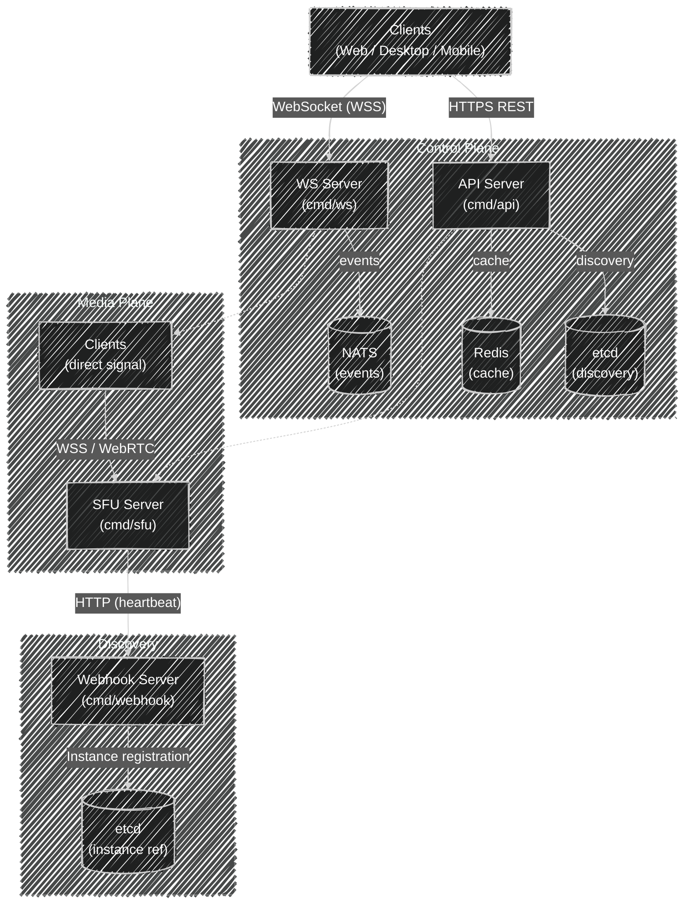

[<- Documentation](../README.md) - [Voice](README.md)

# Voice System — Architecture Documentation

## Overview

The gochat voice system enables real-time audio and video communication between users in voice channels. It is built on **WebRTC** using a **Selective Forwarding Unit (SFU)** topology and is integrated with the rest of the platform through **NATS** (message queue), **etcd** (service discovery), and **Redis/KeyDB** (caching).



---

## 1. Services

### 1.1 API Server (`cmd/api`)

The REST API server handles all voice control-plane operations:
- Issuing SFU tokens and URLs for joining voice channels.
- Changing voice region for a channel.
- Moving members between voice channels.
- Querying available voice regions.

**Voice endpoints:**

| Method | Path | Purpose |
|--------|------|---------|
| `POST` | `/guild/{guild_id}/voice/{channel_id}/join` | Get SFU URL + JWT token |
| `PATCH` | `/guild/{guild_id}/voice/{channel_id}/region` | Change SFU region |
| `POST` | `/guild/{guild_id}/voice/move` | Admin: move member between channels |
| `GET`  | `/voice/regions` | List available SFU regions |

### 1.2 SFU Server (`cmd/sfu`)

The Selective Forwarding Unit is the core of the voice data plane. It:
- Accepts WebSocket connections from voice clients.
- Manages WebRTC peer connections per voice channel.
- Forwards audio/video tracks between participants.
- Enforces voice permissions (speak, video, mute, deafen, kick).
- Registers itself with the discovery system via heartbeat webhook.

**Key characteristics:**
- Stateful, in-memory channel/peer management.
- Custom codec restriction: Opus (audio), VP8/VP9 (video) only.
- Debounced signaling: 50ms coalesce window before generating offers.
- Per-channel TTL ticker: notifies platform of ongoing sessions.
- Optional audio bitrate enforcement via SDP manipulation and RTP monitoring.

### 1.3 WebSocket Server (`cmd/ws`)

The WebSocket server is the real-time event bus for clients:
- Maintains persistent WebSocket connections to clients.
- Subscribes to NATS topics on behalf of clients (hub pattern).
- Delivers voice events: `VoiceRebind`, `VoiceMove`, `GuildMemberJoinVoice`, `GuildMemberLeaveVoice`.

### 1.4 Webhook Server (`cmd/webhook`)

Internal-only HTTP service:
- Receives SFU heartbeats and registers instances in etcd.
- Receives SFU presence events (join/leave) and publishes them to NATS.

---

## 2. Infrastructure Components

### 2.1 etcd — Service Discovery

etcd is the registry for SFU instances. Each SFU registers itself with:

```json
{
  "id":        "sfu-eu-west-01",
  "region":    "eu-west",
  "url":       "wss://sfu.example.com/signal",
  "load":      12,
  "updated_at": 1700000000
}
```

**Key prefix:** `voice/instances/{region}/{id}`
**TTL:** 15 seconds (refreshed every 5s by SFU heartbeat)
**Discovery interface:** `internal/voice/discovery/`

Operations:
- `Register(ctx, region, instance)` — write/refresh instance.
- `List(ctx, region)` — enumerate live instances for a region.
- `Regions(ctx)` — enumerate all regions with live instances.

### 2.2 Redis/KeyDB — Route Cache

Redis stores several voice-related keys:

**Route binding** — the active SFU routing decision for each voice channel:
```
Key:   voice:route:{channelId}
Value: {"id": "sfu-eu-west-01", "url": "wss://...", "region": "eu-west"}
TTL:   60 seconds
```
The `region` field prevents unnecessary rebinds when `SetVoiceRegion` is called with the same region that is already active.

**Migration marker** — written by `SetVoiceRegion` to signal an in-progress region change:
```
Key:   voice:rebind:{channelId}
Value: "1"
TTL:   300 seconds
```
`JoinVoice` checks this key; if present, it issues a 5-minute SFU JWT instead of the standard 2-minute token, giving clients extra time to reconnect under migration load.

**Session hash** — maintained by the webhook server on each join/leave event:
```
Key:   voice:clients:{channelId}
Type:  Redis Hash  (field = userId, value = "true")
```
`SetVoiceRegion` uses `HGETALL` on this key as the authoritative signal for whether anyone is in the channel. A non-empty hash means live sessions exist and a `VoiceRebind` should be sent.

This prevents every `JoinVoice` call from hitting etcd. A cache miss triggers fresh discovery.

### 2.3 NATS — Event Bus

NATS is the internal pub/sub backbone. Voice-related topics:

| Topic | Message Types | Publisher | Consumers |
|-------|--------------|-----------|-----------|
| `channel.{channelId}` | `VoiceRebind` | API | WS hub → clients |
| `user.{userId}` | `VoiceMove` | API | WS hub → client |
| `guild.{guildId}` | `GuildMemberJoinVoice`, `GuildMemberLeaveVoice`, `VoiceRegionChanging` | Webhook / API | WS hub → clients |

`VoiceRegionChanging` (event type 208) is published to `guild.{guildId}` immediately when `SetVoiceRegion` is called with live sessions. It carries the new region and a `delay_ms` hint (3000 ms) so clients can display a countdown before the disruptive `VoiceRebind` arrives 3 seconds later.

### 2.4 PostgreSQL — Persistent Configuration

Voice configuration stored in the `channels` table:

| Column | Type | Description |
|--------|------|-------------|
| `id` | BIGINT | Snowflake channel ID |
| `type` | INT | `2` = voice channel |
| `voice_region` | TEXT (nullable) | Preferred SFU region; NULL = default |

---

## 3. SFU Internal Architecture

### 3.1 Data Structures

**App (top-level):**
```go
type App struct {
    api          *webrtc.API           // Custom WebRTC engine
    config       *config.Config
    sfu          *SFU                  // Channel manager
    totalPeers   atomic.Int64          // Metrics
    disco        discovery.Manager
}
```

**SFU (channel manager):**
```go
type SFU struct {
    mu       sync.RWMutex
    channels map[int64]*channelState   // channelId → state
    nc       *nats.Conn                // NATS for presence events
}
```

**channelState:**
```go
type channelState struct {
    id           int64
    mu           sync.Mutex
    peers        []*peerConnectionState
    trackLocals  map[string]trackLocalEntry  // trackId → {track, userId}
    ttlTicker    *time.Ticker               // 60s channel-alive heartbeat
    signalCh     chan struct{}               // debounced signal trigger
    blockedUsers map[int64]bool
    maxAudioBitrateBps uint64
}
```

**peerConnectionState:**
```go
type peerConnectionState struct {
    peerConnection  *webrtc.PeerConnection
    websocket       *threadSafeWriter
    userID          int64
    perms           int64   // voice permission bitmask
    serverMuted     bool
    serverDeafened  bool
}
```

### 3.2 Channel Lifecycle

```
First peer joins channel
    → channelState created
    → TTL ticker started (60s interval → ChannelAliveNotify webhook)
    → signaling goroutine started

Peers join/leave
    → tracks added/removed
    → signaling triggered (debounced 50ms)

Last peer leaves
    → channel cleanup: close TTL ticker, stop signal goroutine
    → channelState removed from SFU.channels map
```

### 3.3 Signaling — Debounce Pattern

Rapid track changes (multiple peers joining simultaneously) are coalesced to avoid redundant offer generation:

```
Event fires → signalCh ← (capacity 1, non-blocking)

Goroutine:
  Receive from signalCh
  Sleep 50ms
  Drain any queued signal
  Lock channel
  Generate offer for all peers
  Unlock channel
  Send offers without lock
```

### 3.4 Track Routing

When a peer adds a track (audio/video):

1. SFU receives `OnTrack` callback.
2. Checks permissions: `PermVoiceSpeak` for audio, `PermVoiceVideo` for video.
3. Checks server mute status.
4. Creates a `LocalTrack` with stream ID `u:{userId}`.
5. Registers track in `channelState.trackLocals`.
6. Triggers renegotiation: all other peers receive this track.
7. Starts RTP forwarding goroutine.

Track removal (peer disconnect or server mute):
1. `LocalTrack` removed from `trackLocals`.
2. Renegotiation triggered.
3. All peers lose the sender for this track.

### 3.5 Audio Bitrate Enforcement

When `MaxAudioBitrateKbps > 0` and `EnforceAudioBitrate = true`:

1. **SDP Constraint:** `limitAudioBitrateInSDP()` sets TIAS/AS bandwidth and Opus `maxaveragebitrate` FMTP parameter in every offer.
2. **RTP Monitoring:** 1-second sliding window measures actual bitrate per peer.
3. **Enforcement:** If measured bitrate exceeds limit for 2+ consecutive seconds, peer connection is closed.

### 3.6 Administrative Controls

| Action | Mechanism |
|--------|-----------|
| Server Mute | Remove audio tracks from forwarding; set `serverMuted = true`; broadcast mute event |
| Server Deafen | Set `serverDeafened = true`; add/remove track senders accordingly; broadcast deafen event |
| Kick User | Close peer connection; send WebSocket kick notification |
| Block User | Add to `blockedUsers` map; kick if already present; reject future joins |

---

## 4. Permission System

Voice permissions are encoded as a **bitfield** (`int64`) computed at join time and stored in the SFU JWT:

| Permission | Bit | Description |
|-----------|-----|-------------|
| `PermVoiceConnect` | — | Required to call `JoinVoice` |
| `PermVoiceSpeak` | — | Required to send audio |
| `PermVoiceVideo` | — | Required to send video |
| `PermVoiceMuteMembers` | — | Can server-mute other users |
| `PermVoiceDeafenMembers` | — | Can server-deafen other users |
| `PermVoiceMoveMembers` | — | Can move members between channels |
| `PermServerManageChannels` | — | Can change voice region |

Permissions are verified at:
- **API layer:** `JoinVoice` checks `PermVoiceConnect`; `SetVoiceRegion` checks `PermServerManageChannels`.
- **SFU layer:** `OnTrack` checks speak/video; administrative operations check their respective bits against the peer's stored permissions.

---

## 5. Security Model

### 5.1 SFU JWT (client tokens)

Clients receive a short-lived JWT from `JoinVoice`. The SFU validates:
- Algorithm: HS256 (shared secret between API and SFU).
- Issuer: `"gochat"`.
- Audience: `["sfu"]`.
- Token type: `"sfu"`.
- Expiry: must not be expired.
- Block list: `userId` must not be in `channelState.blockedUsers`.

**Standard expiry:** 2 minutes.
**Migration expiry:** 5 minutes — issued when `voice:rebind:{channelId}` exists in Redis, giving clients extra time to reconnect after a region change.

JWT claims:
```json
{
  "typ": "sfu",
  "iss": "gochat",
  "aud": ["sfu"],
  "user_id": 123456,
  "channel_id": 789,
  "guild_id": 111,
  "perms": 32,
  "moved": false,
  "iat": 1700000000,
  "exp": 1700000120
}
```

### 5.2 Admin JWT (API → SFU control plane)

The API issues a separate short-lived JWT when it needs to instruct an SFU to close a channel (e.g., after a region change). The SFU validates this on its `/admin/channel/close` endpoint.

- Algorithm: HS256 (same `authSecret` as client tokens).
- Token type: `"admin"` (distinct from `"sfu"` — rejected by the client join path).
- Audience: `["sfu"]`.
- Expiry: 2 minutes (prevents replay attacks).
- Claims include `channel_id` which the endpoint validates against the request body.

```json
{
  "typ": "admin",
  "iss": "gochat",
  "aud": ["sfu"],
  "user_id": 0,
  "channel_id": 789,
  "iat": 1700000000,
  "exp": 1700000120
}
```

**SFU admin endpoint:**
```
POST /admin/channel/close
Authorization: Bearer <admin_jwt>
Body: { "channel_id": 789 }
Response: 204 No Content
```

This endpoint kicks all peers in the specified channel by sending `EventTypeRTCServerKickUser` to each and closing their peer connections. Cleanup follows the normal `OnConnectionStateChange` path.

### 5.3 ICE Security

- STUN servers configured via `config.STUNServers`.
- No TURN servers by default (direct P2P ICE candidates).
- All WebSocket signaling over WSS (TLS via Traefik).

### 5.4 Codec Restriction

The custom `webrtc.MediaEngine` only registers Opus, VP8, and VP9. All other codecs (H.264, AV1, etc.) are rejected at the SDP negotiation level.

---

## 6. Codec Configuration

| Codec | Type | Clock Rate | Channels | FMTP |
|-------|------|-----------|----------|------|
| Opus | Audio | 48000 | 2 (stereo) | `minptime=10;useinbandfec=1` |
| VP8  | Video | 90000 | — | — |
| VP9  | Video | 90000 | — | — |

Opus in-band FEC provides some resilience to packet loss. `minptime=10` limits packet size for low-latency communication.

---

## 7. Service Registration and Discovery

### 7.1 SFU Heartbeat

Every 5 seconds, the SFU sends:
```
POST /api/v1/webhook/sfu/heartbeat
{
  "id":     "sfu-eu-west-01",
  "region": "eu-west",
  "url":    "wss://sfu.gochat.io/signal",
  "load":   42
}
```

The webhook server writes this to etcd with a 15-second TTL. Instances that stop heartbeating expire and are removed from the available pool within 15 seconds.

### 7.2 Load Balancing

`JoinVoice` and `SetVoiceRegion` select an SFU instance using **weighted random selection**:

```
weight = max(1, 1000 - load)
```

A random number is drawn in `[0, totalWeight)` and the corresponding instance is selected. This distributes concurrent requests across instances rather than funnelling all of them to the single lowest-load node, which is particularly important during the thundering-herd burst after a `VoiceRebind`.

Load values are stale by up to 5 seconds (heartbeat interval), but the weighted-random approach naturally spreads connections even with stale metrics.

---

## 8. Monitoring

### 8.1 SFU Metrics
- `totalPeers atomic.Int64`: Exported as the `load` field in heartbeats.
- Prometheus endpoint planned but not yet implemented.

### 8.2 Channel Alive Notification
Every 60 seconds while a channel has active users, the SFU sends `ChannelAliveNotify` to the webhook server, maintaining the channel's "active" record in any persistence layer.

### 8.3 Presence Events
- `GuildMemberJoinVoice` — published when a peer successfully joins a channel.
- `GuildMemberLeaveVoice` — published when a peer's WebRTC connection closes.

These events flow: `SFU → Webhook → NATS → WS hub → subscribed clients`.

---

## 9. Infrastructure Deployment

From `compose.yaml`:

```yaml
sfu:
  - Exposed via Traefik on path /sfu
  - Internal port 3300
  - WebSocket endpoint: /signal

api:
  - Port 3100
  - Depends on: PostgreSQL, KeyDB (Redis), NATS, auth service

ws:
  - Port 3100
  - Depends on: NATS

webhook:
  - Port 3200
  - Depends on: NATS, etcd

nats:
  - Ports: 4222 (client), 8222 (monitoring), 6222 (cluster)

etcd:
  - Ports: 2379 (client), 2380 (peer)

keydb:
  - Port 6379
  - Redis-compatible
```

All public endpoints proxied through Traefik with TLS termination.
