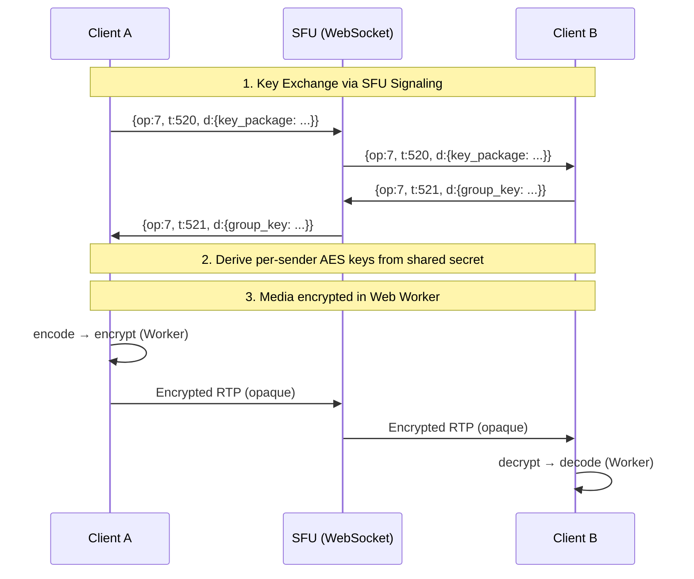

[<- Documentation](../README.md) - [Voice](README.md)

# Voice End-to-End Encryption (E2EE)

This document describes the voice E2EE system for GoChat, inspired by Discord's [DAVE protocol](https://daveprotocol.com). It covers the server-side SFU changes, the signaling protocol extensions, and full React frontend integration guide.

## Design Principles

1. **SFU is untrusted** — The SFU forwards encrypted RTP as opaque bytes. It cannot read or modify media content.
2. **Per-sender symmetric keys** — Each participant has their own encryption key. Other participants can decrypt but cannot impersonate.
3. **Forward secrecy** — When a member leaves, the group ratchets to new keys. Past media cannot be decrypted by the departing member.
4. **Post-compromise security** — When a member joins, they cannot decrypt media from before their join.
5. **Zero SFU changes needed for media path** — Encryption operates at the encoded-frame level via WebRTC Encoded Transforms. The SFU's RTP forwarding remains unchanged.

## Architecture Overview



## Protocol Extensions

### New SFU Event Types (op=7)

| t | Name | Direction | Payload |
|---|---|---|---|
| 520 | `RTCKeyExchange` | Both | `{ type: "offer"|"answer"|"key", data: string }` |
| 521 | `RTCGroupKey` | S→C | `{ epoch: int, sender_keys: {[user_id]: string} }` |
| 522 | `RTCE2EEState` | S→C | `{ enabled: bool, epoch: int }` |
| 523 | `RTCE2EEVerify` | Both | `{ user_id: int64, fingerprint: string }` |

### Simplified Key Exchange (No MLS)

Discord's DAVE uses full MLS (RFC 9420) for group key exchange. For our implementation, we use a **simplified approach** that achieves the same security properties for typical group sizes (≤100 users):

1. **Server-generated epoch key** — The SFU generates a random 128-bit group epoch key when the first E2EE-capable user joins.
2. **Per-sender key derivation** — Each sender's AES-128-GCM key is derived from the epoch key + their user ID:
   ```
   sender_key = HKDF-SHA256(
       ikm  = epoch_key,
       salt = "gochat-e2ee-v1",
       info = "sender:" + LE64(user_id),
       len  = 16
   )
   ```
3. **Key rotation** — The epoch key rotates (new random key + increment epoch) when:
   - A member leaves
   - A member joins (so they can't decrypt past media)
   - Manually triggered by a privileged user
4. **Key distribution** — The SFU sends the epoch key encrypted with each client's ECDH public key (exchanged during join). Only the clients can derive it.

> [!NOTE]
> This is simpler than full MLS but still provides forward secrecy and post-compromise security. For channels with >100 users, the overhead is still O(N) per key rotation (one encrypted key per user). Full MLS reduces this to O(log N) but adds significant complexity.

### Epoch Key Distribution Flow

```
1. Client A joins, sends ECDH public key in join envelope:
   { op:7, t:500, d:{ channel, token, e2ee_pubkey: "<base64 ECDH pub>" } }

2. SFU generates epoch_key (or retrieves current for the channel)

3. SFU encrypts epoch_key for Client A using ECDH:
   shared = ECDH(sfu_ephemeral_priv, client_a_pub)
   encrypted_epoch_key = AES-GCM(shared, epoch_key)

4. SFU sends to Client A:
   { op:7, t:521, d:{ epoch: 1, key: "<encrypted_epoch_key>", sfu_pub: "<base64>" } }

5. Client A derives sender keys for all current participants.

6. When Client B joins, SFU rotates to epoch 2:
   - Generates new epoch_key
   - Sends RTCGroupKey to ALL participants with new encrypted key
   - All participants re-derive sender keys
```

## SFU Server Changes

### What Changes

The SFU needs minimal changes because encrypted frames are opaque bytes to the RTP forwarder. Changes are only needed for:

1. **Signaling** — Relay `RTCKeyExchange` and `RTCGroupKey` messages between peers
2. **Epoch management** — Generate/rotate epoch keys per channel
3. **ECDH key exchange** — Generate ephemeral keypairs per session

### What Does NOT Change

- RTP forwarding (encrypted frames are valid RTP payloads)
- SDP negotiation (Encoded Transforms are transparent to SDP)
- ICE/DTLS (transport encryption is orthogonal to E2EE)
- Audio bitrate enforcement (operates on RTP-level bytes, not media content)

### Config Addition

```yaml
# sfu_config.yaml
e2ee:
  enabled: true                    # Enable E2EE support
  require: false                   # If true, reject non-E2EE clients
  key_rotation_interval: "5m"      # Auto-rotate epoch keys
```

## React Frontend Integration Guide

### Prerequisites

- Browser with `RTCRtpScriptTransform` support (Chrome 110+, Firefox 117+, Safari 15.4+)
- WebRTC connection to SFU already established

### File Structure

```
src/
  voice/
    VoiceConnection.tsx          # Main voice hook/component
    encryption/
      E2EEManager.ts             # Key management & state machine
      encryptionWorker.ts        # Web Worker for frame transforms
      crypto.ts                  # ECDH, HKDF, AES-GCM utilities
      types.ts                   # Shared types
```

### Step 1: Crypto Utilities (`crypto.ts`)

```typescript
// crypto.ts — Shared cryptographic operations

/**
 * Generate an ECDH key pair for key exchange with the SFU.
 * Uses P-256 which is widely supported and fast.
 */
export async function generateECDHKeyPair(): Promise<CryptoKeyPair> {
  return crypto.subtle.generateKey(
    { name: "ECDH", namedCurve: "P-256" },
    true,  // extractable (need to export public key)
    ["deriveBits"]
  );
}

/**
 * Export an ECDH public key as base64 for sending to the SFU.
 */
export async function exportPublicKey(key: CryptoKey): Promise<string> {
  const raw = await crypto.subtle.exportKey("raw", key);
  return btoa(String.fromCharCode(...new Uint8Array(raw)));
}

/**
 * Import an ECDH public key received from the SFU.
 */
export async function importPublicKey(base64: string): Promise<CryptoKey> {
  const raw = Uint8Array.from(atob(base64), c => c.charCodeAt(0));
  return crypto.subtle.importKey(
    "raw", raw,
    { name: "ECDH", namedCurve: "P-256" },
    false,
    []
  );
}

/**
 * Derive a shared AES-GCM key from our ECDH private key and
 * the SFU's ECDH public key. Used to decrypt the epoch key.
 */
export async function deriveSharedKey(
  privateKey: CryptoKey,
  publicKey: CryptoKey
): Promise<CryptoKey> {
  const bits = await crypto.subtle.deriveBits(
    { name: "ECDH", public: publicKey },
    privateKey,
    256
  );
  return crypto.subtle.importKey(
    "raw", bits,
    { name: "AES-GCM", length: 256 },
    false,
    ["decrypt"]
  );
}

/**
 * Decrypt the epoch key sent by the SFU using our shared key.
 */
export async function decryptEpochKey(
  sharedKey: CryptoKey,
  encryptedData: ArrayBuffer,
  iv: Uint8Array
): Promise<ArrayBuffer> {
  return crypto.subtle.decrypt(
    { name: "AES-GCM", iv },
    sharedKey,
    encryptedData
  );
}

/**
 * Derive a per-sender AES-128-GCM key from the epoch key and sender ID.
 * Matches the server-side derivation:
 *   HKDF-SHA256(ikm=epoch_key, salt="gochat-e2ee-v1", info="sender:"+LE64(uid))
 */
export async function deriveSenderKey(
  epochKey: ArrayBuffer,
  senderId: bigint
): Promise<CryptoKey> {
  // Import epoch key as HKDF input
  const baseKey = await crypto.subtle.importKey(
    "raw", epochKey, "HKDF", false, ["deriveKey"]
  );

  // Encode sender ID as little-endian 8 bytes
  const info = new Uint8Array(7 + 8); // "sender:" + LE64
  const encoder = new TextEncoder();
  info.set(encoder.encode("sender:"));
  const view = new DataView(info.buffer, 7, 8);
  view.setBigUint64(0, senderId, true); // little-endian

  const salt = encoder.encode("gochat-e2ee-v1");

  return crypto.subtle.deriveKey(
    { name: "HKDF", hash: "SHA-256", salt, info },
    baseKey,
    { name: "AES-GCM", length: 128 },
    false,
    ["encrypt", "decrypt"]
  );
}
```

### Step 2: Encryption Web Worker (`encryptionWorker.ts`)

> [!IMPORTANT]
> The encryption/decryption MUST run in a Web Worker via `RTCRtpScriptTransform` to avoid blocking the main thread and to access the encoded frames API.

```typescript
// encryptionWorker.ts — Runs in a dedicated Web Worker
// This file is loaded by: new Worker(new URL('./encryptionWorker.ts', import.meta.url))

/**
 * State managed by the worker.
 * Main thread sends keys and config via postMessage.
 */
interface WorkerState {
  senderKey: CryptoKey | null;        // Our encryption key
  receiverKeys: Map<string, CryptoKey>; // userId -> their decryption key
  enabled: boolean;
  nonceCounter: number;
}

const state: WorkerState = {
  senderKey: null,
  receiverKeys: new Map(),
  enabled: false,
  nonceCounter: 0,
};

// Frame magic marker to identify encrypted frames (like Discord's 0xFAFA)
const MAGIC_MARKER = new Uint8Array([0xFA, 0xFA]);

/**
 * Handle messages from the main thread (key updates, enable/disable).
 */
self.onmessage = async (event: MessageEvent) => {
  const { type, data } = event.data;

  switch (type) {
    case "set-sender-key":
      state.senderKey = await importAESKey(data.key);
      state.nonceCounter = 0;
      break;

    case "set-receiver-key":
      state.receiverKeys.set(
        data.userId,
        await importAESKey(data.key)
      );
      break;

    case "remove-receiver-key":
      state.receiverKeys.delete(data.userId);
      break;

    case "enable":
      state.enabled = data.enabled;
      break;

    case "clear":
      state.senderKey = null;
      state.receiverKeys.clear();
      state.enabled = false;
      state.nonceCounter = 0;
      break;
  }
};

async function importAESKey(rawBytes: ArrayBuffer): Promise<CryptoKey> {
  return crypto.subtle.importKey(
    "raw", rawBytes,
    { name: "AES-GCM", length: 128 },
    false,
    ["encrypt", "decrypt"]
  );
}

/**
 * RTCRtpScriptTransform event handler.
 * Called when this worker is attached to a sender or receiver transform.
 */
// @ts-ignore — RTCTransformEvent is available in Worker context
self.onrtctransform = (event: any) => {
  const transformer = event.transformer;
  const readable: ReadableStream = transformer.readable;
  const writable: WritableStream = transformer.writable;
  const options = transformer.options;

  if (options.mode === "encrypt") {
    encryptTransform(readable, writable);
  } else {
    decryptTransform(readable, writable, options.senderId);
  }
};

/**
 * SENDER side: encrypt each encoded frame before it leaves the browser.
 *
 * Frame format after encryption:
 *   [encrypted_payload] [8-byte auth_tag] [4-byte nonce] [0xFAFA]
 */
async function encryptTransform(
  readable: ReadableStream,
  writable: WritableStream
) {
  const reader = readable.getReader();
  const writer = writable.getWriter();

  while (true) {
    const { done, value: frame } = await reader.read();
    if (done) break;

    if (!state.enabled || !state.senderKey) {
      // Pass through unencrypted
      writer.write(frame);
      continue;
    }

    try {
      const frameData = new Uint8Array(frame.data);

      // Generate a 12-byte nonce: 4 bytes counter + 8 bytes zero-padded
      const nonce = new Uint8Array(12);
      const nonceView = new DataView(nonce.buffer);
      nonceView.setUint32(0, state.nonceCounter++, true);

      // Encrypt the entire frame payload
      const encrypted = await crypto.subtle.encrypt(
        { name: "AES-GCM", iv: nonce, tagLength: 64 }, // 8-byte (64-bit) tag
        state.senderKey,
        frameData
      );

      // Build output: [encrypted_payload+tag] [4-byte nonce] [0xFAFA]
      const encryptedBytes = new Uint8Array(encrypted);
      const output = new Uint8Array(
        encryptedBytes.length + 4 + 2
      );
      output.set(encryptedBytes, 0);
      // Append truncated nonce (4 bytes)
      output.set(nonce.subarray(0, 4), encryptedBytes.length);
      // Append magic marker
      output.set(MAGIC_MARKER, encryptedBytes.length + 4);

      frame.data = output.buffer;
      writer.write(frame);
    } catch (err) {
      console.error("[E2EE Worker] Encrypt error:", err);
      // Drop frame on encryption failure
    }
  }
}

/**
 * RECEIVER side: decrypt each incoming encrypted frame.
 *
 * Reads [encrypted_data] [4-byte nonce] [0xFAFA] format.
 * Falls back to pass-through if frame is not encrypted (no magic marker).
 */
async function decryptTransform(
  readable: ReadableStream,
  writable: WritableStream,
  senderId: string
) {
  const reader = readable.getReader();
  const writer = writable.getWriter();

  while (true) {
    const { done, value: frame } = await reader.read();
    if (done) break;

    if (!state.enabled) {
      writer.write(frame);
      continue;
    }

    try {
      const data = new Uint8Array(frame.data);

      // Check for magic marker at end
      if (
        data.length < 8 || // minimum: some data + nonce + marker
        data[data.length - 2] !== 0xFA ||
        data[data.length - 1] !== 0xFA
      ) {
        // Not encrypted, pass through (compatibility with non-E2EE peers)
        writer.write(frame);
        continue;
      }

      // Extract nonce (4 bytes before marker)
      const truncatedNonce = data.subarray(data.length - 6, data.length - 2);
      const nonce = new Uint8Array(12);
      nonce.set(truncatedNonce, 0);

      // Extract encrypted payload (everything before nonce)
      const encryptedPayload = data.subarray(0, data.length - 6);

      // Get the sender's decryption key
      const key = state.receiverKeys.get(senderId);
      if (!key) {
        console.warn(`[E2EE Worker] No key for sender ${senderId}`);
        writer.write(frame); // pass through
        continue;
      }

      const decrypted = await crypto.subtle.decrypt(
        { name: "AES-GCM", iv: nonce, tagLength: 64 },
        key,
        encryptedPayload
      );

      frame.data = decrypted;
      writer.write(frame);
    } catch (err) {
      // Decryption failure — likely epoch transition, drop frame
      // (briefly causes audio glitch during key rotation, expected)
    }
  }
}
```

### Step 3: E2EE Manager (`E2EEManager.ts`)

```typescript
// E2EEManager.ts — Manages encryption lifecycle on the main thread

import {
  generateECDHKeyPair,
  exportPublicKey,
  importPublicKey,
  deriveSharedKey,
  decryptEpochKey,
  deriveSenderKey,
} from "./crypto";

export interface E2EEConfig {
  enabled: boolean;
  userId: bigint;
}

export class E2EEManager {
  private worker: Worker;
  private ecdhKeyPair: CryptoKeyPair | null = null;
  private epoch: number = 0;
  private epochKey: ArrayBuffer | null = null;
  private config: E2EEConfig;

  constructor(config: E2EEConfig) {
    this.config = config;
    this.worker = new Worker(
      new URL("./encryptionWorker.ts", import.meta.url),
      { type: "module" }
    );
  }

  /**
   * Initialize: generate ECDH keypair.
   * Call this before connecting to the SFU.
   * Returns the public key to include in the join envelope.
   */
  async initialize(): Promise<string> {
    this.ecdhKeyPair = await generateECDHKeyPair();
    return exportPublicKey(this.ecdhKeyPair.publicKey);
  }

  /**
   * Handle RTCGroupKey message from SFU.
   * Decrypts the epoch key using ECDH, then derives all sender keys.
   */
  async handleGroupKey(msg: {
    epoch: number;
    key: string;      // base64 encrypted epoch key
    iv: string;       // base64 IV for AES-GCM
    sfu_pub: string;  // base64 SFU ephemeral public key
    senders: string[]; // user IDs currently in channel
  }): Promise<void> {
    if (!this.ecdhKeyPair) throw new Error("E2EE not initialized");

    // Derive shared secret from our private key + SFU's public key
    const sfuPub = await importPublicKey(msg.sfu_pub);
    const sharedKey = await deriveSharedKey(
      this.ecdhKeyPair.privateKey,
      sfuPub
    );

    // Decrypt the epoch key
    const encData = Uint8Array.from(atob(msg.key), c => c.charCodeAt(0));
    const iv = Uint8Array.from(atob(msg.iv), c => c.charCodeAt(0));
    this.epochKey = await decryptEpochKey(sharedKey, encData, iv);
    this.epoch = msg.epoch;

    // Derive and send our sender key to the worker
    const ourKey = await deriveSenderKey(this.epochKey, this.config.userId);
    const rawKey = await crypto.subtle.exportKey("raw", ourKey);
    this.worker.postMessage({
      type: "set-sender-key",
      data: { key: rawKey },
    });

    // Derive and send all receiver keys
    for (const sid of msg.senders) {
      if (BigInt(sid) === this.config.userId) continue;
      const recvKey = await deriveSenderKey(this.epochKey, BigInt(sid));
      const rawRecvKey = await crypto.subtle.exportKey("raw", recvKey);
      this.worker.postMessage({
        type: "set-receiver-key",
        data: { userId: sid, key: rawRecvKey },
      });
    }

    // Enable encryption
    this.worker.postMessage({ type: "enable", data: { enabled: true } });
  }

  /**
   * Attach encryption transform to an RTP sender (our outgoing media).
   */
  attachSenderTransform(sender: RTCRtpSender): void {
    if (!("transform" in sender)) {
      console.warn("RTCRtpScriptTransform not supported");
      return;
    }

    // @ts-ignore — RTCRtpScriptTransform is not yet in TS lib types
    sender.transform = new RTCRtpScriptTransform(this.worker, {
      mode: "encrypt",
    });
  }

  /**
   * Attach decryption transform to an RTP receiver (incoming media from a sender).
   */
  attachReceiverTransform(receiver: RTCRtpReceiver, senderId: string): void {
    if (!("transform" in receiver)) {
      console.warn("RTCRtpScriptTransform not supported");
      return;
    }

    // @ts-ignore
    receiver.transform = new RTCRtpScriptTransform(this.worker, {
      mode: "decrypt",
      senderId,
    });
  }

  /**
   * Handle a participant leaving — update receiver keys.
   */
  handlePeerLeft(userId: string): void {
    this.worker.postMessage({
      type: "remove-receiver-key",
      data: { userId },
    });
    // New epoch key will arrive via handleGroupKey when SFU rotates
  }

  /** Clean up when leaving the voice channel. */
  destroy(): void {
    this.worker.postMessage({ type: "clear" });
    this.worker.terminate();
    this.ecdhKeyPair = null;
    this.epochKey = null;
  }
}
```

### Step 4: React Integration (`useVoiceE2EE.ts` Hook)

```tsx
// useVoiceE2EE.ts — React hook for voice E2EE

import { useCallback, useEffect, useRef, useState } from "react";
import { E2EEManager } from "./encryption/E2EEManager";

interface UseVoiceE2EEOptions {
  /** Current user's ID as bigint */
  userId: bigint;
  /** Whether E2EE is enabled for this channel */
  enabled: boolean;
}

interface UseVoiceE2EEResult {
  /** Base64 ECDH public key to include in the SFU join envelope */
  e2eePubKey: string | null;
  /** Current encryption epoch */
  epoch: number;
  /** Whether encryption is active */
  isEncrypted: boolean;
  /** Call when receiving RTCGroupKey from SFU */
  handleGroupKey: (msg: any) => Promise<void>;
  /** Attach transform to an outgoing sender */
  attachSender: (sender: RTCRtpSender) => void;
  /** Attach transform to an incoming receiver */
  attachReceiver: (receiver: RTCRtpReceiver, senderId: string) => void;
  /** Notify that a peer left */
  handlePeerLeft: (userId: string) => void;
  /** Cleanup */
  destroy: () => void;
}

export function useVoiceE2EE({
  userId,
  enabled,
}: UseVoiceE2EEOptions): UseVoiceE2EEResult {
  const managerRef = useRef<E2EEManager | null>(null);
  const [pubKey, setPubKey] = useState<string | null>(null);
  const [epoch, setEpoch] = useState(0);
  const [isEncrypted, setIsEncrypted] = useState(false);

  // Initialize manager on mount
  useEffect(() => {
    if (!enabled) return;

    const manager = new E2EEManager({ enabled, userId });
    managerRef.current = manager;

    manager.initialize().then((key) => {
      setPubKey(key);
    });

    return () => {
      manager.destroy();
      managerRef.current = null;
      setPubKey(null);
      setEpoch(0);
      setIsEncrypted(false);
    };
  }, [userId, enabled]);

  const handleGroupKey = useCallback(async (msg: any) => {
    const m = managerRef.current;
    if (!m) return;
    await m.handleGroupKey(msg);
    setEpoch(msg.epoch);
    setIsEncrypted(true);
  }, []);

  const attachSender = useCallback((sender: RTCRtpSender) => {
    managerRef.current?.attachSenderTransform(sender);
  }, []);

  const attachReceiver = useCallback(
    (receiver: RTCRtpReceiver, senderId: string) => {
      managerRef.current?.attachReceiverTransform(receiver, senderId);
    },
    []
  );

  const handlePeerLeft = useCallback((uid: string) => {
    managerRef.current?.handlePeerLeft(uid);
  }, []);

  const destroy = useCallback(() => {
    managerRef.current?.destroy();
    managerRef.current = null;
    setIsEncrypted(false);
  }, []);

  return {
    e2eePubKey: pubKey,
    epoch,
    isEncrypted,
    handleGroupKey,
    attachSender,
    attachReceiver,
    handlePeerLeft,
    destroy,
  };
}
```

### Step 5: Usage in Voice Component

```tsx
// VoiceChannel.tsx — Example usage

import { useVoiceE2EE } from "./voice/useVoiceE2EE";

function VoiceChannel({ channelId, userId }: Props) {
  const {
    e2eePubKey,
    epoch,
    isEncrypted,
    handleGroupKey,
    attachSender,
    attachReceiver,
    handlePeerLeft,
    destroy,
  } = useVoiceE2EE({ userId: BigInt(userId), enabled: true });

  // 1. Include e2eePubKey in the SFU join message
  const joinSFU = async (sfuUrl: string, sfuToken: string) => {
    const ws = new WebSocket(sfuUrl);
    ws.onopen = () => {
      ws.send(JSON.stringify({
        op: 7,
        t: 500,
        d: {
          channel: channelId,
          token: sfuToken,
          e2ee_pubkey: e2eePubKey, // ← include ECDH public key
        },
      }));
    };

    ws.onmessage = (event) => {
      const msg = JSON.parse(event.data);

      if (msg.op === 7) {
        switch (msg.t) {
          case 521: // RTCGroupKey
            handleGroupKey(msg.d);
            break;
          // ... handle other events
        }
      }
    };
  };

  // 2. When creating RTCPeerConnection, attach transforms
  const setupPeerConnection = (pc: RTCPeerConnection) => {
    // Attach encryption to our senders
    pc.getSenders().forEach((sender) => {
      if (sender.track) {
        attachSender(sender);
      }
    });

    // Attach decryption to incoming tracks
    pc.ontrack = (event) => {
      const stream = event.streams[0];
      // stream.id format: "u:<user_id>"
      const senderId = stream.id.replace("u:", "");
      attachReceiver(event.receiver, senderId);

      // ... render audio/video as usual
    };
  };

  // 3. Show encryption status in UI
  return (
    <div>
      {isEncrypted && (
        <div className="e2ee-badge">
          🔒 Encrypted (epoch {epoch})
        </div>
      )}
      {/* ... voice UI */}
    </div>
  );
}
```

### Browser Compatibility

| Browser | `RTCRtpScriptTransform` | Status |
|---|---|---|
| Chrome 110+ | ✅ | Full support |
| Edge 110+ | ✅ | Full support (Chromium) |
| Firefox 117+ | ✅ | Full support |
| Safari 15.4+ | ✅ | Full support |
| Mobile Chrome | ✅ | Android 110+ |
| Mobile Safari | ✅ | iOS 15.4+ |

> [!WARNING]
> Older browsers that don't support `RTCRtpScriptTransform` will gracefully fall back to unencrypted mode. The `attachSender`/`attachReceiver` functions silently skip transform attachment and log a warning.

### Webpack/Vite Configuration

The encryption worker uses `new Worker(new URL('./encryptionWorker.ts', import.meta.url))` which is natively supported by Vite and Webpack 5+. No additional configuration needed.

For TypeScript, add to `tsconfig.json`:
```json
{
  "compilerOptions": {
    "lib": ["ES2020", "DOM", "WebWorker"]
  }
}
```

## Verification

Users can verify that E2EE is active by:
1. **Lock icon** — A green lock icon appears next to the voice channel name when E2EE is active
2. **Epoch indicator** — Shows current key epoch (increments on member join/leave)
3. **Privacy code** — Users can compare a short numeric code derived from the epoch key fingerprint (displayed in voice settings)

```typescript
// Derive a displayable verification code from the epoch key
async function getVerificationCode(epochKey: ArrayBuffer): Promise<string> {
  const hash = await crypto.subtle.digest("SHA-256", epochKey);
  const bytes = new Uint8Array(hash);
  // Take first 4 bytes as a numeric code
  const code = ((bytes[0] << 24) | (bytes[1] << 16) | (bytes[2] << 8) | bytes[3]) >>> 0;
  return code.toString().padStart(10, "0").replace(/(\d{3})(\d{3})(\d{4})/, "$1-$2-$3");
}
// Example output: "482-917-3052"
```
