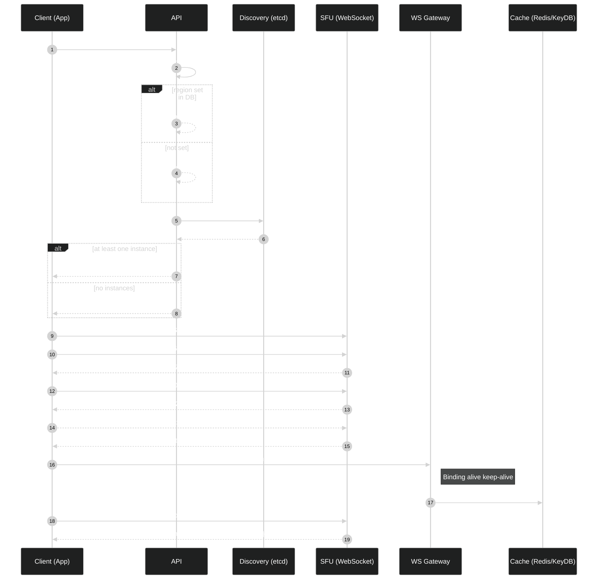

[<- Documentation](../README.md) - [Voice](README.md)

# Voice Connection Pipeline

This document explains the end‑to‑end flow of joining a voice channel, discovering the SFU, establishing media, and controlling audio/video.

## Sequence Diagram



## 1) User Action → API Join

- User clicks a voice channel in the UI.
- Client calls: `POST /api/v1/guild/{guild_id}/voice/{channel_id}/join` with the user access token.
- API validates:
  - User authentication.
  - Channel exists, is a voice channel, and user has `PermVoiceConnect`.
- API computes the user’s effective channel permissions (single DB call):
  - `PermVoiceConnect`, `PermVoiceSpeak`, `PermVoiceVideo`, `PermVoiceMuteMembers`, `PermVoiceDeafenMembers`, `PermVoiceMoveMembers`.
  - `PermAdministrator` overrides all checks (treated as allow-all).
  - Returned as a bitmask (int64).

## 2) SFU Selection via Discovery

- API chooses an SFU instance using etcd discovery:
  - Looks up region (default or channel override).
  - Queries etcd (`ETCD_ENDPOINTS`, `ETCD_PREFIX`) for instances in this region.
  - Picks one (lowest load or first available).
- API returns JSON to the client:

```json
{
  "sfu_url": "wss://sfu-{region}.example.com/sfu/signal",
  "sfu_token": "<JWT typ=sfu aud=sfu>"
}
```

The `sfu_token` includes:
- `channel_id`: voice channel to join
- `perms`: permission bitmask for this user in this channel

## 3) Connect to SFU WS and Join

- Client opens WebSocket to `sfu_url`.
- First message must be an RTC join envelope using `op/t/d`:

```json
{ "op":7, "t":500, "d": { "channel": 123, "token": "<sfu_token>" } }
```

- SFU validates `typ=sfu`, `aud=sfu`, and `PermVoiceConnect`.
- SFU replies ack:

```json
{ "op":7, "t":500, "d": { "ok": true } }
```

See [SFU WebSocket Protocol](SFUProtocol.md) for the full event catalog.

## 4) WebRTC Negotiation

- Typically client offers:

```json
{ "op":7, "t":501, "d": { "sdp": "<OFFER>" } }
```

- SFU applies remote description, adds recvonly transceivers, creates answer:

```json
{ "op":7, "t":502, "d": { "sdp": "<ANSWER>" } }
```

- Trickle ICE both directions:

```json
{ "op":7, "t":503, "d": { "candidate": "...", "sdpMid": "0", "sdpMLineIndex": 0 } }
```

## 5) Media + Permissions

- On inbound tracks, SFU enforces the token `perms`:
  - Audio requires `PermVoiceSpeak`.
  - Video requires `PermVoiceVideo`.
  - `PermAdministrator` bypasses these checks.
  - Otherwise, the track is ignored.
- For each published track, SFU relays (RTP) to other peers in the room and renegotiates for late joiners.

## 6) Mute/Deafen Controls

- Local (client‑side only):
  - Mute self: `{ "op":7, "t":505, "d": { "muted": true } }` — stops forwarding this publisher’s audio.
  - Mute a user locally: `{ "op":7, "t":506, "d": { "user": 123, "muted": true } }` — detaches that user’s track for this peer only.
- Server‑wide (privileged):
  - Mute user for everyone: `{ "op":7, "t":507, "d": { "user": 123, "muted": true } }` (requires `PermVoiceMuteMembers`).
  - Deafen user: `{ "op":7, "t":508, "d": { "user": 123, "deafened": true } }` (requires `PermVoiceDeafenMembers`).
  - Kick/move user to another channel: requires `PermVoiceMoveMembers` (handled by API/protocol; see roadmap).

## 7) Leave / Close

- Client leaves with `{ "op":7, "t":504 }` or closes the WS. SFU removes the peer and senders.

## 8) Measuring Latency (Ping/Pong)

- Client can measure RTT anytime via `op=2`:

```json
{ "op":2, "d": { "nonce": "abc", "ts": 1717171717 } }
```

SFU replies:

```json
{ "op":2, "d": { "pong": true, "server_ts": 1717171720, "nonce": "abc", "ts": 1717171717 } }
```

Compute RTT as `now_ms - send_ts` on the client.

## 9) Discovery & Regions

- SFU sends heartbeats to the Webhook service (`/webhook/sfu/heartbeat`) including `{ id, region, url, load }`.
- Webhook validates `X-Webhook-Token` (HS256) and writes/refreshes the SFU instance in etcd.
- API lists instances from etcd for the requested region and returns `sfu_url`. If none exist, API returns `503` (no SFU).

## 10) Security Summary

- Short‑lived SFU tokens scoped to `typ=sfu`, `aud=sfu` with embedded `channel_id` and `perms`.
- SFU enforces `PermVoice*` at media/control plane.
- etcd runs with authentication (and optionally TLS) when exposed to the Internet.
