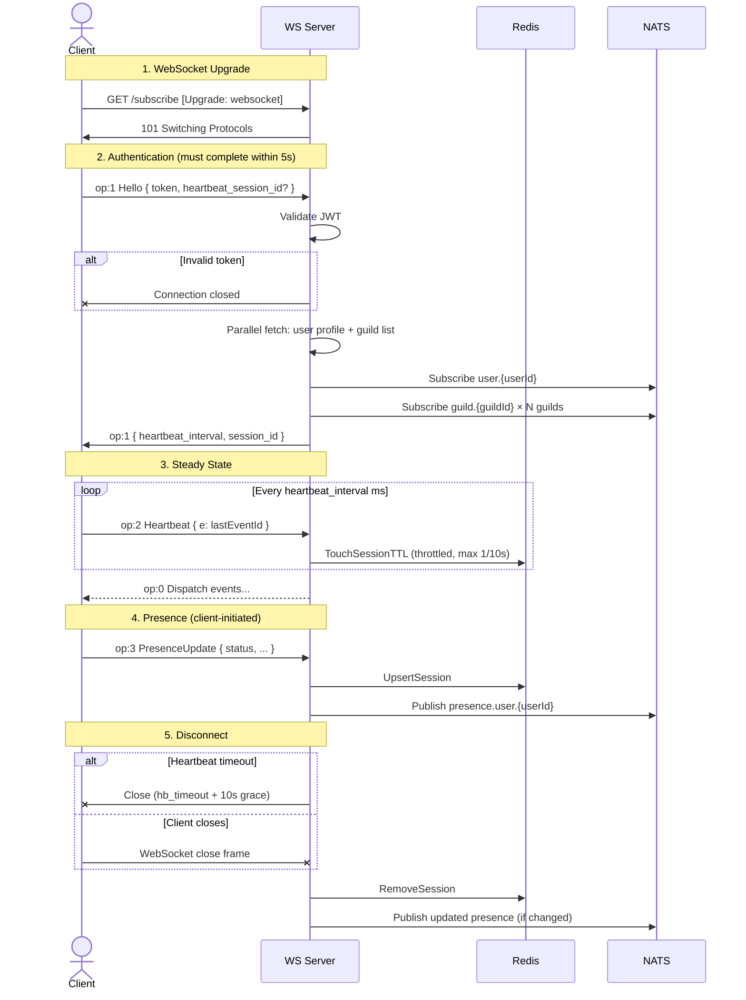

[<- Documentation](../README.md) - [WebSocket Events](README.md)

# Connection Lifecycle

This document describes the full lifecycle of a WebSocket gateway connection, from initial upgrade to graceful and abnormal close scenarios.

---

## Connection Flow

---

## Authentication Phase

1. Client opens a WebSocket to `/subscribe` (optionally with `?compress=zlib-stream`).
2. A **5-second init timer** starts. If no valid Hello (op=1) arrives, the connection is closed.
3. Client sends Hello with JWT access token.
4. Server validates the JWT (issuer: `gochat`, audience: `api`).
5. On failure → connection closed immediately.
6. On success → the init timer is cancelled, and the server:
   - Fetches user by ID and guild memberships **in parallel**.
   - Generates or reuses a session ID (UUID v4 style).
   - Subscribes to `user.{userId}` and all `guild.{guildId}` topics via the Hub.
   - Sends the Hello reply with `heartbeat_interval` and `session_id`.

### Session Resumption

If the client provides `heartbeat_session_id` in the Hello payload (from a previous connection's `session_id`), the server reuses that session ID. This allows the presence session in Redis to survive reconnections without publishing spurious offline→online transitions.

---

## Heartbeat

- **Interval:** Configured server-side (default: `30000` ms). Sent in the Hello reply.
- **Client sends:** `{ "op": 2, "d": { "e": <last_event_id> } }` on the specified interval.
- **Grace period:** The server allows `heartbeat_interval + 10 seconds` of silence before timing out.
- **Presence refresh:** On each valid heartbeat, `pstore.TouchSessionTTL` is called (throttled to 1 call per 10 seconds to reduce Redis load).
- **On timeout:** The server logs a warning, calls `handler.Close()`, and the connection is torn down.

---

## Server-Side Ping

Independent of the application heartbeat, the server sends WebSocket **Ping** frames at a fixed interval (`min(heartbeat_interval/2, 15s)`) to detect dead TCP connections at the transport level. These are handled automatically by the WebSocket library — clients do not need to respond manually.

---

## Compression

If the client connects with `?compress=zlib-stream`:
- All server→client messages are zlib-compressed (BestSpeed) and sent as **binary** frames.
- The zlib writer is flushed after each message (no inter-message compression state).
- Client→server messages remain uncompressed JSON text frames.

---

## Disconnect & Cleanup

When a connection closes (for any reason), the following cleanup occurs in order:

1. **Hub unregistration:** The connection is removed from all NATS topic fan-out sets. If a topic has zero remaining connections, its shared NATS subscription is unsubscribed.
2. **Subscriber close:** All tracked topic keys are cleared.
3. **Presence cleanup:**
   - Previous aggregated presence is read.
   - The current session is removed from the user's session set.
   - Presence is re-aggregated across remaining sessions.
   - If the aggregated status changed (e.g., last session closed → now offline), the new presence is stored and published.
4. **WebSocket close:** The underlying TCP connection is closed.

### Abnormal Close Scenarios

| Scenario | Server Behavior |
|----------|----------------|
| Client sends close frame | Normal cleanup, no error logged |
| TCP connection drops silently | Ping timeout → close → cleanup |
| Heartbeat timeout | Timer fires → `handler.Close()` → cleanup |
| Server panic in handler | Recovered by middleware; connection closed |

---

## Writer Pump

All outbound writes go through a dedicated goroutine per connection (the "writer pump") with a 256-slot buffered channel. This ensures:

- **No concurrent writes** to the WebSocket (which is not goroutine-safe for writes).
- **Non-blocking fan-out** from NATS → Hub → connection. If the channel is full, messages are dropped (slow consumer).
- **Graceful close** via a special `kind=3` message that sends a WebSocket close frame and terminates the pump.

| Kind | Purpose |
|------|---------|
| 1 | Send pre-serialized bytes |
| 2 | Marshal and send JSON |
| 3 | Send close frame + terminate |
| 4 | WebSocket Ping frame |
