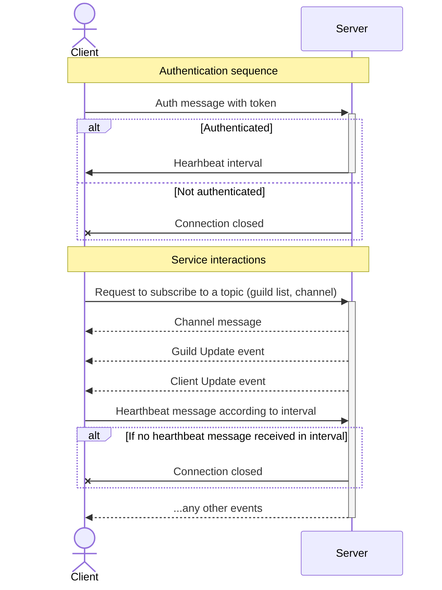

[<- Documentation](../README.md) - [WebSocket Events](README.md)

# Events Flow

The main flow of events and authentication is described in the diagram below.

### Message flow after connection to the WebSocket Gateway established

So far it's pretty much simplified, but it's still a work in progress.