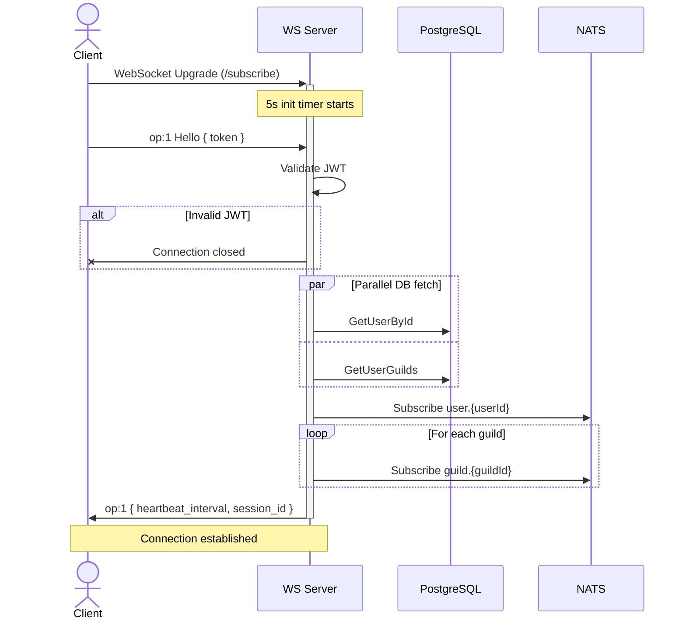
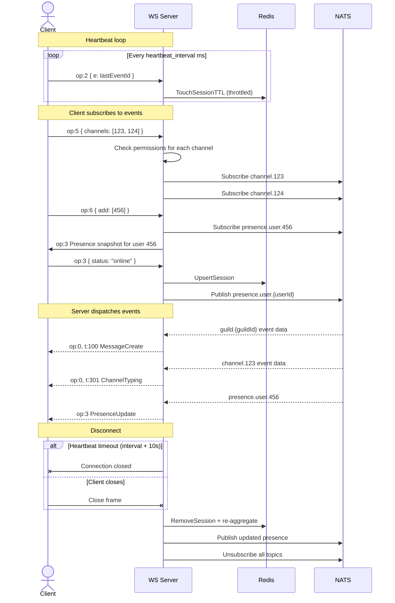
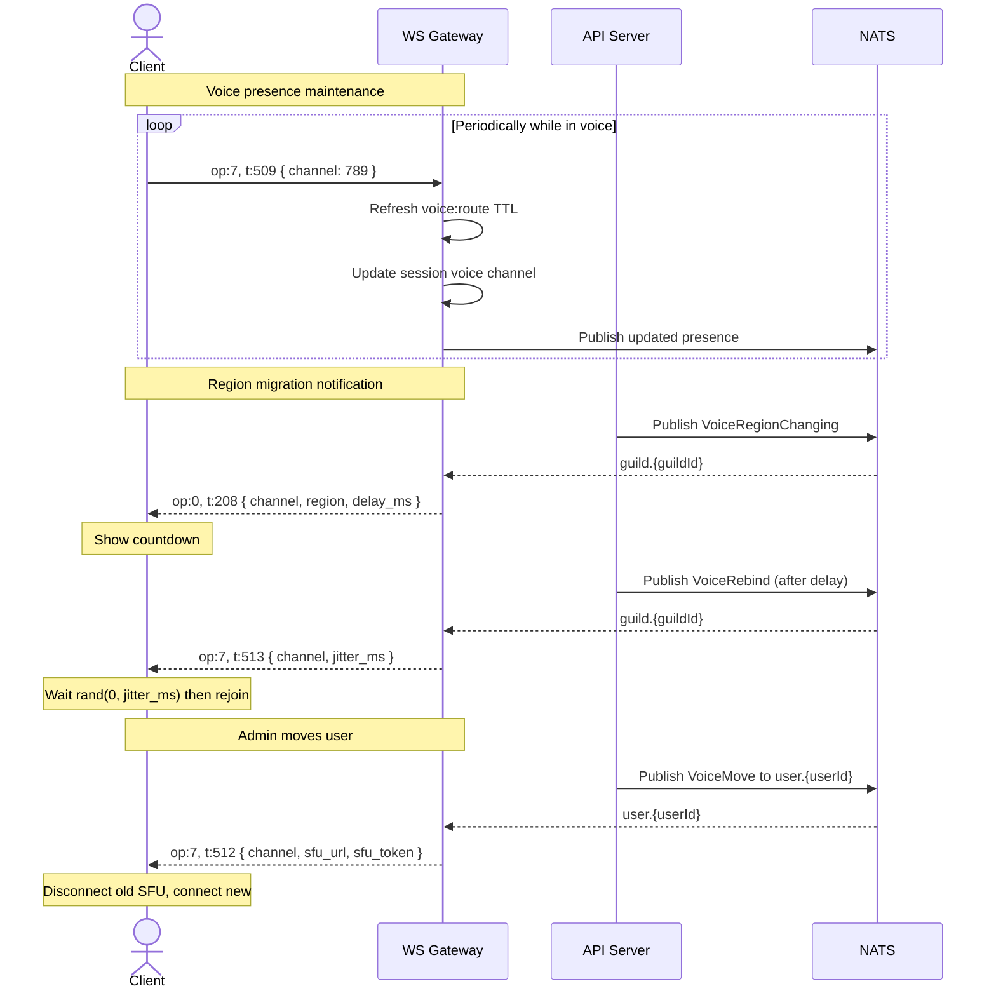

[<- Documentation](../README.md) - [WebSocket Events](README.md)

# Events Flow

## Connection & Authentication

```mermaid
sequenceDiagram
    actor C as Client
    participant S as WS Server
    participant DB as PostgreSQL
    participant N as NATS

    C->>+S: WebSocket Upgrade (/subscribe)
    Note over S: 5s init timer starts

    C->>S: op:1 Hello { token }
    S->>S: Validate JWT
    alt Invalid JWT
        S-xC: Connection closed
    end

    par Parallel DB fetch
        S->>DB: GetUserById
    and
        S->>DB: GetUserGuilds
    end

    S->>N: Subscribe user.{userId}
    loop For each guild
        S->>N: Subscribe guild.{guildId}
    end

    S->>-C: op:1 { heartbeat_interval, session_id }
    Note over C, S: Connection established
```

## Steady-State Event Flow

```mermaid
sequenceDiagram
    actor C as Client
    participant S as WS Server
    participant R as Redis
    participant N as NATS

    Note over C, S: Heartbeat loop
    loop Every heartbeat_interval ms
        C->>S: op:2 { e: lastEventId }
        S->>R: TouchSessionTTL (throttled)
    end

    Note over C, S: Client subscribes to events
    C->>S: op:5 { channels: [123, 124] }
    S->>S: Check permissions for each channel
    S->>N: Subscribe channel.123
    S->>N: Subscribe channel.124

    C->>S: op:6 { add: [456] }
    S->>N: Subscribe presence.user.456
    S->>C: op:3 Presence snapshot for user 456

    C->>S: op:3 { status: "online" }
    S->>R: UpsertSession
    S->>N: Publish presence.user.{userId}

    Note over C, S: Server dispatches events
    N-->>S: guild.{guildId} event data
    S-->>C: op:0, t:100 MessageCreate
    N-->>S: channel.123 event data
    S-->>C: op:0, t:301 ChannelTyping
    N-->>S: presence.user.456
    S-->>C: op:3 PresenceUpdate

    Note over C, S: Disconnect
    alt Heartbeat timeout (interval + 10s)
        S-xC: Connection closed
    else Client closes
        C-xS: Close frame
    end
    S->>R: RemoveSession + re-aggregate
    S->>N: Publish updated presence
    S->>N: Unsubscribe all topics
```

## Voice Events via Gateway

```mermaid
sequenceDiagram
    actor C as Client
    participant WS as WS Gateway
    participant API as API Server
    participant N as NATS

    Note over C, WS: Voice presence maintenance
    loop Periodically while in voice
        C->>WS: op:7, t:509 { channel: 789 }
        WS->>WS: Refresh voice:route TTL
        WS->>WS: Update session voice channel
        WS->>N: Publish updated presence
    end

    Note over C, WS: Region migration notification
    API->>N: Publish VoiceRegionChanging
    N-->>WS: guild.{guildId}
    WS-->>C: op:0, t:208 { channel, region, delay_ms }
    Note over C: Show countdown
    API->>N: Publish VoiceRebind (after delay)
    N-->>WS: guild.{guildId}
    WS-->>C: op:7, t:513 { channel, jitter_ms }
    Note over C: Wait rand(0, jitter_ms) then rejoin

    Note over C, WS: Admin moves user
    API->>N: Publish VoiceMove to user.{userId}
    N-->>WS: user.{userId}
    WS-->>C: op:7, t:512 { channel, sfu_url, sfu_token }
    Note over C: Disconnect old SFU, connect new
```
